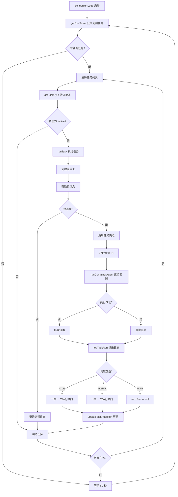
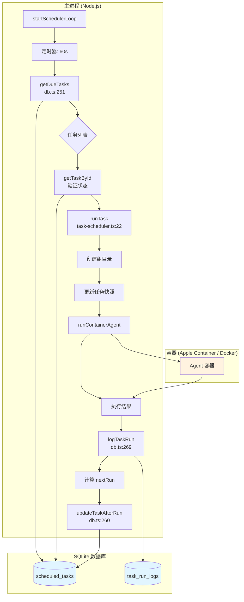

# 调度系统详解

## 概述

NanoClaw 的调度系统负责管理和执行计划任务。系统支持三种调度类型，并通过定期的轮询机制检查和执行到期任务。

## 调度类型

### 1. Cron 调度

使用标准 cron 表达式定义执行时间，支持复杂的周期性调度。

**示例**:
- `"0 9 * * *"` - 每天上午 9 点
- `"0 9 * * 1-5"` - 工作日上午 9 点
- `"0 */6 * * *"` - 每 6 小时

**实现位置**: `src/task-scheduler.ts:101-103`

```typescript
const interval = CronExpressionParser.parse(task.schedule_value, { tz: TIMEZONE });
nextRun = interval.next().toISOString();
```

**特点**:
- 使用 `cron-parser` 库解析表达式
- 支持时区配置（通过 `TIMEZONE` 环境变量）
- 自动计算下次运行时间

### 2. Interval 调度

以毫秒为单位的间隔调度，简单直接。

**示例**:
- `"3600000"` - 每小时（3600000 毫秒）
- `"86400000"` - 每天（86400000 毫秒）
- `"1800000"` - 每 30 分钟

**实现位置**: `src/task-scheduler.ts:104-107`

```typescript
const ms = parseInt(task.schedule_value, 10);
nextRun = new Date(Date.now() + ms).toISOString();
```

**特点**:
- 直接解析整数值（毫秒）
- 下次运行时间 = 当前时间 + 间隔
- 适合固定周期的简单任务

### 3. One-time 调度

一次性任务，执行完成后不再重复。

**示例**:
- `"2026-02-03T15:30:00Z"` - 指定时间执行一次
- ISO 8601 时间戳格式

**实现位置**: `src/task-scheduler.ts:108-109`

```typescript
// 'once' tasks have no next run
// 一次性任务没有下次运行时间
```

**特点**:
- 任务状态在执行后变为 `completed`
- `next_run` 字段设为 `null`
- 适用于延迟执行的单次操作

## Scheduler Loop 机制

### 轮询间隔

调度器采用定期轮询机制，检查并执行到期任务。

**配置**: `src/config.ts:5`

```typescript
export const SCHEDULER_POLL_INTERVAL = 60000; // 60 秒
```

**实现位置**: `src/task-scheduler.ts:114-141`

```typescript
export function startSchedulerLoop(deps: SchedulerDependencies): void {
  logger.info('Scheduler loop started');

  const loop = async () => {
    try {
      const dueTasks = getDueTasks();  // 获取到期任务
      if (dueTasks.length > 0) {
        logger.info({ count: dueTasks.length }, 'Found due tasks');
      }

      for (const task of dueTasks) {
        // Re-check task status in case it was paused/cancelled
        const currentTask = getTaskById(task.id);
        if (!currentTask || currentTask.status !== 'active') {
          continue;
        }

        await runTask(currentTask, deps);
      }
    } catch (err) {
      logger.error({ err }, 'Error in scheduler loop');
    }

    setTimeout(loop, SCHEDULER_POLL_INTERVAL);  // 60 秒后再次执行
  };

  loop();
}
```

### 轮询流程

1. **获取到期任务**: 调用 `getDueTasks()` 查询数据库
2. **状态验证**: 重新检查任务是否仍为 `active` 状态
3. **任务执行**: 对每个到期任务调用 `runTask()`
4. **异常处理**: 捕获并记录循环中的错误
5. **延迟重试**: 等待 60 秒后进入下一轮

**注意**: 轮询间隔固定为 60 秒，不根据任务数量或执行时间动态调整。

## Task Execution Flow

### 完整执行流程



### 详细步骤说明

#### 1. 任务启动准备（`src/task-scheduler.ts:22-43`）

```typescript
async function runTask(task: ScheduledTask, deps: SchedulerDependencies): Promise<void> {
  const startTime = Date.now();
  const groupDir = path.join(GROUPS_DIR, task.group_folder);
  fs.mkdirSync(groupDir, { recursive: true });  // 创建组目录

  const groups = deps.registeredGroups();
  const group = Object.values(groups).find(g => g.folder === task.group_folder);

  if (!group) {
    // 组不存在，记录错误并返回
    logTaskRun({
      task_id: task.id,
      run_at: new Date().toISOString(),
      duration_ms: Date.now() - startTime,
      status: 'error',
      result: null,
      error: `Group not found: ${task.group_folder}`
    });
    return;
  }
```

#### 2. 更新任务快照（`src/task-scheduler.ts:45-57`）

```typescript
  // 更新任务快照供容器读取（按组过滤）
  const isMain = task.group_folder === MAIN_GROUP_FOLDER;
  const tasks = getAllTasks();
  writeTasksSnapshot(task.group_folder, isMain, tasks.map(t => ({
    id: t.id,
    groupFolder: t.group_folder,
    prompt: t.prompt,
    schedule_type: t.schedule_type,
    schedule_value: t.schedule_value,
    status: t.status,
    next_run: t.next_run
  })));
```

#### 3. 获取会话 ID（`src/task-scheduler.ts:64-65`）

```typescript
  // 组上下文模式使用该组的当前会话
  const sessions = deps.getSessions();
  const sessionId = task.context_mode === 'group' ? sessions[task.group_folder] : undefined;
```

#### 4. 运行容器代理（`src/task-scheduler.ts:67-87`）

```typescript
  try {
    const output = await runContainerAgent(group, {
      prompt: task.prompt,
      sessionId,
      groupFolder: task.group_folder,
      chatJid: task.chat_jid,
      isMain,
      isScheduledTask: true
    });

    if (output.status === 'error') {
      error = output.error || 'Unknown error';
    } else {
      result = output.result;
    }

    logger.info({ taskId: task.id, durationMs: Date.now() - startTime }, 'Task completed');
  } catch (err) {
    error = err instanceof Error ? err.message : String(err);
    logger.error({ taskId: task.id, error }, 'Task failed');
  }
```

#### 5. 记录执行日志（`src/task-scheduler.ts:89-98`）

```typescript
  const durationMs = Date.now() - startTime;

  logTaskRun({
    task_id: task.id,
    run_at: new Date().toISOString(),
    duration_ms: durationMs,
    status: error ? 'error' : 'success',
    result,
    error
  });
```

#### 6. 计算下次运行时间（`src/task-scheduler.ts:100-109`）

```typescript
  let nextRun: string | null = null;
  if (task.schedule_type === 'cron') {
    const interval = CronExpressionParser.parse(task.schedule_value, { tz: TIMEZONE });
    nextRun = interval.next().toISOString();
  } else if (task.schedule_type === 'interval') {
    const ms = parseInt(task.schedule_value, 10);
    nextRun = new Date(Date.now() + ms).toISOString();
  }
  // 'once' tasks have no next run
```

#### 7. 更新任务状态（`src/task-scheduler.ts:110-112`）

```typescript
  const resultSummary = error ? `Error: ${error}` : (result ? result.slice(0, 200) : 'Completed');
  updateTaskAfterRun(task.id, nextRun, resultSummary);
```

## 数据库操作

### 获取到期任务

**函数**: `src/db.ts:251-258`

```typescript
export function getDueTasks(): ScheduledTask[] {
  const now = new Date().toISOString();
  return db.prepare(`
    SELECT * FROM scheduled_tasks
    WHERE status = 'active' AND next_run IS NOT NULL AND next_run <= ?
    ORDER BY next_run
  `).all(now) as ScheduledTask[];
}
```

**查询条件**:
- `status = 'active'` - 只查询活跃任务
- `next_run IS NOT NULL` - 排除已完成的一次性任务
- `next_run <= ?` - 运行时间早于或等于当前时间

### 更新任务状态

**函数**: `src/db.ts:260-267`

```typescript
export function updateTaskAfterRun(id: string, nextRun: string | null, lastResult: string): void {
  const now = new Date().toISOString();
  db.prepare(`
    UPDATE scheduled_tasks
    SET next_run = ?, last_run = ?, last_result = ?, status = CASE WHEN ? IS NULL THEN 'completed' ELSE status END
    WHERE id = ?
  `).run(nextRun, now, lastResult, nextRun, id);
}
```

**更新字段**:
- `next_run` - 下次运行时间（可能为 `null`）
- `last_run` - 最后运行时间（当前时间）
- `last_result` - 结果摘要（前 200 字符）
- `status` - 如果 `nextRun` 为 `null`，设为 `completed`

### 记录执行日志

**函数**: `src/db.ts:269-274`

```typescript
export function logTaskRun(log: TaskRunLog): void {
  db.prepare(`
    INSERT INTO task_run_logs (task_id, run_at, duration_ms, status, result, error)
    VALUES (?, ?, ?, ?, ?, ?)
  `).run(log.task_id, log.run_at, log.duration_ms, log.status, log.result, log.error);
}
```

**记录内容**:
- `task_id` - 任务 ID
- `run_at` - 运行时间
- `duration_ms` - 执行时长（毫秒）
- `status` - 状态（`success` 或 `error`）
- `result` - 结果内容
- `error` - 错误信息（如果有）

## 调度系统架构图



## 关键特性总结

| 特性 | 描述 |
|------|------|
| **调度类型** | cron、interval、one-time |
| **轮询间隔** | 60 秒（`SCHEDULER_POLL_INTERVAL`） |
| **状态验证** | 执行前重新检查任务状态 |
| **错误处理** | 捕获并记录任务执行错误 |
| **日志记录** | 详细的执行日志和结果摘要 |
| **时区支持** | 通过 `TIMEZONE` 环境变量配置 |
| **会话模式** | 支持 `isolated` 和 `group` 上下文模式 |

## 注意事项

1. **轮询精度**: 60 秒的轮询间隔意味着任务执行最多有 60 秒的延迟
2. **任务隔离**: 每个任务在独立的容器中执行，提供隔离性
3. **状态变化**: 一次性任务执行后状态变为 `completed`
4. **错误恢复**: 单个任务执行失败不会影响其他任务
5. **快照更新**: 每次执行前更新任务快照，供容器读取
