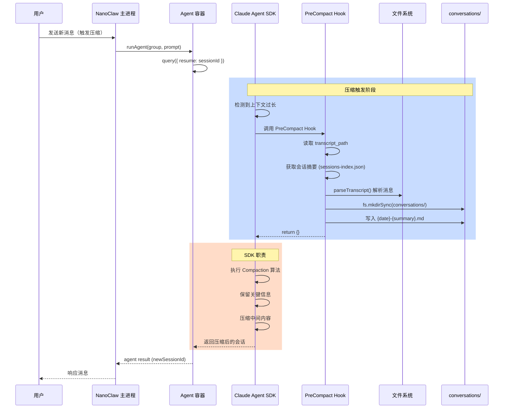

# 对话归档与会话压缩

NanoClaw 通过 PreCompact Hook 机制实现对话归档与会话压缩的协同工作。当 Claude Agent SDK 触发会话压缩时，NanoClaw 先将完整的对话记录归档到 `conversations/` 目录，再由 SDK 执行压缩，确保历史对话不丢失。

## 架构流程图



## PreCompact Hook 机制

### Hook 触发时机

PreCompact Hook 在以下时机被调用：

1. **会话上下文过长**：当 Claude Agent SDK 检测到对话历史超出模型上下文窗口限制时
2. **自动触发**：SDK 内部自动决定需要压缩时
3. **首次归档**：新会话首次达到压缩阈值时

### Hook 接口定义

**位置**: `container/agent-runner/src/index.ts:87-127`

```typescript
function createPreCompactHook(): HookCallback {
  return async (input, _toolUseId, _context) => {
    const preCompact = input as PreCompactHookInput;
    const transcriptPath = preCompact.transcript_path;
    const sessionId = preCompact.session_id;

    // ... 归档逻辑
    return {};  // 返回空对象，不修改 SDK 行为
  };
}
```

### Hook 配置集成

**位置**: `container/agent-runner/src/index.ts:254-256`

```typescript
hooks: {
  PreCompact: [{ hooks: [createPreCompactHook()] }]
}
```

在 `query()` 调用时传递给 Claude Agent SDK：

```typescript
for await (const message of query({
  prompt,
  options: {
    // ... 其他配置
    hooks: {
      PreCompact: [{ hooks: [createPreCompactHook()] }]
    }
  }
})) {
  // 处理消息
}
```

## 对话归档到 conversations/ 目录

### 归档流程

```
1. 检测到 transcript_path
   ↓
2. 读取并解析 transcript 文件
   ↓
3. 从 sessions-index.json 获取会话摘要
   ↓
4. 生成归档文件名：{date}-{summary}.md
   ↓
5. 写入 groups/{name}/conversations/
```

### 归档目录结构

```
groups/
├── main/
│   ├── CLAUDE.md
│   └── conversations/
│       ├── 2025-01-15-weekly-summary.md
│       ├── 2025-01-22-project-planning.md
│       └── 2025-02-03-conversation-0930.md
├── work/
│   ├── CLAUDE.md
│   └── conversations/
│       ├── 2025-01-18-bug-fix.md
│       └── 2025-02-01-api-design.md
└── family/
    ├── CLAUDE.md
    └── conversations/
        └── 2025-01-20-recipe-suggestion.md
```

### 归档文件名生成逻辑

**位置**: `container/agent-runner/src/index.ts:107-115`

```typescript
// 获取会话摘要作为文件名
const summary = getSessionSummary(sessionId, transcriptPath);
const name = summary ? sanitizeFilename(summary) : generateFallbackName();

// 构建日期和文件名
const conversationsDir = '/workspace/group/conversations';
const date = new Date().toISOString().split('T')[0];
const filename = `${date}-${name}.md`;
```

| 情况 | 文件名示例 | 生成方式 |
|------|----------|----------|
| 有会话摘要 | `2025-02-03-weekly-summary.md` | 使用 `summary` 字段 |
| 无会话摘要 | `2025-02-03-conversation-0930.md` | 使用时间戳 fallback |

### 文件名清理函数

**位置**: `container/agent-runner/src/index.ts:129-135`

```typescript
function sanitizeFilename(summary: string): string {
  return summary
    .toLowerCase()
    .replace(/[^a-z0-9]+/g, '-')  // 只保留字母和数字
    .replace(/^-+|-+$/g, '')       // 去除前后连字符
    .slice(0, 50);                 // 限制长度为 50 字符
}
```

### 归档内容格式

**位置**: `container/agent-runner/src/index.ts:173-201`

```typescript
function formatTranscriptMarkdown(messages: ParsedMessage[], title?: string | null): string {
  const lines: string[] = [];

  // 标题和归档时间
  lines.push(`# ${title || 'Conversation'}`);
  lines.push('');
  lines.push(`Archived: ${formatDateTime(now)}`);
  lines.push('');
  lines.push('---');
  lines.push('');

  // 消息列表
  for (const msg of messages) {
    const sender = msg.role === 'user' ? 'User' : 'Andy';
    // 长消息截断为 2000 字符
    const content = msg.content.length > 2000
      ? msg.content.slice(0, 2000) + '...'
      : msg.content;
    lines.push(`**${sender}**: ${content}`);
    lines.push('');
  }

  return lines.join('\n');
}
```

### 归档文件示例

```markdown
# weekly-summary

Archived: Feb 3, 2025 at 10:30 AM

---

**User**: Generate a weekly summary of the project progress

**Andy**: I'll compile a weekly summary for you based on the recent activity...

**User**: Include git commits and any issues resolved

**Andy**: Here's the updated summary with git commit history and issue tracking...
```

## 会话压缩策略

### SDK 职责 vs NanoClaw 职责

| 方面 | NanoClaw 职责 | Claude Agent SDK 职责 |
|------|--------------|----------------------|
| **压缩触发** | ❌ 不涉及 | ✅ 检测上下文长度，自动触发 |
| **压缩算法** | ❌ 不涉及 | ✅ 保留关键信息，压缩中间内容 |
| **历史保存** | ✅ PreCompact Hook 归档 | ❌ 不归档 |
| **新会话 ID** | ✅ 接收并存储 | ✅ 生成并返回 |

### 会话压缩效果对比

#### 压缩前 (Pre-Compaction)

```json
// .claude/session.json (完整对话历史)
{
  "session_id": "ses_abc123",
  "messages": [
    { "role": "user", "content": "如何设置触发词？" },
    { "role": "assistant", "content": "修改 TRIGGER_PATTERN..." },
    { "role": "user", "content": "具体怎么修改？" },
    { "role": "assistant", "content": "在 src/config.ts 中..." },
    // ... 100+ 条消息，总计 50000 tokens
  ]
}
```

#### 压缩后 (Post-Compaction)

```json
// .claude/session.json (保留关键信息)
{
  "session_id": "ses_abc123",
  "messages": [
    {
      "role": "user",
      "content": "[SUMMARY: User asked how to set trigger word, then asked for specific modifications. Andy explained modifying TRIGGER_PATTERN in src/config.ts with examples. User successfully configured the trigger to @Bob]"
    },
    { "role": "user", "content": "现在添加一个新的组" },
    { "role": "assistant", "content": "要在 registered_groups.json 中添加..." }
    // ... 只保留摘要和最近的消息
  ]
}
```

#### 归档文件

```markdown
# trigger-word-configuration

Archived: Feb 3, 2025 at 10:30 AM

---

**User**: 如何设置触发词？
**Andy**: 修改 TRIGGER_PATTERN...

**User**: 具体怎么修改？
**Andy**: 在 src/config.ts 中...

... (完整的 100+ 条消息历史)
```

### 压缩策略特点

1. **关键信息保留**：
   - 最近的 N 条消息（通常 10-20 条）
   - 重要工具调用结果（文件写入、重要决策）
   - 用户和 Agent 的关键交互

2. **中间内容压缩**：
   - 长对话序列被摘要化
   - 重复的澄清问题被移除
   - 辅助性解释被精简

3. **上下文连贯性**：
   - 压缩后仍能理解对话流程
   - 重要的设置和决策被保留
   - Agent 可以继续基于压缩后的上下文工作

## Hook 配置与使用

### 配置 PreCompact Hook

**位置**: `container/agent-runner/src/index.ts:237-257`

```typescript
for await (const message of query({
  prompt,
  options: {
    cwd: '/workspace/group',
    resume: input.sessionId,          // 恢复会话
    allowedTools: [
      'Bash',
      'Read', 'Write', 'Edit', 'Glob', 'Grep',
      'WebSearch', 'WebFetch',
      'mcp__nanoclaw__*'
    ],
    permissionMode: 'bypassPermissions',
    allowDangerouslySkipPermissions: true,
    settingSources: ['project'],
    mcpServers: {
      nanoclaw: ipcMcp
    },
    hooks: {
      PreCompact: [{ hooks: [createPreCompactHook()] }]
    }
  }
})) {
  // ...
}
```

### Hook 输入参数

`PreCompactHookInput` 接口由 Claude Agent SDK 提供：

```typescript
interface PreCompactHookInput {
  session_id: string;        // 会话 ID
  transcript_path: string;   // 完整对话记录的文件路径
  // ... 其他 SDK 提供的参数
}
```

### Hook 返回值

Hook 返回空对象 `{}`，不修改 SDK 的压缩行为：

```typescript
return {};
```

### 自定义 PreCompact Hook

如需自定义归档行为，可以修改 `createPreCompactHook()` 函数：

```typescript
function createPreCompactHook(): HookCallback {
  return async (input, _toolUseId, _context) => {
    const preCompact = input as PreCompactHookInput;
    const transcriptPath = preCompact.transcript_path;
    const sessionId = preCompact.session_id;

    if (!transcriptPath || !fs.existsSync(transcriptPath)) {
      return {};
    }

    // 自定义归档目录
    const customDir = '/workspace/group/archive';  // 替换为自定义路径
    fs.mkdirSync(customDir, { recursive: true });

    // 自定义文件名格式
    const filename = `${sessionId}-${Date.now()}.json`;

    // 自定义格式（如 JSON 而非 Markdown）
    const messages = parseTranscript(content);
    const jsonContent = JSON.stringify(messages, null, 2);

    fs.writeFileSync(path.join(customDir, filename), jsonContent);

    return {};
  };
}
```

## 关键函数解析

### getSessionSummary

**位置**: `container/agent-runner/src/index.ts:61-82`

从 `sessions-index.json` 获取会话摘要作为文件名：

```typescript
function getSessionSummary(sessionId: string, transcriptPath: string): string | null {
  const projectDir = path.dirname(transcriptPath);
  const indexPath = path.join(projectDir, 'sessions-index.json');

  if (!fs.existsSync(indexPath)) {
    return null;
  }

  try {
    const index: SessionsIndex = JSON.parse(fs.readFileSync(indexPath, 'utf-8'));
    const entry = index.entries.find(e => e.sessionId === sessionId);
    if (entry?.summary) {
      return entry.summary;
    }
  } catch (err) {
    log(`Failed to read sessions index: ${err}`);
  }

  return null;
}
```

### parseTranscript

**位置**: `container/agent-runner/src/index.ts:147-171`

解析 transcript 文件为消息列表：

```typescript
function parseTranscript(content: string): ParsedMessage[] {
  const messages: ParsedMessage[] = [];

  for (const line of content.split('\n')) {
    if (!line.trim()) continue;
    try {
      const entry = JSON.parse(line);
      // 解析用户消息
      if (entry.type === 'user' && entry.message?.content) {
        const text = typeof entry.message.content === 'string'
          ? entry.message.content
          : entry.message.content.map((c: { text?: string }) => c.text || '').join('');
        if (text) messages.push({ role: 'user', content: text });
      }
      // 解析助手消息
      else if (entry.type === 'assistant' && entry.message?.content) {
        const textParts = entry.message.content
          .filter((c: { type: string }) => c.type === 'text')
          .map((c: { text: string }) => c.text);
        const text = textParts.join('');
        if (text) messages.push({ role: 'assistant', content: text });
      }
    } catch {
      // 忽略无效行
    }
  }

  return messages;
}
```

## 归档效果示例

### 示例场景：周报生成任务

#### 压缩前状态

- 会话 ID: `ses_weekly_report_001`
- 消息数: 45 条
- 总 tokens: 38,500
- 上下文: 接近模型限制

#### 归档文件

**文件**: `groups/main/conversations/2025-02-03-weekly-report.md`

```markdown
# weekly-report-generation

Archived: Feb 3, 2025 at 2:15 PM

---

**User**: 生成一份周报，包含本周的 git 提交历史
**Andy**: 我会分析 git 历史并生成周报...

**User**: 还要包括未解决的问题
**Andy**: 好的，我会查看 issues...

**User**: 格式要求简洁，每部分不超过 100 字
**Andy**: 明白了，我会控制每部分长度...

... (完整的 45 条消息对话历史)
```

#### 压缩后状态

- 会话 ID: `ses_weekly_report_001` (保持不变)
- 消息数: 8 条 (摘要 + 最近 3 条)
- 总 tokens: 4,200 (减少 89%)
- 上下文: 安全范围内

#### 后续对话能力

用户继续提问时，Agent 仍能理解上下文：

```
User: 下周我打算重构项目，你有什么建议吗？

Andy: 基于之前的周报讨论，我看到你的项目有以下特点...

(成功理解之前讨论的项目状态，归档内容作为背景知识)
```

## 总结

NanoClaw 的对话归档与会话压缩机制实现了以下目标：

1. **历史保存**：通过 PreCompact Hook 在压缩前归档完整对话，确保不丢失任何历史
2. **上下文优化**：SDK 压缩算法有效减少 token 使用，保持对话连贯性
3. **易于浏览**：归档文件使用 Markdown 格式，便于人工查看和管理
4. **自动触发**：无需手动干预，在上下文过长时自动执行
5. **隔离性**：每个 Group 的归档独立存储在各自的 `conversations/` 目录

这种设计让 NanoClaw 在长期使用时既能保持高效的 token 使用率，又能完整保存所有历史对话，方便后续查看和回顾。

## 相关文件

| 文件 | 用途 |
|------|------|
| `container/agent-runner/src/index.ts:87-127` | createPreCompactHook 实现 |
| `container/agent-runner/src/index.ts:129-135` | sanitizeFilename 文件名清理 |
| `container/agent-runner/src/index.ts:137-140` | generateFallbackName 备用命名 |
| `container/agent-runner/src/index.ts:147-171` | parseTranscript 解析消息 |
| `container/agent-runner/src/index.ts:173-201` | formatTranscriptMarkdown 格式化归档 |
| `container/agent-runner/src/index.ts:254-256` | Hook 配置集成 |
| `src/container-runner.ts` | 容器运行器，创建挂载目录 |
| `groups/*/conversations/` | 归档文件存储目录 |
