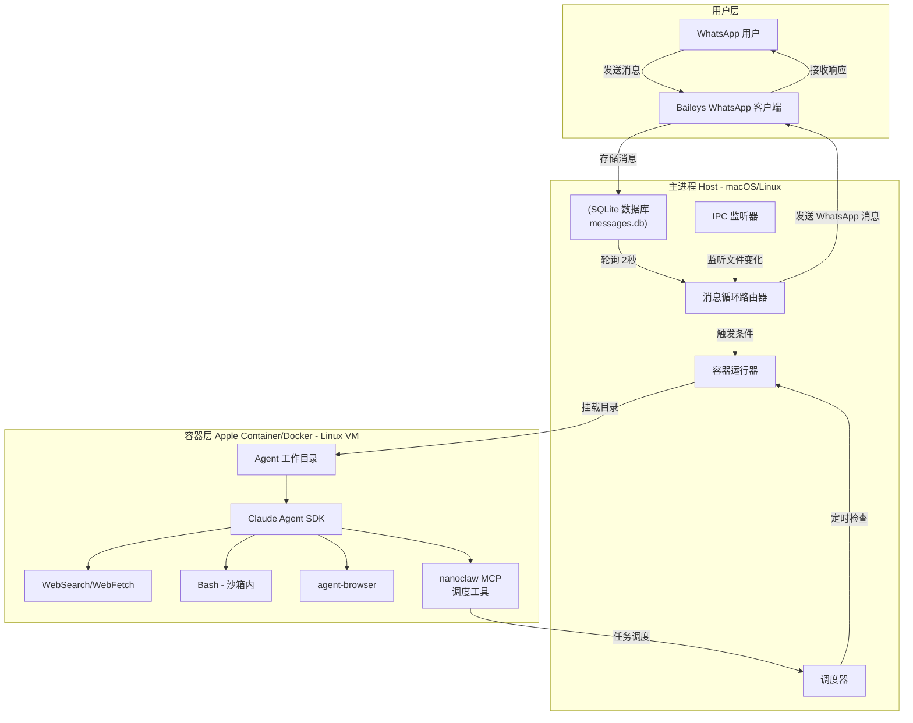

# 项目概览与哲学

## 读者将能够

- 理解 NanoClaw 的核心设计哲学和项目定位
- 掌握 NanoClaw 与 OpenClaw 的核心差异
- 了解项目的技术架构和规模
- 建立 NanoClaw 的整体认知框架

---

## 项目简介

NanoClaw 是一个轻量级的个人 Claude 助手，运行在安全的容器环境中。它通过 WhatsApp 提供交互接口，支持群组隔离记忆、定时任务调度和网络访问等核心功能。

与 OpenClaw 等复杂的多进程系统不同，NanoClaw 专注于**极致简洁**和**安全隔离**，提供了一个可以在 8 分钟内阅读并理解整个代码库的个人助手解决方案。

---

## 为什么创建 NanoClaw

### OpenClaw 的复杂性问题

[OpenClaw](https://github.com/openclaw/openclaw) 是一个令人印象深刻的项目，拥有宏大的愿景。但作者无法安心运行一个自己无法理解的软件来管理自己的生活：

- **52+ 模块**：代码库过于庞大，难以全面理解
- **8 个配置管理文件**：配置分散，学习曲线陡峭
- **45+ 依赖**：依赖关系复杂，维护成本高
- **15 个渠道提供商的抽象**：过度抽象，增加了不必要的复杂性
- **应用级安全**：通过白名单、配对代码等方式实现，而非真正的 OS 级隔离
- **共享内存**：所有内容在一个 Node 进程中运行，缺乏真正的隔离

### NanoClaw 的解决方案

NanoClaw 提供相同的核心功能，但代码库简洁到可以在 8 分钟内理解：

- **单进程**：一个 Node.js 进程处理所有逻辑
- **少量文件**：核心代码只有 9 个源文件
- **真实容器隔离**：Agent 在 Linux 容器中运行，具有文件系统隔离
- **没有权限检查**：通过容器隔离而非应用级权限系统实现安全

---

## 项目规模对比

| 维度 | OpenClaw | NanoClaw | 对比 |
|------|----------|----------|------|
| 源代码模块数 | 52+ | 9 | **-83%** |
| 配置管理文件 | 8 | 最少（仅 1 个 .env） | **-88%** |
| NPM 依赖数 | 45+ | 核心依赖约 15 个 | **-67%** |
| 渠道提供商抽象 | 15 个 | 直接实现 | **-93%** |
| 进程数 | 4-5 个（不同网关） | 1 个 | **-75%** |
| 安全模型 | 应用级权限（白名单、配对码） | OS 级容器隔离 | **更安全** |
| 代码理解时间 | 数小时到数天 | 8 分钟 | **大幅缩短** |

### 源代码文件结构

NanoClaw 的核心代码由 9 个文件组成：

```
src/
├── index.ts              # 主应用：WhatsApp 连接、消息路由、IPC
├── config.ts             # 配置常量（触发模式、路径、间隔）
├── types.ts              # TypeScript 类型定义
├── utils.ts              # 通用工具函数
├── db.ts                 # SQLite 数据库操作
├── whatsapp-auth.ts      # WhatsApp 认证（独立脚本）
├── task-scheduler.ts     # 定时任务调度器
└── container-runner.ts   # 容器运行器（在 Apple Container/Docker 中启动 Agent）

container/agent-runner/
└── src/
    ├── index.ts          # Agent 入口点
    └── ipc-mcp.ts        # MCP 服务器（主机通信）
```

---

## 架构概览

### 整体架构图



### 核心架构组件

| 组件 | 作用 | 技术实现 |
|------|------|----------|
| **WhatsApp 连接** | 连接 WhatsApp，发送/接收消息 | `@whiskeysockets/baileys` |
| **消息存储** | 持久化消息用于轮询 | SQLite (`better-sqlite3`) |
| **消息路由器** | 轮询数据库，触发并路由消息 | 轮询循环 (每 2 秒) |
| **容器运行器** | 在隔离容器中启动 Agent | Apple Container / Docker |
| **调度器** | 执行定时任务 | Cron 表达式 / 间隔 / 一次性 |
| **IPC 机制** | 容器与主机通信 | 文件系统 (data/ipc/) |
| **Agent** | 执行用户请求的 AI | Claude Agent SDK |

---

## 设计哲学

NanoClaw 的设计哲学建立在以下几个核心原则之上，这些原则塑造了整个项目的架构和开发方式。

### 1. 极致简洁

> **Small enough to understand** - 一个进程，少量源文件，没有微服务、消息队列和抽象层。

**核心理念**：代码库应该小到可以被一个人完整阅读和理解。

**实践体现**：
- **单进程架构**：所有功能在一个 Node.js 进程中运行，无需多个守护进程协同
- **最小化抽象**：不引入不必要的抽象层，代码直观易懂
- **文件数量可控**：核心源代码仅 9 个文件，结构清晰

**优势**：
- 降低了理解成本，开发者可以快速掌握整个系统
- 减少了潜在的 bug 来源，更易维护
- 用户可以放心地审查代码，确保没有隐藏的恶意行为

---

### 2. 安全隔离

> **Secure by isolation** - Agent 在 Linux 容器中运行，只能看到显式挂载的内容。Bash 访问是安全的，因为命令在容器内执行，不在宿主机上。

**核心理念**：通过 OS 级容器隔离实现真正的安全，而非应用级权限检查。

**实践体现**：
- **Apple Container (macOS) / Docker**：Agent 运行在轻量级 Linux 虚拟机中
- **文件系统隔离**：Agent 只能访问显式挂载的目录
- **安全的 Bash 访问**：所有命令在容器内执行，无法影响宿主机
- **会话隔离**：每个群组有自己的文件系统和记忆

**与 OpenClaw 的对比**：

| 安全机制 | OpenClaw | NanoClaw |
|----------|----------|----------|
| 实现层级 | 应用级权限 | OS 级容器隔离 |
| 权限控制 | 白名单、配对码 | 文件系统挂载 |
| Bash 安全 | 依赖权限检查 | 容器沙箱隔离 |
| 隔离粒度 | 共享内存 | 完全隔离 |

**优势**：
- 即使 Agent 被攻破，攻击范围也仅限于容器内
- 可以放心地提供 Bash 访问权限给 AI
- 用户可以精确控制 Agent 能访问哪些数据

---

### 3. AI-Native

> **Built for AI collaboration** - 不需要安装向导，Claude Code 引导设置；不需要监控仪表板，询问 Claude 发生了什么；不需要调试工具，描述问题，Claude 修复。

**核心理念**：代码库假设始终有 AI 协作者，因此不需要过度的自我文档化和自我调试能力。

**实践体现**：
- **AI 驱动的设置**：运行 `/setup`，Claude Code 处理所有配置
- **自然语言调试**："为什么调度器没有运行？"、"最近的日志里有什么？"
- **AI 驱动的定制**：直接告诉 Claude Code 你想要什么行为
- **无复杂 UI**：没有监控仪表板、日志浏览器等传统工具

**传统方式 vs AI-Native**：

| 场景 | 传统方式 | AI-Native 方式 |
|------|----------|----------------|
| 初始设置 | 安装向导、配置文件 | 运行 `/setup`，Claude 引导 |
| 监控状态 | 仪表板、指标查询 | "Claude，发生了什么？" |
| 问题排查 | 日志查看工具、调试器 | "为什么这条消息没有回复？" |
| 定制行为 | 编辑配置文件 | "改变触发词为 @Bob" |

**优势**：
- 减少了开发和维护成本（无需编写复杂的 UI）
- 更自然、灵活的交互方式
- 始终保持与最新 AI 能力的同步

---

### 4. Skills over Features

> **Skills over Features** - 贡献者不应向代码库添加功能（如 Telegram 支持），而应贡献技能（如 `/add-telegram`）来转换你的分支。

**核心理念**：通过技能（Skills）实现扩展，避免代码库膨胀，每个用户获得恰好满足需求的干净代码。

**实践体现**：
- **不添加新功能到主代码库**：除安全修复、bug 修复外
- **通过技能扩展**：开发者贡献 `.claude/skills/add-telegram/SKILL.md`
- **用户驱动的定制**：用户 fork 仓库，运行技能来定制
- **干净的最终代码**：每个用户得到的代码只包含他们需要的功能

**传统方式 vs Skills 方式**：

| 扩展需求 | 传统 Feature 方式 | Skills 方式 |
|----------|------------------|------------|
| 添加 Telegram | 提交 PR 添加 Telegram 支持 | 贡献 `/add-telegram` 技能 |
| 切换到 Telegram | 配置文件切换 | 运行 `/convert-to-telegram` |
| 只用 Telegram | 代码中仍保留 WhatsApp | 代码中只有 Telegram |
| 多渠道支持 | 代码同时支持所有渠道 | 用户选择需要的渠道 |

**示例技能流程**：

```bash
# 用户想要 Telegram 支持
git clone https://github.com/gavrielc/nanoclaw.git
cd nanoclaw
claude

# 运行技能
/add-telegram

# Claude Code 会：
# 1. 安装 Telegram 依赖
# 2. 移除 WhatsApp 相关代码（或保留作为额外渠道）
# 3. 添加 Telegram 连接器
# 4. 更新配置和路由
# 5. 更新文档

# 最终得到一个干净的、只支持 Telegram 的代码库
```

**优势**：
- 主代码库保持最小化
- 用户不会被不需要的功能污染
- 社区可以自由贡献各种定制方案
- 技能可以复用和组合

---

## 中文术语对照表

| 英文术语 | 中文解释 | 首次出现章节 |
|----------|----------|--------------|
| OpenClaw | 开源 AI 助手项目，NanoClaw 的参考对象 | 为什么创建 NanoClaw |
| NanoClaw | 本项目名称，轻量级个人 Claude 助手 | 项目简介 |
| Container | 容器，操作系统级别的虚拟化技术 | 为什么创建 NanoClaw |
| Apple Container | Apple 公司开发的轻量级容器运行时（macOS 专用） | 设计哲学 - 安全隔离 |
| Docker | 通用容器运行时平台 | 设计哲学 - 安全隔离 |
| Claude Agent SDK | Anthropic 提供的 AI Agent 开发工具包 | 架构概览 |
| IPC (Inter-Process Communication) | 进程间通信 | 架构概览 |
| Baileys | WhatsApp Web 协议的 Node.js 实现 | 架构概览 |
| SQLite | 轻量级嵌入式关系数据库 | 架构概览 |
| MCP (Model Context Protocol) | 模型上下文协议，用于扩展 AI 能力 | 架构概览 |
| Scheduler | 调度器，负责定时任务的执行 | 架构概览 |
| Polling loop | 轮询循环，定期检查状态或消息的循环机制 | 架构概览 |
| Skill (技能) | Claude Code 的扩展机制，用于定制和扩展功能 | 设计哲学 - Skills over Features |
| Harness | "挽具"或"框架"，指运行和控制 AI 模型的系统 | README |
| ToS (Terms of Service) | 服务条款 | README |
| WSL2 (Windows Subsystem for Linux 2) | Windows 的 Linux 子系统 | README |

---

## 验证检查

完成本章节学习后，读者应该能够回答以下问题：

1. NanoClaw 与 OpenClaw 的核心差异是什么？
2. NanoClaw 的 4 大设计哲学分别是什么？
3. 为什么选择容器隔离而非应用级权限？
4. AI-Native 开发方式与传统方式有何不同？
5. Skills over Features 的优势是什么？

---

## 下一步

本章节建立了 NanoClaw 的整体认知框架。后续章节将深入探讨：

- **01-架构与目录结构详解**：详细的代码组织方式
- **02-消息路由与会话管理**：消息如何流转和会话如何保持
- **03-容器系统深度解析**：容器隔离的实现细节
- **04-调度器机制**：定时任务的工作原理
- **05-安全模型与最佳实践**：安全设计和使用建议
