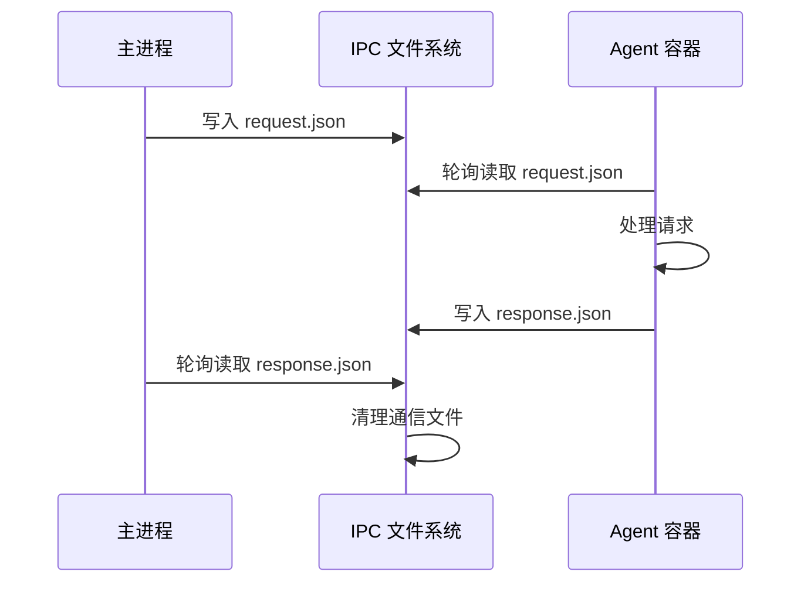
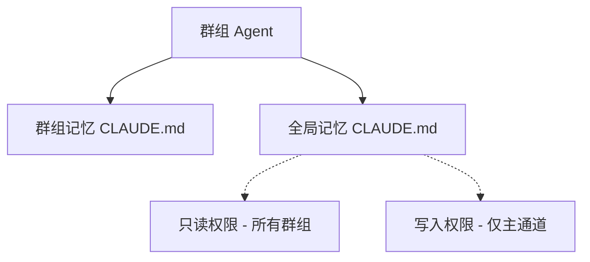
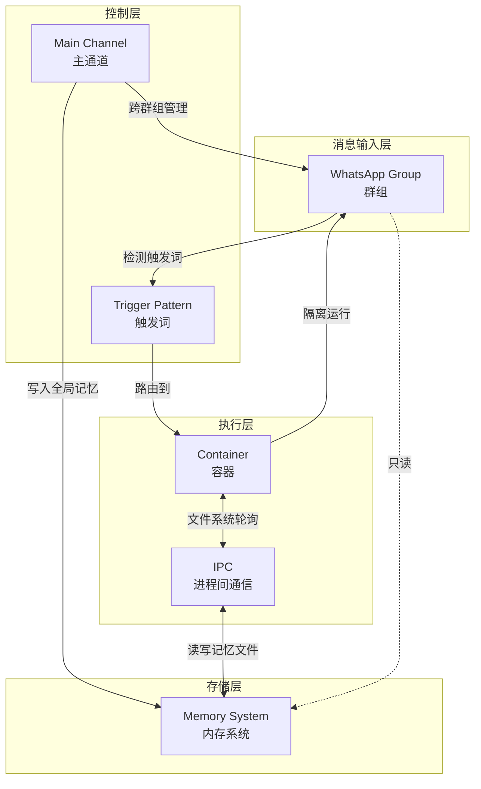

# 核心概念入门

本文档介绍 NanoClaw 的六个核心概念，帮助您理解项目的架构设计思路和工作原理。这些概念是理解后续内容的基础。

---

## 概念一：WhatsApp Group（WhatsApp 群组）

### 定义

**WhatsApp Group** 指的是在 NanoClaw 中注册的 WhatsApp 群组，是系统进行消息路由和隔离的基本单位。每个群组都有独立的内存文件系统，运行在自己的容器沙箱中。

### 类比

想象 WhatsApp Group 就像是不同的"房间"或"办公室"。你可以在不同的房间和 Claude 对话，每个房间的对话记录和文件存储都是独立的。当你在"工作群"对话时，Claude 只能看到这个房间里的记忆，不会看到"家庭群"的内容。

### 核心特性

- **独立隔离**：每个群组拥有独立的 `CLAUDE.md` 记忆文件和文件系统
- **容器沙箱**：群组的 Agent 在隔离的容器中运行，只能访问该群组的挂载目录
- **自动注册**：通过主通道（Main Channel）注册新群组后自动创建对应的目录和配置

### 技术实现

- 群组注册信息存储在 `data/registered_groups.json`
- 每个群组的专属目录位于 `groups/{群组名}/`
- 消息路由通过轮询 SQLite 数据库实现

---

## 概念二：Main Channel（主通道）

### 定义

**Main Channel** 是一个特殊的 WhatsApp 群组（通常是用户自己的自我对话/自聊），具有管理员权限，可以跨群组执行管理操作。

### 类比

Main Channel 就像是"总控制室"或"管理员办公室"。这里是你作为系统管理员的地方，你可以从这里查看所有群组的状态、管理所有计划任务、修改全局配置。其他群组只能看到自己的内容，但主通道可以看到所有群组。

### 核心特性

- **全局管理**：可以列出、暂停、恢复、取消任何群组的计划任务
- **全局记忆写入**：可以写入根目录的 `CLAUDE.md`，所有群组都可以读取
- **群组管理**：可以添加新群组、配置群组挂载目录
- **完整权限**：拥有普通群组没有的管理权限

### 技术实现

- 默认群组名为 `main`（在 `src/config.ts` 中配置）
- 对应目录 `groups/main/`
- 在路由逻辑中具有特殊权限标识

---

## 概念三：Trigger Pattern（触发词模式）

### 定义

**Trigger Pattern** 是用来触发 AI 助手响应的消息前缀模式。只有以指定前缀开头的消息才会被处理为需要 AI 回应的指令。

### 类比

Trigger Pattern 就像是"呼叫名字"。在一个房间里，只有当你喊出某人的名字（比如"@Andy"）时，那个人才会回应。你说的其他内容只是普通聊天，不会触发特殊处理。这就像餐厅里的服务员，只有你喊"服务员"时他才会过来服务。

### 核心特性

- **可配置**：通过 `ASSISTANT_NAME` 环境变量设置（默认为 "Andy"）
- **正则表达式**：`^@{ASSISTANT_NAME}\b`，匹配消息开头，不区分大小写
- **选择性处理**：只有符合模式的消息才会路由到 Agent 容器处理
- **前缀移除**：触发词会被移除后再发送给 Agent

### 技术实现

```typescript
// src/config.ts
export const TRIGGER_PATTERN = new RegExp(`^@${escapeRegex(ASSISTANT_NAME)}\\b`, 'i');
```

### 示例

| 消息内容 | 是否触发 | 说明 |
|---------|---------|------|
| `@Andy 帮我写一份报告` | ✅ 触发 | 以 `@Andy` 开头 |
| `andy 帮我写一份报告` | ✅ 触发 | 不区分大小写 |
| `@Andy你好` | ✅ 触发 | 不需要空格 |
| `请Andy帮我` | ❌ 不触发 | 不在开头 |
| `@Andy是个人名` | ❌ 不触发 | `\\b` 边界匹配，`@Andy是` 不符合 |

---

## 概念四：Container（容器）

### 定义

**Container** 是指隔离的 Linux 容器环境（Apple Container 或 Docker），每个 Agent 都在独立的容器中运行。容器提供文件系统隔离，确保 Agent 只能访问明确挂载的目录。

### 类比

Container 就像是"安全工作间"或"隔离实验室"。当你需要让 Claude 执行一些危险操作（比如运行 Bash 命令）时，它不是在你的电脑上直接操作，而是进入一个隔离的工作间。这个工作间只有指定的工具和文件，即使它把工作间拆了，也不会影响你的电脑。

### 核心特性

- **真实隔离**：基于操作系统层面的容器隔离，而非应用层权限检查
- **按需创建**：每次 Agent 调用都创建新容器，用完销毁
- **文件系统挂载**：只挂载必要的目录（群组目录、全局记忆等）
- **安全执行**：Bash 命令在容器内运行，不会影响宿主机
- **可选运行时**：支持 Apple Container（macOS 优化）和 Docker（跨平台）

### 技术实现

- 通过 `src/container-runner.ts` 管理容器生命周期
- 挂载路径包括：群组目录、全局 CLAUDE.md、store 目录、MCP 配置
- 容器镜像：`nanoclaw-agent:latest`
- 超时限制：默认 5 分钟（可配置）

---

## 概念五：IPC（Inter-Process Communication，进程间通信）

### 定义

**IPC** 是 NanoClaw 中的主进程和容器内 Agent 之间通信的机制，通过文件系统轮询实现。

### 类比

IPC 文件系统就像是"信箱"或"公告板"。主进程和 Agent 就像是两个办公室里的人，他们不直接对话，而是通过一个共享的公告板传递信息。主进程把请求写在公告板上，Agent 定期来看有没有新任务，完成后把结果写回公告板，主进程再定期来取结果。

### 核心特性

- **基于文件系统**：通过共享目录下的文件进行通信
- **轮询机制**：双方定期检查文件更新（1 秒间隔）
- **简单可靠**：无需复杂的消息队列或网络协议
- **输出限制**：容器输出限制为 10MB，防止内存溢出

### 技术实现

- IPC 目录：`groups/{群组名}/ipc/`
- 请求文件：`request.json`（主进程写入，Agent 读取）
- 响应文件：`response.json`（Agent 写入，主进程读取）
- 轮询间隔：`IPC_POLL_INTERVAL = 1000` 毫秒

### 工作流程



---

## 概念六：Memory System（内存系统）

### 定义

**Memory System** 是 NanoClaw 的持久化记忆机制，通过 Markdown 文件存储对话历史、上下文信息和个人偏好。每个群组都有独立的记忆文件，同时存在全局共享记忆。

### 类比

Memory System 就像是"笔记本"或"个人日记"。每个群组都有自己的笔记本，记录与这个群组的对话历史和重要信息。除此之外，还有一个"公共笔记本"（全局记忆），记录所有群组共享的知识，但只有主通道可以写入这个公共笔记本。

### 核心特性

- **双层结构**：群组级记忆（`groups/{群组名}/CLAUDE.md`）+ 全局记忆（`groups/CLAUDE.md`）
- **Markdown 格式**：使用人类可读的 Markdown 格式存储
- **自动继承**：Agent 运行时自动读取两个记忆文件
- **写入权限控制**：只有主通道可以写入全局记忆

### 技术实现

- **群组记忆**：`groups/{群组名}/CLAUDE.md` - 该群组专属记忆
- **全局记忆**：`groups/CLAUDE.md` - 所有群组可读，仅主通道可写
- **会话管理**：通过 Claude Agent SDK 实现会话保持和上下文压缩

### 记忆层次



---

## 概念关系图

以下是六个核心概念之间的关系：



---

## 传统应用 vs AI-Native 应用对比

NanoClaw 是典型的 AI-Native 应用，与传统应用在设计理念上有显著差异：

| 维度 | 传统应用 | AI-Native 应用（NanoClaw） |
|------|---------|---------------------------|
| **配置方式** | 配置文件（YAML/JSON/INI） | 直接修改代码，通过 AI 助手定制 |
| **安装向导** | 详细的安装向导和设置界面 | `/setup` 由 Claude Code 引导完成 |
| **调试工具** | 日志分析器、调试器、监控面板 | 直接问 Claude "为什么 scheduler 没运行？" |
| **文档** | 详细的用户手册和 API 文档 | 代码即文档，小到可以 8 分钟读懂 |
| **自定义** | 配置选项 + 插件系统 | Fork + AI 助手修改代码 |
| **安全模型** | 应用层权限检查（allowlist） | 操作系统层容器隔离 |
| **监控** | 仪表板、指标、告警系统 | 自然语言查询状态 |
| **错误处理** | 详细的错误日志和堆栈跟踪 | 描述问题，Claude 定位并修复 |
| **扩展方式** | 添加功能模块到主代码库 | Skills（代码转换脚本） |
| **用户假设** | 用户会阅读文档、配置参数 | 用户有 AI 协作伙伴辅助 |
| **代码复杂度** | 多层抽象、支持多种场景 | 专注单一用户需求，最小化代码 |
| **部署** | 复杂的部署流程和环境配置 | 单 Node.js 进程，launchd 管理 |

---

## 中文术语对照表

| 英文术语 | 中文术语 | 首次出现位置 |
|---------|---------|-------------|
| WhatsApp Group | WhatsApp 群组 | 概念一 |
| Main Channel | 主通道 | 概念二 |
| Trigger Pattern | 触发词模式 | 概念三 |
| Container | 容器 | 概念四 |
| IPC (Inter-Process Communication) | 进程间通信 | 概念五 |
| Memory System | 内存系统 | 概念六 |
| AI-Native | AI 原生 | 本节对比表 |
| Agent | 代理 | 全文 |
| Claude Agent SDK | Claude Agent 开发工具包 | 概念四 |
| Apple Container | Apple 容器技术 | 概念四 |
| Docker | Docker 容器技术 | 概念四 |
| SQLite | SQLite 数据库 | 概念一 |
| MCP (Model Context Protocol) | 模型上下文协议 | 概念四 |
| Skills | 技能 | 概念六 |

---

## 下一步

理解了这些核心概念后，建议继续阅读：

- **[04-架构设计详解](./04-架构设计详解.md)** - 深入了解 NanoClaw 的架构决策和设计模式
- **[05-关键模块分析](./05-关键模块分析.md)** - 逐个分析核心模块的代码实现
- **[06-安全模型](./06-安全模型.md)** - 了解容器隔离和安全机制
