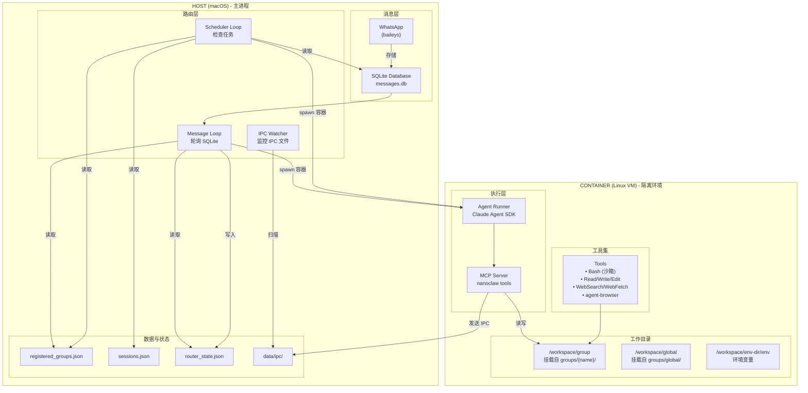
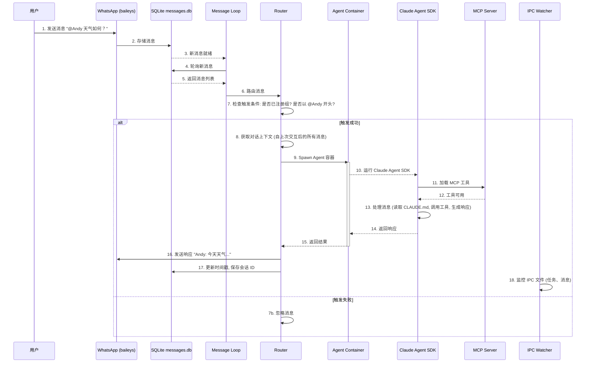
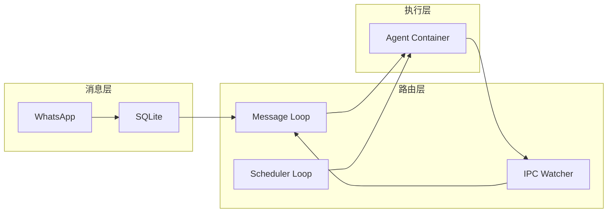
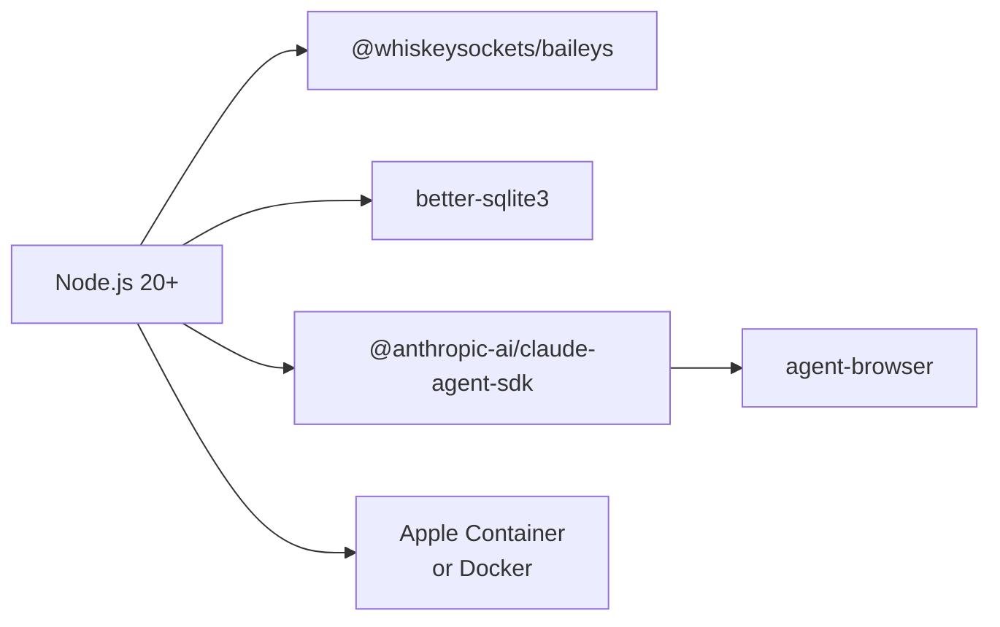

# 整体架构与数据流

本文档介绍 NanoClaw 的整体架构设计，包括 Host 与 Container 的分离架构、数据流向以及三层架构模型。

---

## 目录

1. [架构概览](#架构概览)
2. [Host vs Container 架构](#host-vs-container-架构)
3. [数据流详解](#数据流详解)
4. [三层架构](#三层架构)
5. [技术栈](#技术栈)

---

## 架构概览

NanoClaw 采用单 Node.js 进程架构，将消息路由与 Agent 执行分离到不同的运行环境：

- **Host (macOS)**：负责 WhatsApp 连接、消息存储、路由逻辑、任务调度
- **Container (Linux VM)**：负责 Agent 执行、文件操作、网络访问、浏览器自动化

这种分离设计确保了安全性——Agent 运行在隔离的容器中，只能访问明确挂载的目录。

---

## Host vs Container 架构

以下图展示了 Host 和 Container 之间的职责划分与交互关系：

### 关键设计决策

| 方面 | Host | Container |
|------|------|-----------|
| **运行环境** | macOS | Linux VM (Apple Container/Docker) |
| **职责** | 连接、路由、调度 | 执行、计算、工具调用 |
| **网络访问** | 无（通过 WhatsApp） | 完全访问（WebSearch、浏览器） |
| **文件系统** | 完整访问 | 仅挂载目录 |
| **安全级别** | 信任边界 | 隔离沙箱 |

---

## 数据流详解

### 消息处理流程

当用户在 WhatsApp 中发送消息时，数据依次经过以下处理阶段：

### 关键步骤说明

| 步骤 | 描述 | 涉及组件 |
|------|------|---------|
| 1-2 | 消息接收与存储 | baileys, SQLite |
| 3-5 | 轮询机制 | Message Loop (每 2 秒) |
| 6-7 | 路由过滤 | Router (检查注册组、触发词) |
| 8 | 对话上下文重构 | Router (获取自上次交互后的所有消息) |
| 9-15 | Agent 执行 | Container, Claude Agent SDK, MCP |
| 16-17 | 响应发送与状态更新 | WhatsApp, SQLite |
| 18 | IPC 监控 | IPC Watcher (每 1 秒) |

---

## 三层架构

NanoClaw 的架构可以抽象为三个层次，每层承担明确的职责：

### 消息层 (Message Layer)

**职责**：处理外部通信连接

- **WhatsApp 连接**：通过 baileys 库连接到 WhatsApp Web 协议
- **消息存储**：将接收到的消息存储到 SQLite 数据库
- **消息发送**：将 Agent 响应通过 WhatsApp 发送给用户

**关键文件**：
- `src/index.ts` - WhatsApp 连接和消息监听
- `src/db.ts` - SQLite 数据库操作

**接口边界**：
- 输入：WhatsApp 消息流
- 输出：SQLite 消息记录

### 路由层 (Routing Layer)

**职责**：消息调度和状态管理

- **消息轮询**：定期从 SQLite 读取新消息
- **触发检测**：检查消息是否满足触发条件（已注册组 + 触发词）
- **对话重构**：获取自上次 Agent 交互以来的完整对话上下文
- **会话管理**：维护每个组的会话 ID，实现对话连续性
- **任务调度**：定期检查并执行定时任务
- **IPC 监控**：监控容器生成的 IPC 文件（消息、任务请求）

**关键文件**：
- `src/index.ts` - Message Loop, Scheduler Loop, IPC Watcher
- `src/task-scheduler.ts` - 任务调度逻辑
- `src/container-runner.ts` - 容器生成与运行

**接口边界**：
- 输入：SQLite 消息、任务定义、IPC 文件
- 输出：容器启动指令、WhatsApp 发送指令、状态更新

### 执行层 (Execution Layer)

**职责**：在隔离环境中执行 Agent

- **Agent 运行**：使用 Claude Agent SDK 运行 Claude 模型
- **工具调用**：提供 Bash、文件操作、网络访问、浏览器自动化等工具
- **MCP 服务**：提供 NanoClaw 特定工具（调度、群组管理）
- **文件系统**：访问挂载的组目录，读写 CLAUDE.md 等文件
- **IPC 通信**：通过文件系统与 Host 通信

**关键文件**：
- `container/agent-runner/src/index.ts` - Agent 入口点
- `container/agent-runner/src/ipc-mcp.ts` - MCP 服务器实现

**接口边界**：
- 输入：提示词、会话 ID、挂载目录
- 输出：响应文本、IPC 文件（消息、任务请求）

### 层次间交互

---

## 技术栈

| 组件 | 技术 | 版本/说明 | 用途 |
|------|------|----------|------|
| **运行时** | Node.js | 20+ | 主进程运行环境 |
| **WhatsApp 连接** | @whiskeysockets/baileys | 6.x | 连接 WhatsApp Web 协议，收发消息 |
| **消息存储** | better-sqlite3 | 9.x | SQLite 数据库，存储消息和任务 |
| **容器运行时** | Apple Container | - | macOS 平台轻量级 Linux VM |
| **容器运行时** | Docker | - | Linux 平台标准容器运行时 |
| **Agent 框架** | @anthropic-ai/claude-agent-sdk | 0.2.29 | 运行 Claude 模型，管理工具和会话 |
| **浏览器自动化** | agent-browser | - | 基于 Chromium 的网页交互 |
| **任务调度** | cron-parser | 4.x | 解析 Cron 表达式 |
| **类型系统** | TypeScript | 5.x | 类型安全开发 |
| **日志** | pino | 8.x | 结构化日志记录 |
| **进程管理** | launchd | - | macOS 服务管理器 |

### 依赖关系图

---

## 设计原则

### 1. 简洁性 (Simplicity)

- 单进程架构，无微服务、无消息队列
- 文件系统作为 IPC 机制，无需复杂的通信协议
- 最小化配置，通过代码修改实现定制

### 2. 安全性 (Security)

- OS 级别的隔离：Agent 运行在 Linux 容器中
- 文件系统隔离：只能访问明确挂载的目录
- Bash 安全：命令在容器中执行，不影响 Host

### 3. 隔离性 (Isolation)

- 每个 Agent 运行在独立容器实例中
- 每个组有独立的文件系统和内存 (CLAUDE.md)
- 主组作为管理控制点，其他组完全隔离

### 4. 可维护性 (Maintainability)

- 代码库足够小，可快速理解和修改
- 清晰的三层架构，职责分明
- 使用标准技术栈，降低学习曲线

---

## 相关文档

- [docs/SPEC.md](../docs/SPEC.md) - 完整技术规范
- [docs/REQUIREMENTS.md](../docs/REQUIREMENTS.md) - 架构决策记录
- [README.md](../README.md) - 用户文档
