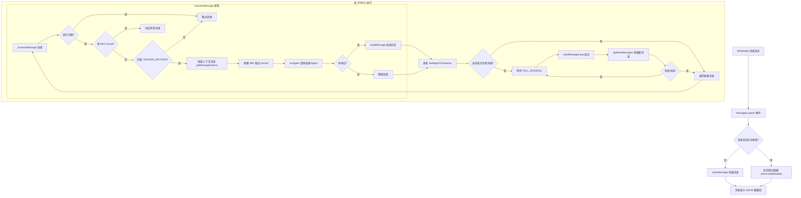

# 消息路由机制

NanoClaw 的消息路由机制负责将 WhatsApp 消息分发到相应的 Agent 容器中进行处理。本文档详细解析路由逻辑、触发模式匹配、Main Channel 与其他 Groups 的差异，以及轮询循环工作原理。

## 路由流程图



## 核心组件

### 1. 消息存储层 (src/db.ts)

#### getNewMessages 函数

**位置**: `src/db.ts:166-186`

此函数从 SQLite 数据库中检索所有已注册组的新消息：

```typescript
export function getNewMessages(jids: string[], lastTimestamp: string, botPrefix: string): { messages: NewMessage[]; newTimestamp: string }
```

**关键逻辑**:
- 接受已注册组 JID 列表、上次处理时间戳和机器人名称前缀
- SQL 查询过滤条件：
  - `timestamp > ?` - 获取上次处理后的消息
  - `chat_jid IN (${placeholders})` - 仅限已注册组
  - `content NOT LIKE ?` - 排除机器人自己的消息（通过内容前缀）
- 按时间戳排序返回结果
- 计算并返回最新的时间戳用于下次查询

#### getMessagesSince 函数

**位置**: `src/db.ts:188-197`

此函数获取特定聊天自上次 Agent 交互以来的所有消息：

```typescript
export function getMessagesSince(chatJid: string, sinceTimestamp: string, botPrefix: string): NewMessage[]
```

**关键逻辑**:
- 查询特定 JID 的消息
- 时间戳过滤：仅获取 `sinceTimestamp` 之后的消息
- 排除机器人自己的消息（`content NOT LIKE '${botPrefix}:%'`）
- 按时间戳排序返回

### 2. 路由处理层 (src/index.ts)

#### processMessage 函数

**位置**: `src/index.ts:139-177`

这是消息路由的核心函数，决定每条消息是否以及如何被处理：

```typescript
async function processMessage(msg: NewMessage): Promise<void>
```

**详细解析**:

```typescript
// 第 140-141 行：验证消息来源组
const group = registeredGroups[msg.chat_jid];
if (!group) return;  // 未注册的组直接跳过

// 第 143-144 行：提取内容和判断是否为主组
const content = msg.content.trim();
const isMainGroup = group.folder === MAIN_GROUP_FOLDER;

// 第 148 行：路由决策逻辑
// 主组响应所有消息；其他组需要触发前缀
if (!isMainGroup && !TRIGGER_PATTERN.test(content)) return;
```

**路由决策树**:

| 组类型 | 消息内容 | 是否处理 |
|--------|----------|----------|
| Main Group | 任意内容 | ✅ 是 |
| 其他 Groups | 匹配 `@Andy` | ✅ 是 |
| 其他 Groups | 不匹配 `@Andy` | ❌ 否 |

**上下文构建** (src/index.ts:151-163):

```typescript
// 第 151-152 行：获取上下文消息
const sinceTimestamp = lastAgentTimestamp[msg.chat_jid] || '';
const missedMessages = getMessagesSince(msg.chat_jid, sinceTimestamp, ASSISTANT_NAME);

// 第 154-162 行：构建 XML 格式的 prompt
const lines = missedMessages.map(m => {
  const escapeXml = (s: string) => s
    .replace(/&/g, '&amp;')
    .replace(/</g, '&lt;')
    .replace(/>/g, '&gt;')
    .replace(/"/g, '&quot;');
  return `<message sender="${escapeXml(m.sender_name)}" time="${m.timestamp}">${escapeXml(m.content)}</message>`;
});
const prompt = `<messages>\n${lines.join('\n')}\n</messages>`;
```

**Agent 调用和响应** (src/index.ts:165-176):

```typescript
// 第 165 行：如果 prompt 为空则返回
if (!prompt) return;

// 第 167 行：记录处理日志
logger.info({ group: group.name, messageCount: missedMessages.length }, 'Processing message');

// 第 169-171 行：设置输入状态，调用 Agent，恢复状态
await setTyping(msg.chat_jid, true);
const response = await runAgent(group, prompt, msg.chat_jid);
await setTyping(msg.chat_jid, false);

// 第 173-176 行：发送响应并更新时间戳
if (response) {
  lastAgentTimestamp[msg.chat_jid] = msg.timestamp;
  await sendMessage(msg.chat_jid, `${ASSISTANT_NAME}: ${response}`);
}
```

### 3. 轮询循环 (Polling Loop)

#### startMessageLoop 函数

**位置**: `src/index.ts:564-590`

这是消息路由的主循环，持续轮询数据库中的新消息：

```typescript
async function startMessageLoop(): Promise<void>
```

**工作原理**:

```typescript
// 第 565 行：启动日志
logger.info(`NanoClaw running (trigger: @${ASSISTANT_NAME})`);

// 第 567 行：无限循环
while (true) {
  try {
    // 第 570 行：获取所有已注册组的新消息
    const jids = Object.keys(registeredGroups);
    const { messages } = getNewMessages(jids, lastTimestamp, ASSISTANT_NAME);

    // 第 572 行：记录新消息数量
    if (messages.length > 0) logger.info({ count: messages.length }, 'New messages');

    // 第 573-584 行：顺序处理每条消息
    for (const msg of messages) {
      try {
        await processMessage(msg);
        // 第 577-578 行：成功后更新时间戳（至少一次语义）
        lastTimestamp = msg.timestamp;
        saveState();
      } catch (err) {
        // 第 579-583 行：处理失败，停止当前批次
        logger.error({ err, msg: msg.id }, 'Error processing message, will retry');
        break;  // 失败的消息将在下次循环中重试
      }
    }
  } catch (err) {
    // 第 585-586 行：捕获循环级别的错误
    logger.error({ err }, 'Error in message loop');
  }
  // 第 588 行：等待轮询间隔后继续
  await new Promise(resolve => setTimeout(resolve, POLL_INTERVAL));
}
```

**轮询特性**:

| 特性 | 说明 |
|------|------|
| 轮询间隔 | `POLL_INTERVAL = 2000ms` (2 秒) |
| 至少一次语义 | 成功处理后更新时间戳 |
| 批次失败处理 | 失败时中断当前批次，下次重试 |
| 顺序处理 | 按时间戳顺序处理消息 |

## TRIGGER_PATTERN 触发模式

### 定义位置

**文件**: `src/config.ts:28`

```typescript
export const TRIGGER_PATTERN = new RegExp(`^@${escapeRegex(ASSISTANT_NAME)}\\b`, 'i');
```

### 正则表达式解析

| 模式 | 含义 |
|------|------|
| `^` | 匹配字符串开头 |
| `@` | 必须以 @ 符号开始 |
| `${ASSISTANT_NAME}` | 助手名称（默认为 "Andy"） |
| `\\b` | 单词边界，确保完整匹配 |
| `i` | 不区分大小写 |

### 匹配示例

| 输入 | 是否匹配 | 原因 |
|------|----------|------|
| `@Andy help` | ✅ 是 | 完全匹配 |
| `@andy help` | ✅ 是 | 大小写不敏感 |
| `@AndyBot help` | ❌ 否 | 单词边界不匹配 |
| `hello @Andy` | ❌ 否 | 不在开头 |
| `@Andy` | ✅ 是 | 独立名称也匹配 |

### escapeRegex 函数

**位置**: `src/config.ts:24-26`

```typescript
function escapeRegex(str: string): string {
  return str.replace(/[.*+?^${}()|[\]\\]/g, '\\$&');
}
```

此函数转义正则表达式中的特殊字符，防止助手名称中的特殊字符被解释为正则元字符。

## Main Channel 与其他 Groups 的路由差异

### 组注册信息

**位置**: `src/index.ts:68-77`

每个已注册组都有以下信息：
- `jid`: WhatsApp 聊天标识符
- `name`: 组名称
- `folder`: 文件夹名称（主组为 "main"）
- `trigger`: 自定义触发模式（可选）
- `containerConfig`: 容器配置（可选）

### 路由差异对比

**关键代码**: `src/index.ts:144-148`

```typescript
const isMainGroup = group.folder === MAIN_GROUP_FOLDER;

// Main group responds to all messages; other groups require trigger prefix
// 主组响应所有消息，其他组需要触发前缀
if (!isMainGroup && !TRIGGER_PATTERN.test(content)) return;
```

| 特性 | Main Channel | 其他 Groups |
|------|--------------|--------------|
| 文件夹名 | `main` | 自定义（如 `work`, `family`） |
| 触发要求 | 无，响应所有消息 | 必须匹配 `@Andy` |
| 权限范围 | 可以管理所有组 | 仅能管理自己组 |
| IPC 消息发送 | 可发送到任何组 | 仅能发送到自己的组 |
| 上下文隔离 | 完全隔离自己的记忆 | 完全隔离自己的记忆 |

### 设计意图

- **Main Channel**：作为管理员控制台，用于系统级管理、跨组操作、任务调度等
- **其他 Groups**：作为特定用途的聊天组，需要明确的触发才能避免打扰正常对话

## 数据流程

### 消息生命周期

```
WhatsApp 收到消息
  ↓
baileys 触发 messages.upsert 事件
  ↓
storeMessage/storeChatMetadata 写入 SQLite
  ↓
Polling Loop (每 2000ms)
  ↓
getNewMessages 查询新消息
  ↓
processMessage 路由决策
  ↓
getMessagesSince 获取上下文
  ↓
runAgent 调用容器
  ↓
Agent 返回响应
  ↓
sendMessage 发送到 WhatsApp
  ↓
更新 lastAgentTimestamp
```

### 状态管理

**位置**: `src/index.ts:53-66`

```typescript
// 加载状态
function loadState(): void {
  const statePath = path.join(DATA_DIR, 'router_state.json');
  const state = loadJson<{ last_timestamp?: string; last_agent_timestamp?: Record<string, string> }>(statePath, {});
  lastTimestamp = state.last_timestamp || '';           // 全局最后处理时间戳
  lastAgentTimestamp = state.last_agent_timestamp || {}; // 每组最后 Agent 交互时间戳
  sessions = loadJson(path.join(DATA_DIR, 'sessions.json'), {});
  registeredGroups = loadJson(path.join(DATA_DIR, 'registered_groups.json'), {});
}

// 保存状态
function saveState(): void {
  saveJson(path.join(DATA_DIR, 'router_state.json'), {
    last_timestamp: lastTimestamp,
    last_agent_timestamp: lastAgentTimestamp
  });
  saveJson(path.join(DATA_DIR, 'sessions.json'), sessions);
}
```

**状态变量说明**:

| 变量 | 作用 | 更新时机 |
|------|------|----------|
| `lastTimestamp` | 全局最后处理的数据库时间戳 | 消息处理成功后 (src/index.ts:577) |
| `lastAgentTimestamp[msg.chat_jid]` | 每个组最后 Agent 交互时间戳 | 成功发送响应后 (src/index.ts:174) |

### 时间戳的双重用途

1. **`lastTimestamp`**: 用于 `getNewMessages`，防止重复处理已处理过的消息
2. **`lastAgentTimestamp[msg.chat_jid]`**: 用于 `getMessagesSince`，为 Agent 提供完整的对话上下文

## 关键设计决策

### 1. 轮询 vs 事件驱动

NanoClaw 使用轮询而非事件驱动的原因：
- **可靠性**：确保不丢失消息（数据库持久化）
- **上下文完整性**：可以获取完整的消息历史，不仅仅是单条消息
- **简单性**：无需复杂的事件队列管理
- **至少一次语义**：通过时间戳跟踪保证消息不丢失

### 2. 批次失败处理

```typescript
try {
  await processMessage(msg);
  lastTimestamp = msg.timestamp;
  saveState();
} catch (err) {
  logger.error({ err, msg: msg.id }, 'Error processing message, will retry');
  break;  // 停止处理当前批次
}
```

当一条消息处理失败时：
- 中断当前批次的处理
- 不更新时间戳
- 失败的消息将在下次循环中重新获取
- 避免批量消息全部因一条失败而被跳过

### 3. 上下文隔离

每个组的上下文完全隔离：
- 独立的 `lastAgentTimestamp`
- 独立的文件系统挂载（`groups/{folder}/`）
- 独立的会话状态
- 独立的 Agent 容器实例

## 相关文件

| 文件 | 职责 |
|------|------|
| `src/index.ts:139-177` | processMessage 路由处理 |
| `src/index.ts:564-590` | startMessageLoop 轮询循环 |
| `src/index.ts:543-561` | messages.upsert 消息接收 |
| `src/config.ts:28` | TRIGGER_PATTERN 定义 |
| `src/db.ts:166-186` | getNewMessages 查询 |
| `src/db.ts:188-197` | getMessagesSince 查询 |
| `src/db.ts:147-164` | storeMessage 存储 |

## 总结

NanoClaw 的消息路由机制采用轮询模式，通过 SQLite 数据库作为消息中间层，实现了可靠的至少一次消息投递。Main Channel 和其他 Groups 的差异化路由设计，既保证了管理员控制台的便利性，又避免了在其他群组中的打扰。上下文隔离机制确保了每个组的独立性和安全性。
