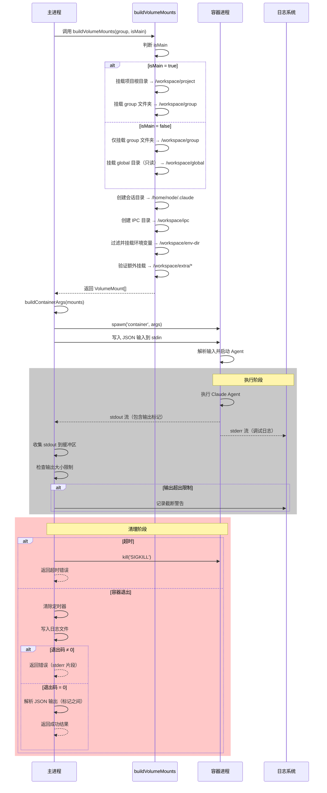

# 容器隔离系统

## 概述

NanoClaw 使用 Apple Container（或 Docker）为每个 Group 提供文件系统隔离。每个容器只能访问明确挂载的目录，确保即使 Bash 命令在容器中执行，也不会访问主机上未授权的文件系统。

## 核心组件

### Volume Mounts 构建

`buildVolumeMounts` 函数（`src/container-runner.ts:63-160`）负责构建每个容器所需的卷挂载配置。

```typescript
// src/container-runner.ts:63-160
function buildVolumeMounts(group: RegisteredGroup, isMain: boolean): VolumeMount[] {
  const mounts: VolumeMount[] = [];
  const homeDir = getHomeDir();
  const projectRoot = process.cwd();

  if (isMain) {
    // Main gets the entire project root mounted
    mounts.push({
      hostPath: projectRoot,
      containerPath: '/workspace/project',
      readonly: false
    });

    // Main also gets its group folder as the working directory
    mounts.push({
      hostPath: path.join(GROUPS_DIR, group.folder),
      containerPath: '/workspace/group',
      readonly: false
    });
  } else {
    // Other groups only get their own folder
    mounts.push({
      hostPath: path.join(GROUPS_DIR, group.folder),
      containerPath: '/workspace/group',
      readonly: false
    });

    // Global memory directory (read-only for non-main)
    // Apple Container only supports directory mounts, not file mounts
    const globalDir = path.join(GROUPS_DIR, 'global');
    if (fs.existsSync(globalDir)) {
      mounts.push({
        hostPath: globalDir,
        containerPath: '/workspace/global',
        readonly: true
      });
    }
  }

  // Per-group Claude sessions directory (isolated from other groups)
  // Each group gets their own .claude/ to prevent cross-group session access
  const groupSessionsDir = path.join(DATA_DIR, 'sessions', group.folder, '.claude');
  fs.mkdirSync(groupSessionsDir, { recursive: true });
  mounts.push({
    hostPath: groupSessionsDir,
    containerPath: '/home/node/.claude',
    readonly: false
  });

  // Per-group IPC namespace: each group gets its own IPC directory
  // This prevents cross-group privilege escalation via IPC
  const groupIpcDir = path.join(DATA_DIR, 'ipc', group.folder);
  fs.mkdirSync(path.join(groupIpcDir, 'messages'), { recursive: true });
  fs.mkdirSync(path.join(groupIpcDir, 'tasks'), { recursive: true });
  mounts.push({
    hostPath: groupIpcDir,
    containerPath: '/workspace/ipc',
    readonly: false
  });

  // Environment file directory (workaround for Apple Container -i env var bug)
  // Only expose specific auth variables needed by Claude Code, not the entire .env
  const envDir = path.join(DATA_DIR, 'env');
  fs.mkdirSync(envDir, { recursive: true });
  const envFile = path.join(projectRoot, '.env');
  if (fs.existsSync(envFile)) {
    const envContent = fs.readFileSync(envFile, 'utf-8');
    const allowedVars = ['CLAUDE_CODE_OAUTH_TOKEN', 'ANTHROPIC_API_KEY'];
    const filteredLines = envContent
      .split('\n')
      .filter(line => {
        const trimmed = line.trim();
        if (!trimmed || trimmed.startsWith('#')) return false;
        return allowedVars.some(v => trimmed.startsWith(`${v}=`));
      });

    if (filteredLines.length > 0) {
      fs.writeFileSync(path.join(envDir, 'env'), filteredLines.join('\n') + '\n');
      mounts.push({
        hostPath: envDir,
        containerPath: '/workspace/env-dir',
        readonly: true
      });
    }
  }

  // Additional mounts validated against external allowlist (tamper-proof from containers)
  if (group.containerConfig?.additionalMounts) {
    const validatedMounts = validateAdditionalMounts(
      group.containerConfig.additionalMounts,
      group.name,
      isMain
    );
    mounts.push(...validatedMounts);
  }

  return mounts;
}
```

### 挂载差异：Main Group vs 其他 Groups

#### Main Group 挂载

| 容器路径 | 主机路径 | 只读 | 用途 |
|---------|---------|------|------|
| `/workspace/project` | `process.cwd()` | ❌ | 完整项目根目录（读写） |
| `/workspace/group` | `groups/{folder}` | ❌ | Main 的 Group 文件夹（工作目录） |
| `/home/node/.claude` | `data/sessions/{folder}/.claude` | ❌ | Claude 会话目录 |
| `/workspace/ipc` | `data/ipc/{folder}` | ❌ | IPC 命名空间 |
| `/workspace/env-dir` | `data/env` | ✅ | 认证环境变量（只读） |
| `/workspace/extra/*` | 额外挂载（验证后） | 变量 | 用户自定义挂载 |

Main Group 获得完整的项目根目录访问权限，用于管理项目和执行系统级任务。

#### 其他 Groups 挂载

| 容器路径 | 主机路径 | 只读 | 用途 |
|---------|---------|------|------|
| `/workspace/group` | `groups/{folder}` | ❌ | 仅自己的 Group 文件夹（读写） |
| `/workspace/global` | `groups/global` | ✅ | 全局共享内存（只读） |
| `/home/node/.claude` | `data/sessions/{folder}/.claude` | ❌ | Claude 会话目录（隔离） |
| `/workspace/ipc` | `data/ipc/{folder}` | ❌ | IPC 命名空间（隔离） |
| `/workspace/env-dir` | `data/env` | ✅ | 认证环境变量（只读） |
| `/workspace/extra/*` | 额外挂载（验证后） | 变量 | 用户自定义挂载 |

其他 Groups 仅能访问自己的文件夹和只读的全局目录，确保跨组隔离。

## 文件系统隔离机制

### 隔离路径

| 路径 | 隔离级别 | 说明 |
|-----|---------|------|
| `/workspace/group` | Group 级别 | 每个 Group 有独立的工作目录，包含 `CLAUDE.md` 和其他文件 |
| `/workspace/global` | 跨组只读共享 | 用于存储可被所有 Groups 读取的全局信息（如系统提示） |
| `/home/node/.claude` | Group 级别 | 每个有独立的 Claude 会话存储，防止跨组会话访问 |
| `/workspace/ipc` | Group 级别 | 每个 Group 有独立的 IPC 目录，包含 `messages` 和 `tasks` 子目录 |

### 隔离保证

1. **路径隔离**：每个 Group 只能看到自己的 `/workspace/group`，无法访问其他 Groups 的文件夹
2. **会话隔离**：每个 Group 的 Claude 会话存储在独立的 `data/sessions/{folder}/.claude/`
3. **IPC 隔离**：每个 Group 有独立的 IPC 命名空间，防止跨组权限提升
4. **环境变量过滤**：只暴露必要的认证变量（`CLAUDE_CODE_OAUTH_TOKEN`, `ANTHROPIC_API_KEY`），不暴露整个 `.env`

## 容器生命周期

容器生命周期遵循以下阶段：spawn → execute → collect output → cleanup



### 生命周期阶段详解

#### 1. 准备阶段

- **buildVolumeMounts**（第63行）：根据 Group 类型（Main 或其他）构建挂载配置
- **buildContainerArgs**（第162行）：将 VolumeMount 转换为 Apple Container 命令行参数

#### 2. 执行阶段（spawn）

- **spawn 容器**（第209行）：使用 `child_process.spawn` 启动容器进程
- **写入输入**（第218-219行）：将 `ContainerInput` JSON 写入容器 stdin
- **收集输出**（第221-248行）：收集 stdout 和 stderr，应用大小限制

#### 3. 清理阶段

- **超时处理**（第251-259行）：如果容器运行超时，发送 SIGKILL 并返回错误
- **日志写入**（第265-318行）：将容器运行日志写入 `groups/{folder}/logs/`
- **结果解析**（第338-374行）：从标记之间提取 JSON 输出，或回退到最后一行

## 安全保证

### 挂载安全验证

额外挂载通过 `mount-security.ts` 中的白名单机制验证：

1. **白名单文件**：`~/.config/nanoclaw/mount-allowlist.json`（存储在项目外，防止容器修改）
2. **默认阻止模式**：`.ssh`、`.env`、`.aws` 等敏感路径被自动阻止
3. **允许根目录**：用户配置允许的根目录（如 `~/projects`、`~/Documents/work`）
4. **只读强制**：非 Main Groups 可被强制为只读访问

### 安全边界

| 边界类型 | 实现 | 保护范围 |
|---------|------|---------|
| 文件系统 | Volume Mounts | 容器只能访问挂载的目录 |
| 会话隔离 | Per-group `.claude/` | 防止跨组会话访问 |
| IPC 隔离 | Per-group IPC 目录 | 防止跨组权限提升 |
| 环境变量 | 过滤的 env 目录 | 只暴露必要的认证变量 |
| 额外挂载 | 白名单验证 | 防止访问敏感路径 |

## 相关文件

| 文件 | 用途 |
|-----|------|
| `src/container-runner.ts` | 容器运行器，实现挂载逻辑和生命周期管理 |
| `src/mount-security.ts` | 挂载安全验证，实现白名单机制 |
| `src/config.ts` | 配置常量（`GROUPS_DIR`, `DATA_DIR`, `MOUNT_ALLOWLIST_PATH`） |
| `src/types.ts` | 类型定义（`RegisteredGroup`, `AdditionalMount`, `MountAllowlist`） |
