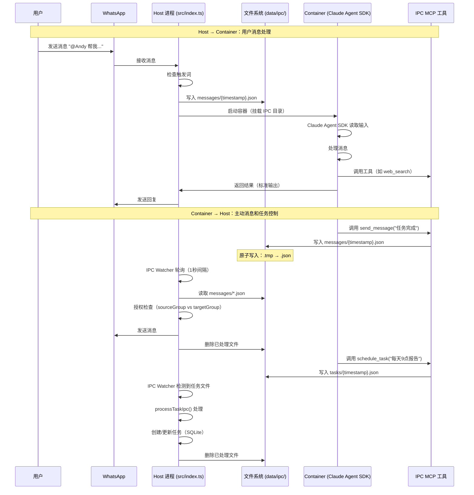

# IPC 机制深度解析

## 概述

NanoClaw 采用基于文件系统的 IPC（进程间通信）机制，实现 Host 进程与 Container 之间的双向通信。这种设计避免了网络 socket 的复杂性，利用文件系统作为通信媒介，简单可靠。

## 设计理念

### 为什么选择文件系统 IPC？

**优势：**
- **简单性**：无需网络配置、端口管理、连接池等复杂机制
- **可靠性**：文件系统提供持久化保证，即使进程崩溃也不会丢失消息
- **隔离性**：通过目录命名空间实现组间隔离，防止跨组权限提升
- **可观测性**：可以直接查看 IPC 目录内容，便于调试和监控
- **原子性**：使用临时文件 + rename 模式确保写入原子性

**局限：**
- **性能**：相比内存共享或 Unix domain socket，文件 I/O 有一定开销
- **延迟**：轮询机制（1秒间隔）引入延迟，不适合实时性要求极高的场景
- **扩展性**：单机部署，不适合分布式场景

> **注意**：对于 NanoClaw 的使用场景（个人助手、低频交互），这些局限是可以接受的。文件系统 IPC 的简单性和可靠性远比性能更重要。

## IPC 目录结构

```
data/ipc/
├── main/                    # 主组 IPC 命名空间
│   ├── messages/            # Container → Host 消息队列
│   │   ├── 1738601234567-abc123.json
│   │   └── 1738601237890-def456.json
│   └── tasks/               # Container → Host 任务控制
│       ├── 1738601234567-ghi789.json
│       └── 1738601237890-jkl012.json
├── family-chat/             # 其他组 IPC 命名空间
│   ├── messages/
│   └── tasks/
└── errors/                  # 处理失败的 IPC 文件
    ├── main-1738601234567-err.json
    └── family-chat-1738601237890-err.json
```

### 目录命名空间隔离

每个组拥有独立的 IPC 命名空间：
- **Host 路径**：`data/ipc/{group}/`
- **Container 挂载路径**：`/workspace/ipc`
- **Container 内部结构**：
  - `/workspace/ipc/messages` → Host 的 `data/ipc/{group}/messages/`
  - `/workspace/ipc/tasks` → Host 的 `data/ipc/{group}/tasks/`

这种设计确保：
1. Container 只能访问自己组的 IPC 目录
2. 无法通过文件系统路径访问其他组的 IPC
3. Host 通过目录路径确定发送者身份（无需额外认证）

## Host → Container 通信

### 通信路径

Host 通过文件系统向 Container 传递输入：

```
Host (src/index.ts)
  ↓ 写入 JSON 文件
data/ipc/{group}/messages/{timestamp}-{random}.json
  ↓ 挂载到
Container (/workspace/ipc/messages/)
  ↓ Claude Agent SDK 读取
Agent 处理
```

### Host 端实现

**文件写入**（`src/index.ts:runAgentInContainer`）：

```typescript
// Host 将用户消息写入 IPC 文件
const promptFile = path.join(groupIpcDir, 'messages', `${Date.now()}.json`);
fs.writeFileSync(promptFile, JSON.stringify({
  type: 'message',
  chatJid,
  text: prompt,
  sessionId,
  groupFolder: group.folder,
  isMain
}));
```

**Container 挂载**（`src/container-runner.ts:114-121`）：

```typescript
// 每个组有独立的 IPC 命名空间
const groupIpcDir = path.join(DATA_DIR, 'ipc', group.folder);
fs.mkdirSync(path.join(groupIpcDir, 'messages'), { recursive: true });
fs.mkdirSync(path.join(groupIpcDir, 'tasks'), { recursive: true });
mounts.push({
  hostPath: groupIpcDir,
  containerPath: '/workspace/ipc',
  readonly: false
});
```

### Container 端接收

Container 内的 Claude Agent SDK 通过标准输入读取消息，无需额外代码。Host 在启动容器时通过标准输入传递消息内容。

## Container → Host 通信

### 通信路径

Container 通过 MCP 工具向 Host 发送消息和任务控制：

```
Container (Claude Agent SDK)
  ↓ 调用 MCP 工具
/workspace/ipc/messages/{timestamp}-{random}.json
  ↓ 挂载到
data/ipc/{group}/messages/{timestamp}-{random}.json
  ↓ Host 轮询检测
Host (src/index.ts:startIpcWatcher)
  ↓ 处理并删除文件
WhatsApp 发送 / 任务调度
```

### Container 端实现

**MCP 工具定义**（`container/agent-runner/src/ipc-mcp.ts`）：

```typescript
// 发送消息工具
tool(
  'send_message',
  'Send a message to the current WhatsApp group.',
  { text: z.string() },
  async (args) => {
    const data = {
      type: 'message',
      chatJid,
      text: args.text,
      groupFolder,
      timestamp: new Date().toISOString()
    };
    const filename = writeIpcFile(MESSAGES_DIR, data);
    return { content: [{ type: 'text', text: `Message queued (${filename})` }] };
  }
)
```

**原子写入**（`container/agent-runner/src/ipc-mcp.ts:22-34`）：

```typescript
function writeIpcFile(dir: string, data: object): string {
  fs.mkdirSync(dir, { recursive: true });

  const filename = `${Date.now()}-${Math.random().toString(36).slice(2, 8)}.json`;
  const filepath = path.join(dir, filename);

  // 原子写入：临时文件 + rename
  const tempPath = `${filepath}.tmp`;
  fs.writeFileSync(tempPath, JSON.stringify(data, null, 2));
  fs.renameSync(tempPath, filepath);

  return filename;
}
```

### Host 端接收

**IPC Watcher**（`src/index.ts:234-318`）：

```typescript
function startIpcWatcher(): void {
  const ipcBaseDir = path.join(DATA_DIR, 'ipc');
  fs.mkdirSync(ipcBaseDir, { recursive: true });

  const processIpcFiles = async () => {
    // 扫描所有组的 IPC 目录
    let groupFolders = fs.readdirSync(ipcBaseDir).filter(f => {
      const stat = fs.statSync(path.join(ipcBaseDir, f));
      return stat.isDirectory() && f !== 'errors';
    });

    for (const sourceGroup of groupFolders) {
      const isMain = sourceGroup === MAIN_GROUP_FOLDER;
      const messagesDir = path.join(ipcBaseDir, sourceGroup, 'messages');
      const tasksDir = path.join(ipcBaseDir, sourceGroup, 'tasks');

      // 处理消息
      if (fs.existsSync(messagesDir)) {
        const messageFiles = fs.readdirSync(messagesDir).filter(f => f.endsWith('.json'));
        for (const file of messageFiles) {
          const filePath = path.join(messagesDir, file);
          const data = JSON.parse(fs.readFileSync(filePath, 'utf-8'));

          // 授权检查
          const targetGroup = registeredGroups[data.chatJid];
          if (isMain || (targetGroup && targetGroup.folder === sourceGroup)) {
            await sendMessage(data.chatJid, `${ASSISTANT_NAME}: ${data.text}`);
          } else {
            logger.warn({ chatJid: data.chatJid, sourceGroup }, 'Unauthorized IPC message blocked');
          }

          fs.unlinkSync(filePath); // 处理完成后删除
        }
      }

      // 处理任务（类似逻辑）
      // ...
    }

    setTimeout(processIpcFiles, IPC_POLL_INTERVAL); // 1秒后再次轮询
  };

  processIpcFiles();
}
```

## IPC 通信流程图



## IPC 授权检查机制

### 身份验证

**基于目录路径的身份验证**（`src/index.ts:253-254`）：

```typescript
for (const sourceGroup of groupFolders) {
  const isMain = sourceGroup === MAIN_GROUP_FOLDER;
  // sourceGroup 从目录路径获取，无需额外认证
}
```

**原理**：
- Container 只能访问自己组的 IPC 目录（通过挂载限制）
- Host 通过读取文件所在的目录路径确定发送者身份
- 无法伪造：Container 无法写入其他组的目录

### 消息发送授权

**规则**（`src/index.ts:266-274`）：

```typescript
if (data.type === 'message' && data.chatJid && data.text) {
  const targetGroup = registeredGroups[data.chatJid];
  // 主组可以发送到任何组，其他组只能发送到自己的组
  if (isMain || (targetGroup && targetGroup.folder === sourceGroup)) {
    await sendMessage(data.chatJid, `${ASSISTANT_NAME}: ${data.text}`);
  } else {
    logger.warn({ chatJid: data.chatJid, sourceGroup }, 'Unauthorized IPC message blocked');
  }
}
```

**授权矩阵**：

| 发送者 | 目标组 | 是否允许 |
|--------|--------|----------|
| main | main | ✅ |
| main | family-chat | ✅ |
| main | work-group | ✅ |
| family-chat | family-chat | ✅ |
| family-chat | main | ❌ |
| family-chat | work-group | ❌ |

### 任务管理授权

**规则**（`src/index.ts:344-353`）：

```typescript
case 'schedule_task':
  if (data.prompt && data.schedule_type && data.schedule_value && data.groupFolder) {
    const targetGroup = data.groupFolder;
    // 非主组只能为自己创建任务
    if (!isMain && targetGroup !== sourceGroup) {
      logger.warn({ sourceGroup, targetGroup }, 'Unauthorized schedule_task blocked');
      break;
    }
    // 创建任务...
  }
```

**授权矩阵**：

| 操作 | main | 其他组 |
|------|------|--------|
| schedule_task（自己） | ✅ | ✅ |
| schedule_task（其他组） | ✅ | ❌ |
| pause_task（自己） | ✅ | ✅ |
| pause_task（其他组） | ✅ | ❌ |
| resume_task（自己） | ✅ | ✅ |
| resume_task（其他组） | ✅ | ❌ |
| cancel_task（自己） | ✅ | ✅ |
| cancel_task（其他组） | ✅ | ❌ |
| register_group | ✅ | ❌ |
| refresh_groups | ✅ | ❌ |

## IPC 消息类型

### 消息类型（messages/）

**发送消息**（`type: 'message'`）：

```json
{
  "type": "message",
  "chatJid": "120363336345536173@g.us",
  "text": "任务已完成，报告已生成",
  "groupFolder": "main",
  "timestamp": "2026-02-03T13:45:00.000Z"
}
```

### 任务类型（tasks/）

**创建任务**（`type: 'schedule_task'`）：

```json
{
  "type": "schedule_task",
  "prompt": "每天早上9点生成销售报告",
  "schedule_type": "cron",
  "schedule_value": "0 9 * * *",
  "context_mode": "group",
  "groupFolder": "main",
  "chatJid": "120363336345536173@g.us",
  "createdBy": "main",
  "timestamp": "2026-02-03T13:45:00.000Z"
}
```

**暂停任务**（`type: 'pause_task'`）：

```json
{
  "type": "pause_task",
  "taskId": "task-1738601234567-abc123",
  "groupFolder": "main",
  "isMain": true,
  "timestamp": "2026-02-03T13:45:00.000Z"
}
```

**恢复任务**（`type: 'resume_task'`）：

```json
{
  "type": "resume_task",
  "taskId": "task-1738601234567-abc123",
  "groupFolder": "main",
  "isMain": true,
  "timestamp": "2026-02-03T13:45:00.000Z"
}
```

**取消任务**（`type: 'cancel_task'`）：

```json
{
  "type": "cancel_task",
  "taskId": "task-1738601234567-abc123",
  "groupFolder": "main",
  "isMain": true,
  "timestamp": "2026-02-03T13:45:00.000Z"
}
```

**注册组**（`type: 'register_group'`）：

```json
{
  "type": "register_group",
  "jid": "120363336345536173@g.us",
  "name": "Family Chat",
  "folder": "family-chat",
  "trigger": "@Andy",
  "timestamp": "2026-02-03T13:45:00.000Z"
}
```

**刷新组元数据**（`type: 'refresh_groups'`）：

```json
{
  "type": "refresh_groups",
  "timestamp": "2026-02-03T13:45:00.000Z"
}
```

## 错误处理

### 处理失败的 IPC 文件

当 IPC 文件处理失败时，Host 会将文件移动到 `data/ipc/errors/` 目录：

```typescript
try {
  const data = JSON.parse(fs.readFileSync(filePath, 'utf-8'));
  // 处理逻辑...
  fs.unlinkSync(filePath);
} catch (err) {
  logger.error({ file, sourceGroup, err }, 'Error processing IPC message');
  const errorDir = path.join(ipcBaseDir, 'errors');
  fs.mkdirSync(errorDir, { recursive: true });
  fs.renameSync(filePath, path.join(errorDir, `${sourceGroup}-${file}`));
}
```

**错误文件命名**：`{sourceGroup}-{original-filename}`

例如：`main-1738601234567-abc123.json`

### 常见错误场景

1. **JSON 解析失败**：文件内容不是有效的 JSON
2. **缺少必需字段**：消息类型不匹配或字段缺失
3. **授权失败**：尝试执行未授权的操作
4. **文件系统错误**：磁盘满、权限问题等

## 性能考虑

### 轮询间隔

**配置**（`src/config.ts:22`）：

```typescript
export const IPC_POLL_INTERVAL = 1000; // 1秒
```

**权衡**：
- **更短间隔**：更低延迟，但更高 CPU 使用率
- **更长间隔**：更低 CPU 使用率，但更高延迟

对于个人助手场景，1秒间隔是合理的平衡点。

### 文件系统优化

**原子写入**：使用临时文件 + rename 模式

```typescript
const tempPath = `${filepath}.tmp`;
fs.writeFileSync(tempPath, JSON.stringify(data, null, 2));
fs.renameSync(tempPath, filepath);
```

**优势**：
- 避免读取到不完整的文件
- rename 操作在大多数文件系统上是原子的

**批量处理**：每次轮询处理所有待处理文件

```typescript
const messageFiles = fs.readdirSync(messagesDir).filter(f => f.endsWith('.json'));
for (const file of messageFiles) {
  // 处理每个文件
}
```

## 安全性分析

### 隔离保证

1. **目录命名空间隔离**：每个组有独立的 IPC 目录
2. **挂载限制**：Container 只能访问自己组的 IPC 目录
3. **身份验证**：基于目录路径，无法伪造
4. **授权检查**：严格的权限矩阵

### 潜在风险

1. **文件系统权限**：如果 Host 文件系统权限配置不当，Container 可能访问其他目录
   - **缓解**：使用容器运行时（Apple Container/Docker）的挂载限制

2. **拒绝服务**：恶意 Container 可能创建大量 IPC 文件
   - **缓解**：Host 可以限制文件数量或大小（当前未实现）

3. **信息泄露**：错误文件可能包含敏感信息
   - **缓解**：定期清理 `data/ipc/errors/` 目录

## 与其他 IPC 机制对比

### 文件系统 IPC vs Unix Domain Socket

| 特性 | 文件系统 IPC | Unix Domain Socket |
|------|--------------|-------------------|
| 复杂度 | 低 | 中 |
| 可观测性 | 高（直接查看文件） | 低（需要工具） |
| 持久化 | 是 | 否 |
| 性能 | 中 | 高 |
| 跨容器 | 需要挂载 | 需要共享 socket |

### 文件系统 IPC vs 网络 Socket

| 特性 | 文件系统 IPC | 网络 Socket |
|------|--------------|-------------|
| 复杂度 | 低 | 高 |
| 可观测性 | 高 | 低 |
| 持久化 | 是 | 否 |
| 性能 | 中 | 高 |
| 跨机器 | 否 | 是 |
| 配置 | 无需配置 | 需要端口、防火墙 |

### 文件系统 IPC vs 消息队列（Redis/RabbitMQ）

| 特性 | 文件系统 IPC | 消息队列 |
|------|--------------|----------|
| 复杂度 | 低 | 高 |
| 依赖 | 无 | 需要额外服务 |
| 可观测性 | 高 | 中 |
| 持久化 | 是 | 可选 |
| 性能 | 中 | 高 |
| 扩展性 | 单机 | 分布式 |

**结论**：对于 NanoClaw 的使用场景（单机、低频、个人使用），文件系统 IPC 是最合适的选择。

## 总结

NanoClaw 的 IPC 机制体现了项目的核心哲学：**简单、可靠、可理解**。

### 核心设计原则

1. **简单性优先**：使用文件系统而非复杂的网络协议
2. **可靠性保证**：原子写入、持久化存储
3. **安全隔离**：目录命名空间 + 授权检查
4. **可观测性**：直接查看 IPC 目录内容

### 适用场景

- ✅ 个人助手
- ✅ 低频交互
- ✅ 单机部署
- ✅ 需要简单调试

### 不适用场景

- ❌ 高频实时通信
- ❌ 分布式部署
- ❌ 需要极低延迟
- ❌ 大规模并发

这种设计不是"最佳"方案，而是"最适合" NanoClaw 使用场景的方案。它牺牲了一些性能，换取了简单性、可靠性和可维护性。
