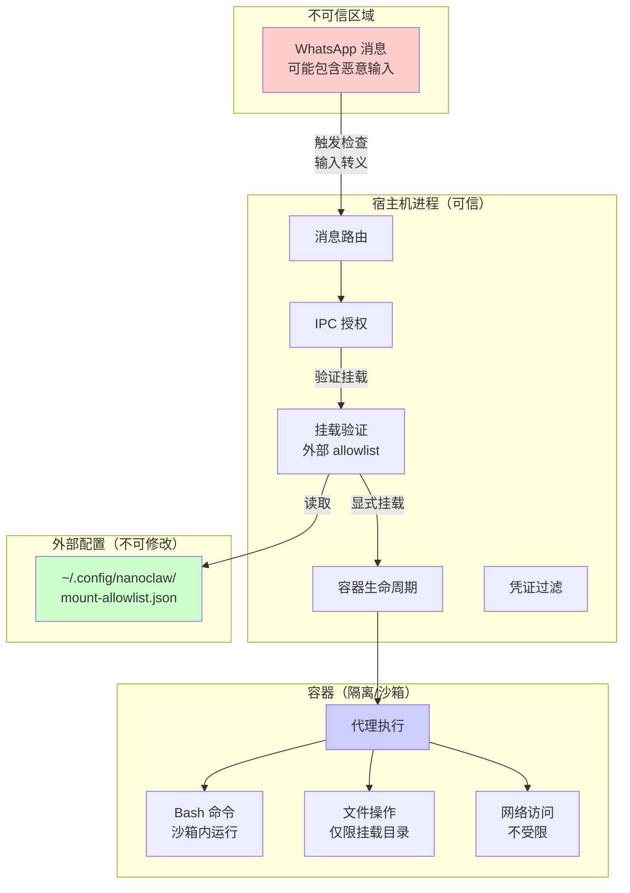
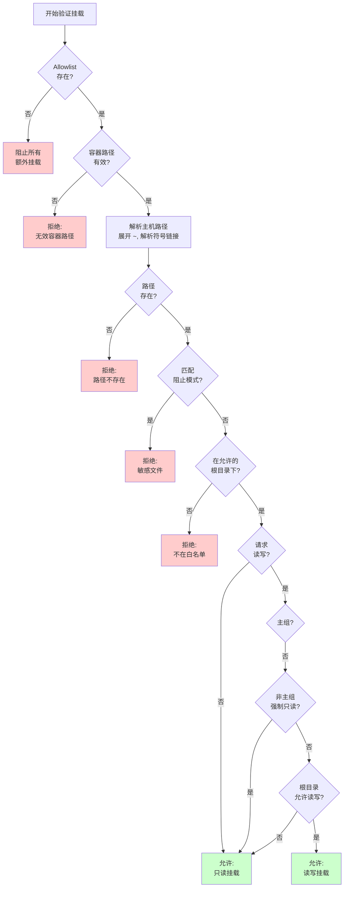
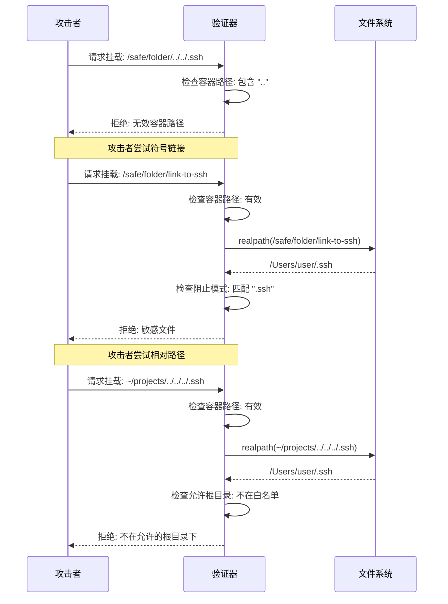

# 安全模型实现细节

## 概述

NanoClaw 的安全模型基于**真正的 OS 级隔离**，而非应用层权限检查。这是与 OpenClaw 等其他系统的核心差异。通过将代理（agent）运行在隔离的 Linux 容器中，攻击面被限制在显式挂载的目录范围内。

> **重要声明**：本文档描述的安全机制是缓解措施，而非"绝对安全"的保证。用户应始终审查运行的代码，理解其行为。

---

## 1. OS 级隔离 vs 应用层权限

### 1.1 核心差异

| 维度 | OS 级隔离（NanoClaw） | 应用层权限（OpenClaw） |
|------|---------------------|---------------------|
| **隔离边界** | 硬边界（OS 内核） | 软边界（应用代码） |
| **攻击面** | 仅限挂载的目录 | 整个文件系统（受权限检查限制） |
| **绕过难度** | 需要容器逃逸漏洞 | 可能通过逻辑漏洞绕过 |
| **实现复杂度** | 简单（依赖容器运行时） | 复杂（需要全面的权限检查） |
| **信任基础** | 容器运行时（Apple Container/Docker） | 应用代码的正确性 |

### 1.2 NanoClaw 的 OS 级隔离

NanoClaw 使用 Apple Container（macOS）或 Docker（macOS/Linux）提供真正的隔离：

```typescript
// src/container-runner.ts 中的容器启动逻辑
const containerArgs = [
  'run', '--rm',
  '--user', '1000:1000',  // 非 root 用户
  '--workdir', '/workspace',
  ...mountArgs,  // 仅显式挂载的目录
  containerImage,
  'node', '/app/agent.js'
];
```

**隔离特性**：
- **进程隔离**：容器进程无法影响宿主机
- **文件系统隔离**：只有显式挂载的目录可见
- **非 root 执行**：以 `node` 用户（uid 1000）运行
- **临时容器**：每次调用都是全新环境（`--rm`）

### 1.3 OpenClaw 的应用层权限

OpenClaw 使用应用层权限系统：
- **Allowlists**：允许访问的路径列表
- **Pairing codes**：配对码机制
- **权限检查**：在应用代码中检查每个操作

**潜在问题**：
- 逻辑漏洞可能绕过权限检查
- 代码复杂度高（52+ 模块，45+ 依赖），难以全面审查
- 所有内容在一个 Node 进程中运行，共享内存

---

## 2. Allowlist 机制

### 2.1 设计原则

Allowlist 机制遵循以下原则：

1. **外部存储**：允许列表存储在项目根目录外
2. **不可修改**：容器代理无法修改安全配置
3. **默认拒绝**：未明确允许的路径被拒绝
4. **多层防护**：结合阻止模式和允许根目录

### 2.2 文件位置

```bash
~/.config/nanoclaw/mount-allowlist.json
```

**关键特性**：
- 在项目根目录外（`/Users/cloudyan/data/code/claw/nanoclaw`）
- **永远不会被挂载到容器中**
- 容器代理无法读取或修改此文件

### 2.3 文件结构

```json
{
  "allowedRoots": [
    {
      "path": "~/projects",
      "allowReadWrite": true,
      "description": "Development projects"
    },
    {
      "path": "~/Documents/work",
      "allowReadWrite": false,
      "description": "Work documents (read-only)"
    }
  ],
  "blockedPatterns": [
    "password",
    "secret",
    "token"
  ],
  "nonMainReadOnly": true
}
```

**字段说明**：
- `allowedRoots`：允许挂载的根目录列表
  - `path`：主机路径（支持 `~` 展开）
  - `allowReadWrite`：是否允许读写
  - `description`：描述信息
- `blockedPatterns`：额外的阻止模式（与默认模式合并）
- `nonMainReadOnly`：非主组是否强制只读

### 2.4 默认阻止模式

```typescript
// src/mount-security.ts
const DEFAULT_BLOCKED_PATTERNS = [
  '.ssh',           // SSH 密钥
  '.gnupg', '.gpg', // GPG 密钥
  '.aws',           // AWS 凭证
  '.azure',         // Azure 凭证
  '.gcloud',        // Google Cloud 凭证
  '.kube',          // Kubernetes 配置
  '.docker',        // Docker 配置
  'credentials',    // 通用凭证文件
  '.env',           // 环境变量文件
  '.netrc',         // FTP/Git 凭证
  '.npmrc',         // NPM 配置
  '.pypirc',        // PyPI 配置
  'id_rsa',         // RSA 私钥
  'id_ed25519',     // Ed25519 私钥
  'private_key',    // 通用私钥
  '.secret',        // 密钥文件
];
```

### 2.5 加载和缓存

```typescript
// src/mount-security.ts
let cachedAllowlist: MountAllowlist | null = null;
let allowlistLoadError: string | null = null;

export function loadMountAllowlist(): MountAllowlist | null {
  if (cachedAllowlist !== null) {
    return cachedAllowlist;  // 使用缓存
  }

  if (allowlistLoadError !== null) {
    return null;  // 已尝试加载失败，不再重复
  }

  try {
    // 读取并验证文件
    const content = fs.readFileSync(MOUNT_ALLOWLIST_PATH, 'utf-8');
    const allowlist = JSON.parse(content) as MountAllowlist;

    // 验证结构
    if (!Array.isArray(allowlist.allowedRoots)) {
      throw new Error('allowedRoots must be an array');
    }
    // ... 更多验证

    // 合并默认阻止模式
    const mergedBlockedPatterns = [
      ...new Set([...DEFAULT_BLOCKED_PATTERNS, ...allowlist.blockedPatterns])
    ];

    cachedAllowlist = allowlist;
    return cachedAllowlist;
  } catch (err) {
    allowlistLoadError = err instanceof Error ? err.message : String(err);
    return null;
  }
}
```

**缓存策略**：
- 在进程启动时加载一次
- 缓存在内存中，避免重复读取
- 加载失败后不再重试（避免日志 spam）

---

## 3. 路径遍历防护

### 3.1 威胁模型

路径遍历攻击（Path Traversal）试图通过特殊路径（如 `../`）访问预期范围外的文件。在容器挂载场景中，攻击者可能尝试：
- 使用 `../` 逃逸挂载目录
- 使用符号链接（symlink）绕过路径检查
- 使用绝对路径访问任意位置

### 3.2 防护机制

#### 3.2.1 符号链接解析

```typescript
// src/mount-security.ts
function getRealPath(p: string): string | null {
  try {
    return fs.realpathSync(p);  // 解析所有符号链接
  } catch {
    return null;
  }
}
```

**关键点**：
- 在验证**之前**解析符号链接
- `fs.realpathSync()` 返回解析后的真实路径
- 如果路径不存在，返回 `null`

**示例**：
```typescript
// 攻击者尝试通过符号链接绕过
const maliciousPath = '/safe/folder/link-to-ssh';
const realPath = getRealPath(maliciousPath);
// realPath = '/Users/user/.ssh'  // 真实路径暴露
// 然后检查 realPath 是否匹配阻止模式
```

#### 3.2.2 容器路径验证

```typescript
// src/mount-security.ts
function isValidContainerPath(containerPath: string): boolean {
  // 必须不包含 .. 以防止路径遍历
  if (containerPath.includes('..')) {
    return false;
  }

  // 必须不是绝对路径（会加上 /workspace/extra/ 前缀）
  if (containerPath.startsWith('/')) {
    return false;
  }

  // 必须非空
  if (!containerPath || containerPath.trim() === '') {
    return false;
  }

  return true;
}
```

**防护目标**：
- 防止容器内路径逃逸 `/workspace/extra/`
- 拒绝 `../` 序列
- 拒绝绝对路径（如 `/etc/passwd`）

#### 3.2.3 相对路径检查

```typescript
// src/mount-security.ts
function findAllowedRoot(realPath: string, allowedRoots: AllowedRoot[]): AllowedRoot | null {
  for (const root of allowedRoots) {
    const expandedRoot = expandPath(root.path);
    const realRoot = getRealPath(expandedRoot);

    if (realRoot === null) {
      continue;  // 允许的根目录不存在，跳过
    }

    // 检查 realPath 是否在 realRoot 下
    const relative = path.relative(realRoot, realPath);
    if (!relative.startsWith('..') && !path.isAbsolute(relative)) {
      return root;  // 路径在允许的根目录下
    }
  }

  return null;  // 不在任何允许的根目录下
}
```

**关键逻辑**：
- 使用 `path.relative()` 计算相对路径
- 如果相对路径以 `..` 开头，说明路径在根目录外
- 如果相对路径是绝对路径，说明路径在不同驱动器（Windows）

**示例**：
```typescript
const realRoot = '/Users/user/projects';
const realPath = '/Users/user/projects/myapp/src';

const relative = path.relative(realRoot, realPath);
// relative = 'myapp/src'
// !relative.startsWith('..') → true
// !path.isAbsolute(relative) → true
// → 允许

const maliciousPath = '/Users/user/.ssh';
const relative = path.relative(realRoot, maliciousPath);
// relative = '../../.ssh'
// relative.startsWith('..') → true
// → 拒绝
```

### 3.3 完整验证流程

```typescript
// src/mount-security.ts
export function validateMount(
  mount: AdditionalMount,
  isMain: boolean
): MountValidationResult {
  const allowlist = loadMountAllowlist();

  // 1. 如果没有 allowlist，阻止所有额外挂载
  if (allowlist === null) {
    return {
      allowed: false,
      reason: `No mount allowlist configured at ${MOUNT_ALLOWLIST_PATH}`
    };
  }

  // 2. 验证容器路径（廉价检查）
  if (!isValidContainerPath(mount.containerPath)) {
    return {
      allowed: false,
      reason: `Invalid container path: "${mount.containerPath}" - must be relative, non-empty, and not contain ".."`
    };
  }

  // 3. 展开并解析主机路径
  const expandedPath = expandPath(mount.hostPath);
  const realPath = getRealPath(expandedPath);

  if (realPath === null) {
    return {
      allowed: false,
      reason: `Host path does not exist: "${mount.hostPath}" (expanded: "${expandedPath}")`
    };
  }

  // 4. 检查阻止模式
  const blockedMatch = matchesBlockedPattern(realPath, allowlist.blockedPatterns);
  if (blockedMatch !== null) {
    return {
      allowed: false,
      reason: `Path matches blocked pattern "${blockedMatch}": "${realPath}"`
    };
  }

  // 5. 检查是否在允许的根目录下
  const allowedRoot = findAllowedRoot(realPath, allowlist.allowedRoots);
  if (allowedRoot === null) {
    return {
      allowed: false,
      reason: `Path "${realPath}" is not under any allowed root. Allowed roots: ${
        allowlist.allowedRoots.map(r => expandPath(r.path)).join(', ')
      }`
    };
  }

  // 6. 确定有效的只读状态
  const requestedReadWrite = mount.readonly === false;
  let effectiveReadonly = true;  // 默认只读

  if (requestedReadWrite) {
    if (!isMain && allowlist.nonMainReadOnly) {
      // 非主组强制只读
      effectiveReadonly = true;
    } else if (!allowedRoot.allowReadWrite) {
      // 根目录不允许读写
      effectiveReadonly = true;
    } else {
      // 允许读写
      effectiveReadonly = false;
    }
  }

  return {
    allowed: true,
    reason: `Allowed under root "${allowedRoot.path}"${allowedRoot.description ? ` (${allowedRoot.description})` : ''}`,
    realHostPath: realPath,
    effectiveReadonly
  };
}
```

**验证顺序**：
1. 检查 allowlist 是否存在
2. 验证容器路径（防止逃逸）
3. 解析主机路径（展开 `~`，解析符号链接）
4. 检查阻止模式（敏感文件）
5. 检查允许根目录（白名单）
6. 确定读写权限

---

## 4. 安全边界图

### 4.1 整体安全架构



### 4.2 挂载验证流程



### 4.3 路径遍历防护



---

## 5. 与 OpenClaw 的对比

### 5.1 架构对比

| 维度 | NanoClaw | OpenClaw |
|------|----------|----------|
| **进程模型** | 单进程 + 容器 | 多进程（4-5 个） |
| **代码复杂度** | ~10 个源文件 | 52+ 模块 |
| **配置文件** | 最小化 | 8 个配置文件 |
| **依赖数量** | ~15 | 45+ |
| **安全边界** | OS 级隔离 | 应用层权限 |
| **隔离机制** | Apple Container/Docker | Allowlists, pairing codes |
| **内存隔离** | 容器隔离 | 共享内存 |

### 5.2 安全模型对比

#### NanoClaw: 真正的隔离

```
┌─────────────────────────────────────────┐
│         宿主机（可信）                   │
│  • 消息路由                              │
│  • 挂载验证（外部 allowlist）            │
│  • 容器生命周期管理                      │
└──────────────┬──────────────────────────┘
               │ 显式挂载
               ▼
┌─────────────────────────────────────────┐
│      容器（隔离/沙箱）                   │
│  • 代理执行                              │
│  • Bash 命令（沙箱内）                   │
│  • 文件操作（仅限挂载目录）              │
│  • 无法修改安全配置                      │
└─────────────────────────────────────────┘
```

**优势**：
- 攻击面明确：仅限挂载的目录
- 容器逃逸难度高：需要内核漏洞
- 代码简单：易于审查和理解

#### OpenClaw: 应用层权限

```
┌─────────────────────────────────────────┐
│         单一 Node 进程                  │
│  • 所有模块共享内存                      │
│  • 权限检查分散在代码中                  │
│  • 逻辑漏洞可能绕过权限                  │
└─────────────────────────────────────────┘
```

**潜在问题**：
- 权限检查可能被绕过（逻辑漏洞）
- 代码复杂度高，难以全面审查
- 所有内容在一个进程空间中

### 5.3 具体差异

#### 5.3.1 文件系统访问

**NanoClaw**：
```typescript
// 容器只能看到挂载的目录
const mounts = [
  { host: '/workspace/project', container: '/workspace/project' },
  { host: '/workspace/group', container: '/workspace/group' },
  // 额外挂载需要通过 allowlist 验证
];
```

**OpenClaw**：
```typescript
// 应用层权限检查
if (!allowlist.includes(path)) {
  throw new Error('Access denied');
}
// 但如果检查逻辑有漏洞，可能被绕过
```

#### 5.3.2 Bash 命令执行

**NanoClaw**：
```typescript
// Bash 命令在容器内执行
// 只能访问挂载的目录
await execInContainer('ls -la /workspace/project');
```

**OpenClaw**：
```typescript
// Bash 命令在宿主机执行
// 需要应用层权限检查
if (isAllowedCommand(cmd)) {
  await exec(cmd);  // 如果检查有漏洞，危险！
}
```

#### 5.3.3 配置安全

**NanoClaw**：
```bash
# 安全配置在项目外，不会被挂载
~/.config/nanoclaw/mount-allowlist.json  # 容器无法访问
```

**OpenClaw**：
```bash
# 配置文件可能在项目内，可能被访问
./config/permissions.json  # 可能被代理读取/修改
```

---

## 6. 安全缓解措施总结

### 6.1 多层防护

NanoClaw 采用多层防护策略：

1. **容器隔离**（第一层）：OS 级隔离，限制攻击面
2. **挂载验证**（第二层）：allowlist 机制，阻止敏感路径
3. **路径遍历防护**（第三层）：符号链接解析，相对路径检查
4. **IPC 授权**（第四层）：基于组身份的权限控制
5. **凭证过滤**（第五层）：仅暴露必要的环境变量

### 6.2 默认安全

- **默认拒绝**：未明确允许的路径被拒绝
- **默认只读**：非主组默认只读访问
- **默认阻止**：敏感文件模式默认阻止
- **最小权限**：容器以非 root 用户运行

### 6.3 已知限制

1. **网络访问不受限**：容器可以访问网络（包括外网）
2. **凭证暴露**：Anthropic API 密钥暴露给容器（见 SECURITY.md 说明）
3. **容器逃逸**：如果容器运行时有漏洞，可能逃逸
4. **符号链接攻击**：虽然解析符号链接，但创建时间窗口可能被利用

### 6.4 最佳实践

1. **审查代码**：始终审查运行的代码，理解其行为
2. **最小化挂载**：只挂载必要的目录
3. **使用只读**：非主组使用只读挂载
4. **定期更新**：保持容器运行时和依赖更新
5. **监控日志**：定期检查日志，发现异常行为

---

## 7. 关键代码位置

| 功能 | 文件 | 关键函数 |
|------|------|----------|
| 挂载验证 | `src/mount-security.ts` | `validateMount()` |
| 路径解析 | `src/mount-security.ts` | `getRealPath()` |
| 容器路径验证 | `src/mount-security.ts` | `isValidContainerPath()` |
| 允许根目录检查 | `src/mount-security.ts` | `findAllowedRoot()` |
| 阻止模式匹配 | `src/mount-security.ts` | `matchesBlockedPattern()` |
| 容器启动 | `src/container-runner.ts` | `runAgentInContainer()` |
| IPC 授权 | `src/index.ts` | 消息路由逻辑 |
| 凭证过滤 | `src/container-runner.ts` | 环境变量过滤 |

---

## 8. 总结

NanoClaw 的安全模型基于**真正的 OS 级隔离**，通过容器技术提供硬安全边界。与 OpenClaw 的应用层权限系统相比，NanoClaw 的安全模型：

- **更简单**：代码量少，易于理解和审查
- **更可靠**：依赖成熟的容器运行时，而非应用代码
- **更明确**：攻击面清晰（仅限挂载的目录）
- **更安全**：多层防护，默认安全

然而，安全是一个持续的过程，没有"绝对安全"的系统。用户应：
- 理解安全模型的工作原理
- 审查运行的代码
- 遵循最佳实践
- 保持系统更新

通过结合 OS 级隔离、allowlist 机制、路径遍历防护和多层安全措施，NanoClaw 提供了一个强大而简洁的安全模型，适合个人 AI 助手的使用场景。
