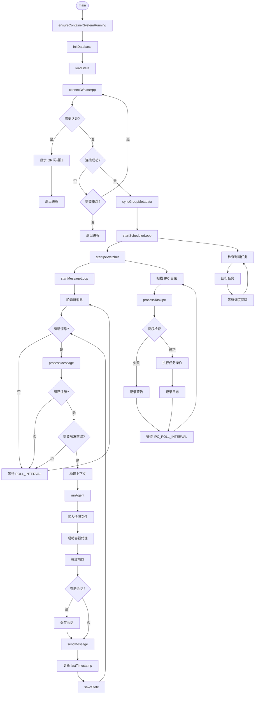

# src/index.ts 源码解读

## 概述

`src/index.ts` 是 NanoClaw 的主入口文件，约 628 行代码，负责：
- WhatsApp 连接管理
- 消息轮询和路由
- IPC（进程间通信）授权检查
- 容器代理进程管理
- 状态持久化

该文件采用单进程架构，通过轮询机制处理消息，使用文件系统进行 IPC 通信，确保每个组拥有独立的上下文和文件系统隔离。

---

## 模块结构

### 核心模块

| 模块 | 功能 | 关键函数 |
|------|------|----------|
| **状态管理** | 加载和保存应用状态 | `loadState`, `saveState` |
| **WhatsApp 连接** | 管理 WhatsApp 连接和事件 | `connectWhatsApp` |
| **消息处理** | 轮询和处理新消息 | `startMessageLoop`, `processMessage` |
| **代理执行** | 运行容器代理 | `runAgent` |
| **IPC 通信** | 处理容器与主进程的 IPC | `startIpcWatcher`, `processTaskIpc` |
| **组管理** | 注册和同步组元数据 | `registerGroup`, `syncGroupMetadata` |

### 全局状态变量

```typescript
// src/index.ts:39-43
let sock: WASocket;                          // WhatsApp socket 实例
let lastTimestamp = '';                      // 最后处理的消息时间戳
let sessions: Session = {};                  // 会话 ID 映射
let registeredGroups: Record<string, RegisteredGroup> = {};  // 已注册组
let lastAgentTimestamp: Record<string, string> = {};         // 每组最后代理交互时间
```

---

## 关键函数详解

### 1. loadState - 加载应用状态

**功能**：从文件系统加载应用状态，包括时间戳、会话和已注册组信息。

**代码位置**：`src/index.ts:53-61`

```typescript
function loadState(): void {
  const statePath = path.join(DATA_DIR, 'router_state.json');
  const state = loadJson<{ last_timestamp?: string; last_agent_timestamp?: Record<string, string> }>(statePath, {});
  lastTimestamp = state.last_timestamp || '';
  lastAgentTimestamp = state.last_agent_timestamp || {};
  sessions = loadJson(path.join(DATA_DIR, 'sessions.json'), {});
  registeredGroups = loadJson(path.join(DATA_DIR, 'registered_groups.json'), {});
  logger.info({ groupCount: Object.keys(registeredGroups).length }, 'State loaded');
}
```

**设计要点**：
- 使用 `loadJson` 工具函数，提供默认值防止文件不存在时崩溃
- 分别加载三个状态文件：`router_state.json`、`sessions.json`、`registered_groups.json`
- 记录已注册组数量，便于启动时验证配置

---

### 2. saveState - 保存应用状态

**功能**：将当前状态持久化到文件系统，确保重启后恢复。

**代码位置**：`src/index.ts:63-66`

```typescript
function saveState(): void {
  saveJson(path.join(DATA_DIR, 'router_state.json'), { last_timestamp: lastTimestamp, last_agent_timestamp: lastAgentTimestamp });
  saveJson(path.join(DATA_DIR, 'sessions.json'), sessions);
}
```

**设计要点**：
- 只保存 `router_state.json` 和 `sessions.json`，`registered_groups.json` 在注册时单独保存
- `lastTimestamp` 用于消息轮询的至少一次投递（at-least-once delivery）
- `lastAgentTimestamp` 用于为代理提供完整的上下文历史

---

### 3. registerGroup - 注册新组

**功能**：注册新的 WhatsApp 组，创建隔离的文件系统目录。

**代码位置**：`src/index.ts:68-77`

```typescript
function registerGroup(jid: string, group: RegisteredGroup): void {
  registeredGroups[jid] = group;
  saveJson(path.join(DATA_DIR, 'registered_groups.json'), registeredGroups);

  // Create group folder
  const groupDir = path.join(DATA_DIR, '..', 'groups', group.folder);
  fs.mkdirSync(path.join(groupDir, 'logs'), { recursive: true });

  logger.info({ jid, name: group.name, folder: group.folder }, 'Group registered');
}
```

**设计要点**：
- JID（Jabber ID）是 WhatsApp 的唯一标识符
- 创建 `groups/{folder}/logs` 目录，用于存储容器日志
- 立即持久化到文件，防止重启丢失注册信息

---

### 4. syncGroupMetadata - 同步组元数据

**功能**：从 WhatsApp 获取所有参与组的名称和元数据，存储到数据库。

**代码位置**：`src/index.ts:86-117`

```typescript
async function syncGroupMetadata(force = false): Promise<void> {
  // Check if we need to sync (skip if synced recently, unless forced)
  if (!force) {
    const lastSync = getLastGroupSync();
    if (lastSync) {
      const lastSyncTime = new Date(lastSync).getTime();
      const now = Date.now();
      if (now - lastSyncTime < GROUP_SYNC_INTERVAL_MS) {
        logger.debug({ lastSync }, 'Skipping group sync - synced recently');
        return;
      }
    }
  }

  try {
    logger.info('Syncing group metadata from WhatsApp...');
    const groups = await sock.groupFetchAllParticipating();

    let count = 0;
    for (const [jid, metadata] of Object.entries(groups)) {
      if (metadata.subject) {
        updateChatName(jid, metadata.subject);
        count++;
      }
    }

    setLastGroupSync();
    logger.info({ count }, 'Group metadata synced');
  } catch (err) {
    logger.error({ err }, 'Failed to sync group metadata');
  }
}
```

**设计要点**：
- 24 小时缓存机制（`GROUP_SYNC_INTERVAL_MS`），避免频繁调用 WhatsApp API
- 支持强制同步（`force = true`），用于 IPC 请求的即时刷新
- 只更新组名称（`subject`），不存储完整成员列表，减少数据量

---

### 5. getAvailableGroups - 获取可用组列表

**功能**：返回所有可用组，按最近活动时间排序，标记已注册状态。

**代码位置**：`src/index.ts:125-137`

```typescript
function getAvailableGroups(): AvailableGroup[] {
  const chats = getAllChats();
  const registeredJids = new Set(Object.keys(registeredGroups));

  return chats
    .filter(c => c.jid !== '__group_sync__' && c.jid.endsWith('@g.us'))
    .map(c => ({
      jid: c.jid,
      name: c.name,
      lastActivity: c.last_message_time,
      isRegistered: registeredJids.has(c.jid)
    }));
}
```

**设计要点**：
- 过滤掉内部同步标记（`__group_sync__`）和非组聊天（`@g.us` 后缀）
- 使用 `Set` 快速判断注册状态
- 返回的数据用于主组的组管理界面

---

### 6. processMessage - 处理消息

**功能**：检查消息是否需要处理，构建上下文，调用代理执行。

**代码位置**：`src/index.ts:139-177`

```typescript
async function processMessage(msg: NewMessage): Promise<void> {
  const group = registeredGroups[msg.chat_jid];
  if (!group) return;

  const content = msg.content.trim();
  const isMainGroup = group.folder === MAIN_GROUP_FOLDER;

  // Main group responds to all messages; other groups require trigger prefix
  // 主组响应所有消息，其他组需要触发前缀
  if (!isMainGroup && !TRIGGER_PATTERN.test(content)) return;

  // Get all messages since last agent interaction so the session has full context
  const sinceTimestamp = lastAgentTimestamp[msg.chat_jid] || '';
  const missedMessages = getMessagesSince(msg.chat_jid, sinceTimestamp, ASSISTANT_NAME);

  const lines = missedMessages.map(m => {
    // Escape XML special characters in content
    const escapeXml = (s: string) => s
      .replace(/&/g, '&amp;')
      .replace(/</g, '&lt;')
      .replace(/>/g, '&gt;')
      .replace(/"/g, '&quot;');
    return `<message sender="${escapeXml(m.sender_name)}" time="${m.timestamp}">${escapeXml(m.content)}</message>`;
  });
  const prompt = `<messages>\n${lines.join('\n')}\n</messages>`;

  if (!prompt) return;

  logger.info({ group: group.name, messageCount: missedMessages.length }, 'Processing message');

  await setTyping(msg.chat_jid, true);
  const response = await runAgent(group, prompt, msg.chat_jid);
  await setTyping(msg.chat_jid, false);

  if (response) {
    lastAgentTimestamp[msg.chat_jid] = msg.timestamp;
    await sendMessage(msg.chat_jid, `${ASSISTANT_NAME}: ${response}`);
  }
}
```

**设计要点**：
- **触发模式**：主组响应所有消息，其他组需要触发前缀（如 `@Andy`）
- **上下文构建**：获取自上次代理交互以来的所有消息，确保代理有完整上下文
- **XML 转义**：防止消息内容中的特殊字符破坏 XML 结构
- **打字状态**：调用 `setTyping` 提供用户反馈
- **时间戳更新**：成功处理后更新 `lastAgentTimestamp`，用于下次上下文构建

---

### 7. runAgent - 运行容器代理

**功能**：准备快照文件，启动容器代理，处理响应。

**代码位置**：`src/index.ts:179-223`

```typescript
async function runAgent(group: RegisteredGroup, prompt: string, chatJid: string): Promise<string | null> {
  const isMain = group.folder === MAIN_GROUP_FOLDER;
  const sessionId = sessions[group.folder];

  // Update tasks snapshot for container to read (filtered by group)
  const tasks = getAllTasks();
  writeTasksSnapshot(group.folder, isMain, tasks.map(t => ({
    id: t.id,
    groupFolder: t.group_folder,
    prompt: t.prompt,
    schedule_type: t.schedule_type,
    schedule_value: t.schedule_value,
    status: t.status,
    next_run: t.next_run
  })));

  // Update available groups snapshot (main group only can see all groups)
  const availableGroups = getAvailableGroups();
  writeGroupsSnapshot(group.folder, isMain, availableGroups, new Set(Object.keys(registeredGroups)));

  try {
    const output = await runContainerAgent(group, {
      prompt,
      sessionId,
      groupFolder: group.folder,
      chatJid,
      isMain
    });

    if (output.newSessionId) {
      sessions[group.folder] = output.newSessionId;
      saveJson(path.join(DATA_DIR, 'sessions.json'), sessions);
    }

    if (output.status === 'error') {
      logger.error({ group: group.name, error: output.error }, 'Container agent error');
      return null;
    }

    return output.result;
  } catch (err) {
    logger.error({ group: group.name, err }, 'Agent error');
    return null;
  }
}
```

**设计要点**：
- **快照机制**：将任务和组信息写入快照文件，容器通过挂载目录读取
- **权限隔离**：主组可以看到所有任务和组，其他组只能看到自己的
- **会话管理**：容器返回新的 `sessionId` 时更新并持久化
- **错误处理**：捕获容器错误，返回 `null` 让调用方决定是否重试

---

### 8. startIpcWatcher - 启动 IPC 监听器

**功能**：轮询 IPC 目录，处理容器发送的消息和任务请求。

**代码位置**：`src/index.ts:234-318`

```typescript
function startIpcWatcher(): void {
  const ipcBaseDir = path.join(DATA_DIR, 'ipc');
  fs.mkdirSync(ipcBaseDir, { recursive: true });

  const processIpcFiles = async () => {
    // Scan all group IPC directories (identity determined by directory)
    // 扫描所有组的 IPC 目录，通过目录路径确定发送者身份
    let groupFolders: string[];
    try {
      groupFolders = fs.readdirSync(ipcBaseDir).filter(f => {
        const stat = fs.statSync(path.join(ipcBaseDir, f));
        return stat.isDirectory() && f !== 'errors';
      });
    } catch (err) {
      logger.error({ err }, 'Error reading IPC base directory');
      setTimeout(processIpcFiles, IPC_POLL_INTERVAL);
      return;
    }

    for (const sourceGroup of groupFolders) {
      const isMain = sourceGroup === MAIN_GROUP_FOLDER;
      const messagesDir = path.join(ipcBaseDir, sourceGroup, 'messages');
      const tasksDir = path.join(ipcBaseDir, sourceGroup, 'tasks');

      // Process messages from this group's IPC directory
      try {
        if (fs.existsSync(messagesDir)) {
          const messageFiles = fs.readdirSync(messagesDir).filter(f => f.endsWith('.json'));
          for (const file of messageFiles) {
            const filePath = path.join(messagesDir, file);
            try {
              const data = JSON.parse(fs.readFileSync(filePath, 'utf-8'));
              if (data.type === 'message' && data.chatJid && data.text) {
                // Authorization: verify this group can send to this chatJid
                const targetGroup = registeredGroups[data.chatJid];
                if (isMain || (targetGroup && targetGroup.folder === sourceGroup)) {
                  await sendMessage(data.chatJid, `${ASSISTANT_NAME}: ${data.text}`);
                  logger.info({ chatJid: data.chatJid, sourceGroup }, 'IPC message sent');
                } else {
                  logger.warn({ chatJid: data.chatJid, sourceGroup }, 'Unauthorized IPC message attempt blocked');
                }
              }
              fs.unlinkSync(filePath);
            } catch (err) {
              logger.error({ file, sourceGroup, err }, 'Error processing IPC message');
              const errorDir = path.join(ipcBaseDir, 'errors');
              fs.mkdirSync(errorDir, { recursive: true });
              fs.renameSync(filePath, path.join(errorDir, `${sourceGroup}-${file}`));
            }
          }
        }
      } catch (err) {
        logger.error({ err, sourceGroup }, 'Error reading IPC messages directory');
      }

      // Process tasks from this group's IPC directory
      try {
        if (fs.existsSync(tasksDir)) {
          const taskFiles = fs.readdirSync(tasksDir).filter(f => f.endsWith('.json'));
          for (const file of taskFiles) {
            const filePath = path.join(tasksDir, file);
            try {
              const data = JSON.parse(fs.readFileSync(filePath, 'utf-8'));
              // Pass source group identity to processTaskIpc for authorization
              await processTaskIpc(data, sourceGroup, isMain);
              fs.unlinkSync(filePath);
            } catch (err) {
              logger.error({ file, sourceGroup, err }, 'Error processing IPC task');
              const errorDir = path.join(ipcBaseDir, 'errors');
              fs.mkdirSync(errorDir, { recursive: true });
              fs.renameSync(filePath, path.join(errorDir, `${sourceGroup}-${file}`));
            }
          }
        }
      } catch (err) {
        logger.error({ err, sourceGroup }, 'Error reading IPC tasks directory');
      }
    }

    setTimeout(processIpcFiles, IPC_POLL_INTERVAL);
  };

  processIpcFiles();
  logger.info('IPC watcher started (per-group namespaces)');
}
```

**设计要点**：
- **身份验证**：通过目录路径（`sourceGroup`）确定发送者身份，而非依赖 IPC 载荷
- **授权检查**：主组可以向任何组发送消息，其他组只能向自己发送
- **错误处理**：处理失败的文件移动到 `errors` 目录，便于调试
- **轮询机制**：使用 `setTimeout` 递归调用，避免阻塞主线程

---

### 9. processTaskIpc - 处理 IPC 任务请求

**功能**：处理容器发送的任务管理请求（创建、暂停、恢复、取消任务等）。

**代码位置**：`src/index.ts:320-485`

```typescript
async function processTaskIpc(
  data: {
    type: string;
    taskId?: string;
    prompt?: string;
    schedule_type?: string;
    schedule_value?: string;
    context_mode?: string;
    groupFolder?: string;
    chatJid?: string;
    // For register_group
    jid?: string;
    name?: string;
    folder?: string;
    trigger?: string;
    containerConfig?: RegisteredGroup['containerConfig'];
  },
  sourceGroup: string,  // Verified identity from IPC directory
  isMain: boolean       // Verified from directory path
): Promise<void> {
  // Import db functions dynamically to avoid circular deps
  const { createTask, updateTask, deleteTask, getTaskById: getTask } = await import('./db.js');
  const { CronExpressionParser } = await import('cron-parser');

  switch (data.type) {
    case 'schedule_task':
      if (data.prompt && data.schedule_type && data.schedule_value && data.groupFolder) {
        // Authorization: non-main groups can only schedule for themselves
        // 授权检查：非主组只能为自己创建任务
        const targetGroup = data.groupFolder;
        if (!isMain && targetGroup !== sourceGroup) {
          logger.warn({ sourceGroup, targetGroup }, 'Unauthorized schedule_task attempt blocked');
          break;
        }

        // Resolve the correct JID for the target group (don't trust IPC payload)
        const targetJid = Object.entries(registeredGroups).find(
          ([, group]) => group.folder === targetGroup
        )?.[0];

        if (!targetJid) {
          logger.warn({ targetGroup }, 'Cannot schedule task: target group not registered');
          break;
        }

        const scheduleType = data.schedule_type as 'cron' | 'interval' | 'once';

        let nextRun: string | null = null;
        if (scheduleType === 'cron') {
          try {
            const interval = CronExpressionParser.parse(data.schedule_value, { tz: TIMEZONE });
            nextRun = interval.next().toISOString();
          } catch {
            logger.warn({ scheduleValue: data.schedule_value }, 'Invalid cron expression');
            break;
          }
        } else if (scheduleType === 'interval') {
          const ms = parseInt(data.schedule_value, 10);
          if (isNaN(ms) || ms <= 0) {
            logger.warn({ scheduleValue: data.schedule_value }, 'Invalid interval');
            break;
          }
          nextRun = new Date(Date.now() + ms).toISOString();
        } else if (scheduleType === 'once') {
          const scheduled = new Date(data.schedule_value);
          if (isNaN(scheduled.getTime())) {
            logger.warn({ scheduleValue: data.schedule_value }, 'Invalid timestamp');
            break;
          }
          nextRun = scheduled.toISOString();
        }

        const taskId = `task-${Date.now()}-${Math.random().toString(36).slice(2, 8)}`;
        const contextMode = (data.context_mode === 'group' || data.context_mode === 'isolated')
          ? data.context_mode
          : 'isolated';
        createTask({
          id: taskId,
          group_folder: targetGroup,
          chat_jid: targetJid,
          prompt: data.prompt,
          schedule_type: scheduleType,
          schedule_value: data.schedule_value,
          context_mode: contextMode,
          next_run: nextRun,
          status: 'active',
          created_at: new Date().toISOString()
        });
        logger.info({ taskId, sourceGroup, targetGroup, contextMode }, 'Task created via IPC');
      }
      break;

    case 'pause_task':
      if (data.taskId) {
        const task = getTask(data.taskId);
        if (task && (isMain || task.group_folder === sourceGroup)) {
          updateTask(data.taskId, { status: 'paused' });
          logger.info({ taskId: data.taskId, sourceGroup }, 'Task paused via IPC');
        } else {
          logger.warn({ taskId: data.taskId, sourceGroup }, 'Unauthorized task pause attempt');
        }
      }
      break;

    case 'resume_task':
      if (data.taskId) {
        const task = getTask(data.taskId);
        if (task && (isMain || task.group_folder === sourceGroup)) {
          updateTask(data.taskId, { status: 'active' });
          logger.info({ taskId: data.taskId, sourceGroup }, 'Task resumed via IPC');
        } else {
          logger.warn({ taskId: data.taskId, sourceGroup }, 'Unauthorized task resume attempt');
        }
      }
      break;

    case 'cancel_task':
      if (data.taskId) {
        const task = getTask(data.taskId);
        if (task && (isMain || task.group_folder === sourceGroup)) {
          deleteTask(data.taskId);
          logger.info({ taskId: data.taskId, sourceGroup }, 'Task cancelled via IPC');
        } else {
          logger.warn({ taskId: data.taskId, sourceGroup }, 'Unauthorized task cancel attempt');
        }
      }
      break;

    case 'refresh_groups':
      // Only main group can request a refresh
      if (isMain) {
        logger.info({ sourceGroup }, 'Group metadata refresh requested via IPC');
        await syncGroupMetadata(true);
        // Write updated snapshot immediately
        const availableGroups = getAvailableGroups();
        const { writeGroupsSnapshot: writeGroups } = await import('./container-runner.js');
        writeGroups(sourceGroup, true, availableGroups, new Set(Object.keys(registeredGroups)));
      } else {
        logger.warn({ sourceGroup }, 'Unauthorized refresh_groups attempt blocked');
      }
      break;

    case 'register_group':
      // Only main group can register new groups
      // 只有主组可以注册新组
      if (!isMain) {
        logger.warn({ sourceGroup }, 'Unauthorized register_group attempt blocked');
        break;
      }
      if (data.jid && data.name && data.folder && data.trigger) {
        registerGroup(data.jid, {
          name: data.name,
          folder: data.folder,
          trigger: data.trigger,
          added_at: new Date().toISOString(),
          containerConfig: data.containerConfig
        });
      } else {
        logger.warn({ data }, 'Invalid register_group request - missing required fields');
      }
      break;

    default:
      logger.warn({ type: data.type }, 'Unknown IPC task type');
  }
}
```

**设计要点**：
- **动态导入**：避免循环依赖（`db.js` 和 `cron-parser`）
- **授权检查**：每个操作都验证 `isMain` 或 `task.group_folder === sourceGroup`
- **不信任载荷**：通过 `groupFolder` 查找 JID，而非直接使用 IPC 载荷中的 `chatJid`
- **任务类型**：支持 `cron`、`interval`、`once` 三种调度类型
- **权限隔离**：只有主组可以注册新组和刷新组元数据

---

### 10. connectWhatsApp - 连接 WhatsApp

**功能**：初始化 WhatsApp 连接，处理连接事件和消息事件。

**代码位置**：`src/index.ts:487-562`

```typescript
async function connectWhatsApp(): Promise<void> {
  const authDir = path.join(STORE_DIR, 'auth');
  fs.mkdirSync(authDir, { recursive: true });

  const { state, saveCreds } = await useMultiFileAuthState(authDir);

  sock = makeWASocket({
    auth: { creds: state.creds, keys: makeCacheableSignalKeyStore(state.keys, logger) },
    printQRInTerminal: false,
    logger,
    browser: ['NanoClaw', 'Chrome', '1.0.0'],
    agent: createProxyAgent()
  });

  sock.ev.on('connection.update', (update) => {
    const { connection, lastDisconnect, qr } = update;

    if (qr) {
      const msg = 'WhatsApp authentication required. Run /setup in Claude Code.';
      logger.error(msg);
      exec(`osascript -e 'display notification "${msg}" with title "NanoClaw" sound name "Basso"'`);
      setTimeout(() => process.exit(1), 1000);
    }

    if (connection === 'close') {
      const reason = (lastDisconnect?.error as any)?.output?.statusCode;
      const shouldReconnect = reason !== DisconnectReason.loggedOut;
      logger.info({ reason, shouldReconnect }, 'Connection closed');

      if (shouldReconnect) {
        logger.info('Reconnecting...');
        connectWhatsApp();
      } else {
        logger.info('Logged out. Run /setup to re-authenticate.');
        process.exit(0);
      }
    } else if (connection === 'open') {
      logger.info('Connected to WhatsApp');
      // Sync group metadata on startup (respects 24h cache)
      syncGroupMetadata().catch(err => logger.error({ err }, 'Initial group sync failed'));
      // Set up daily sync timer
      setInterval(() => {
        syncGroupMetadata().catch(err => logger.error({ err }, 'Periodic group sync failed'));
      }, GROUP_SYNC_INTERVAL_MS);
      startSchedulerLoop({
        sendMessage,
        registeredGroups: () => registeredGroups,
        getSessions: () => sessions
      });
      startIpcWatcher();
      startMessageLoop();
    }
  });

  sock.ev.on('creds.update', saveCreds);

  sock.ev.on('messages.upsert', ({ messages }) => {
    for (const msg of messages) {
      if (!msg.message) continue;
      const chatJid = msg.key.remoteJid;
      if (!chatJid || chatJid === 'status@broadcast') continue;

      const timestamp = new Date(Number(msg.messageTimestamp) * 1000).toISOString();

      // Always store chat metadata for group discovery
      // 始终存储聊天元数据用于组发现
      storeChatMetadata(chatJid, timestamp);

      // Only store full message content for registered groups
      // 仅对已注册组存储完整消息内容
      if (registeredGroups[chatJid]) {
        storeMessage(msg, chatJid, msg.key.fromMe || false, msg.pushName || undefined);
      }
    }
  });
}
```

**设计要点**：
- **认证状态**：使用 `useMultiFileAuthState` 持久化认证信息
- **QR 码处理**：显示 macOS 通知，提示用户运行 `/setup`
- **重连机制**：非登出断开时自动重连，登出时退出进程
- **启动流程**：连接成功后依次启动组同步、任务调度器、IPC 监听器、消息循环
- **消息存储**：所有聊天存储元数据（用于组发现），已注册组存储完整消息

---

### 11. startMessageLoop - 启动消息轮询循环

**功能**：轮询数据库获取新消息，处理并更新时间戳。

**代码位置**：`src/index.ts:564-590`

```typescript
async function startMessageLoop(): Promise<void> {
  logger.info(`NanoClaw running (trigger: @${ASSISTANT_NAME})`);

  while (true) {
    try {
      const jids = Object.keys(registeredGroups);
      const { messages } = getNewMessages(jids, lastTimestamp, ASSISTANT_NAME);

      if (messages.length > 0) logger.info({ count: messages.length }, 'New messages');
      for (const msg of messages) {
        try {
          await processMessage(msg);
          // Only advance timestamp after successful processing for at-least-once delivery
          lastTimestamp = msg.timestamp;
          saveState();
        } catch (err) {
          logger.error({ err, msg: msg.id }, 'Error processing message, will retry');
          // Stop processing this batch - failed message will be retried next loop
          break;
        }
      }
    } catch (err) {
      logger.error({ err }, 'Error in message loop');
    }
    await new Promise(resolve => setTimeout(resolve, POLL_INTERVAL));
  }
}
```

**设计要点**：
- **至少一次投递**：只有成功处理后才更新 `lastTimestamp`，失败的消息会在下次循环重试
- **批量处理**：一次获取所有新消息，逐个处理
- **错误隔离**：单个消息处理失败时停止当前批次，避免级联失败
- **轮询间隔**：使用 `POLL_INTERVAL` 控制轮询频率

---

### 12. ensureContainerSystemRunning - 确保容器系统运行

**功能**：检查并启动 Apple Container 系统（macOS）。

**代码位置**：`src/index.ts:592-614`

```typescript
function ensureContainerSystemRunning(): void {
  try {
    execSync('container system status', { stdio: 'pipe' });
    logger.debug('Apple Container system already running');
  } catch {
    logger.info('Starting Apple Container system...');
    try {
      execSync('container system start', { stdio: 'pipe', timeout: 30000 });
      logger.info('Apple Container system started');
    } catch (err) {
      logger.error({ err }, 'Failed to start Apple Container system');
      console.error('\n╔════════════════════════════════════════════════════════════════╗');
      console.error('║  FATAL: Apple Container system failed to start                 ║');
      console.error('║                                                                ║');
      console.error('║  Agents cannot run without Apple Container. To fix:           ║');
      console.error('║  1. Install from: https://github.com/apple/container/releases ║');
      console.error('║  2. Run: container system start                               ║');
      console.error('║  3. Restart NanoClaw                                          ║');
      console.error('╚════════════════════════════════════════════════════════════════╝\n');
      throw new Error('Apple Container system is required but failed to start');
    }
  }
}
```

**设计要点**：
- **静默检查**：使用 `stdio: 'pipe'` 隐藏命令输出
- **超时控制**：30 秒超时，避免无限等待
- **友好错误**：提供清晰的安装和修复步骤

---

### 13. main - 主函数

**功能**：应用入口，初始化各子系统。

**代码位置**：`src/index.ts:616-622`

```typescript
async function main(): Promise<void> {
  ensureContainerSystemRunning();
  initDatabase();
  logger.info('Database initialized');
  loadState();
  await connectWhatsApp();
}

main().catch(err => {
  logger.error({ err }, 'Failed to start NanoClaw');
  process.exit(1);
});
```

**设计要点**：
- **启动顺序**：容器系统 → 数据库 → 状态加载 → WhatsApp 连接
- **错误处理**：捕获启动失败，退出进程

---

### 14. setTyping - 设置打字状态

**功能**：向 WhatsApp 发送打字状态更新。

**代码位置**：`src/index.ts:45-51`

```typescript
async function setTyping(jid: string, isTyping: boolean): Promise<void> {
  try {
    await sock.sendPresenceUpdate(isTyping ? 'composing' : 'paused', jid);
  } catch (err) {
    logger.debug({ jid, err }, 'Failed to update typing status');
  }
}
```

**设计要点**：
- **静默失败**：打字状态失败不影响主流程，仅记录调试日志
- **用户体验**：提供实时反馈，让用户知道代理正在处理

---

### 15. sendMessage - 发送消息

**功能**：向指定的 WhatsApp 聊天发送文本消息。

**代码位置**：`src/index.ts:225-232`

```typescript
async function sendMessage(jid: string, text: string): Promise<void> {
  try {
    await sock.sendMessage(jid, { text });
    logger.info({ jid, length: text.length }, 'Message sent');
  } catch (err) {
    logger.error({ jid, err }, 'Failed to send message');
  }
}
```

**设计要点**：
- **错误记录**：发送失败记录错误日志，但不抛出异常
- **日志记录**：记录消息长度，便于调试

---

## 状态持久化机制

### 状态文件

| 文件 | 内容 | 用途 |
|------|------|------|
| `router_state.json` | `lastTimestamp`, `lastAgentTimestamp` | 消息轮询和上下文构建 |
| `sessions.json` | `sessions` 映射 | 会话 ID 持久化 |
| `registered_groups.json` | `registeredGroups` | 已注册组信息 |

### 持久化时机

1. **启动时**：`loadState()` 加载所有状态
2. **消息处理后**：`saveState()` 保存 `lastTimestamp` 和 `lastAgentTimestamp`
3. **会话更新后**：`runAgent()` 保存新的 `sessionId`
4. **组注册后**：`registerGroup()` 保存 `registeredGroups`

### 至少一次投递（At-Least-Once Delivery）

```typescript
// src/index.ts:574-578
await processMessage(msg);
// Only advance timestamp after successful processing for at-least-once delivery
lastTimestamp = msg.timestamp;
saveState();
```

- 只有成功处理后才更新 `lastTimestamp`
- 失败的消息会在下次循环重试
- 确保消息不会丢失，但可能重复处理

---

## 主程序流程图



---

## 设计决策

### 1. 轮询 vs 事件驱动

**选择**：轮询数据库获取新消息

**原因**：
- 简单可靠，不依赖复杂的事件系统
- 支持至少一次投递（通过时间戳控制）
- 便于调试和监控

**权衡**：
- 轮询间隔（`POLL_INTERVAL`）影响响应速度
- 数据库查询开销

### 2. 文件系统 IPC vs 消息队列

**选择**：文件系统 IPC

**原因**：
- 容器挂载目录天然支持文件系统通信
- 无需额外的消息队列服务
- 便于调试（可以直接查看 IPC 文件）

**权衡**：
- 轮询开销（`IPC_POLL_INTERVAL`）
- 需要手动清理处理失败的文件

### 3. 身份验证：目录路径 vs 载荷

**选择**：通过目录路径确定发送者身份

**原因**：
- 目录路径由主进程创建，容器无法伪造
- 不信任 IPC 载荷中的身份信息

**示例**：
```typescript
// src/index.ts:253-254
for (const sourceGroup of groupFolders) {
  const isMain = sourceGroup === MAIN_GROUP_FOLDER;
  // sourceGroup 从目录路径获取，可信
```

### 4. 主组特权

**设计**：主组（`MAIN_GROUP_FOLDER`）拥有特殊权限

**特权**：
- 响应所有消息（无需触发前缀）
- 可以向任何组发送消息
- 可以注册新组
- 可以刷新组元数据
- 可以管理所有组的任务

**原因**：
- 主组是用户的私人控制通道
- 其他组完全隔离，防止跨组干扰

### 5. 快照机制

**设计**：将任务和组信息写入快照文件，容器通过挂载目录读取

**原因**：
- 容器无法直接访问主进程内存
- 避免容器直接操作数据库
- 支持权限过滤（主组看到所有，其他组只看到自己的）

**示例**：
```typescript
// src/index.ts:185-193
writeTasksSnapshot(group.folder, isMain, tasks.map(t => ({
  id: t.id,
  groupFolder: t.group_folder,
  // ... 其他字段
})));
```

---

## 总结

`src/index.ts` 是 NanoClaw 的核心文件，实现了：

1. **WhatsApp 连接管理**：使用 baileys 库，支持自动重连
2. **消息轮询和路由**：轮询数据库，至少一次投递
3. **IPC 通信**：文件系统 IPC，基于目录路径的身份验证
4. **容器代理管理**：快照机制，权限隔离
5. **状态持久化**：时间戳、会话、注册组信息

该文件的设计体现了 NanoClaw 的核心哲学：**简单、安全、可理解**。通过轮询、文件系统 IPC、容器隔离等简单机制，实现了复杂的功能，同时保持了代码的可读性和可维护性。
