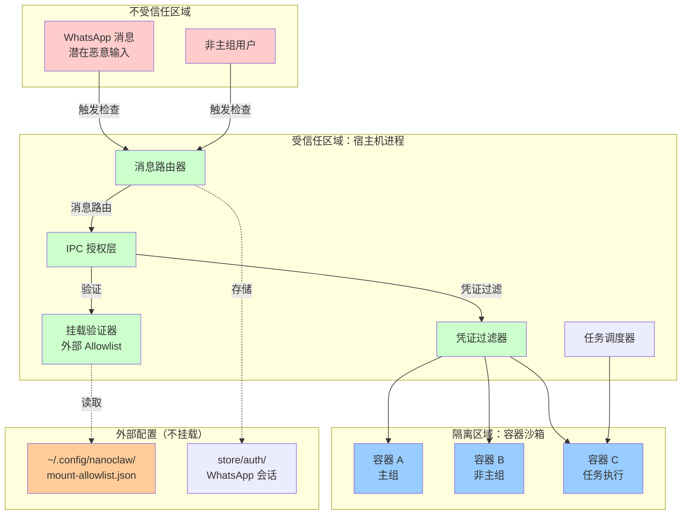
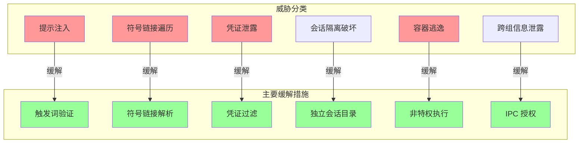
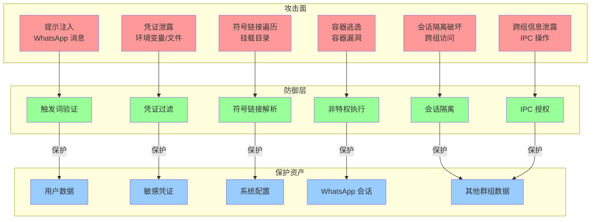

# NanoClaw 安全设计深度解析

本文档深入分析 NanoClaw 的安全架构设计、威胁模型以及缓解措施。安全是系统的核心设计原则，通过多层防御策略实现深度防御。

---

## 1. 安全架构概述

### 1.1 设计哲学

NanoClaw 采用"通过真正隔离实现安全"（Security Through True Isolation）的设计哲学，而不是依赖应用层权限系统。核心思想是：

- **OS 级隔离优于应用级检查**：容器提供操作系统级别的隔离，比应用层权限检查更可靠
- **最小攻击面**：代理只能访问显式挂载的目录，其他资源完全不可见
- **安全配置外部化**：挂载允许列表存储在项目根目录之外，代理无法修改

### 1.2 信任模型

| 实体 | 信任级别 | 理由 |
|------|---------|------|
| 主组（Main Group） | 受信任 | 私聊对话，用户完全控制 |
| 非主组（Non-Main Groups） | 不受信任 | 其他用户可能是恶意的 |
| 容器代理 | 沙箱隔离 | 隔离执行环境 |
| WhatsApp 消息 | 用户输入 | 可能包含提示注入攻击 |

### 1.3 安全边界架构图



---

## 2. 威胁模型

### 2.1 攻击者分类

| 攻击者类型 | 能力范围 | 主要目标 |
|-----------|---------|---------|
| **非主组用户** | 通过 WhatsApp 发送任意消息 | 访问其他群组数据、修改敏感文件 |
| **提示注入攻击者** | 构造恶意提示词 | 诱导代理执行危险操作、泄露凭证 |
| **容器逃逸者** | 容器内部代码执行 | 访问宿主机文件系统、提升权限 |
| **内部威胁（主组）** | 主组用户权限 | 误操作导致数据损坏、凭证泄露 |

### 2.2 主要威胁场景

#### 2.2.1 提示注入攻击（Prompt Injection）

**威胁描述**：攻击者通过构造特定的 WhatsApp 消息，诱导代理执行未授权操作。

**攻击向量**：
- 忽略安全指令的提示
- 要求访问未授权的目录
- 诱骗执行系统命令

**缓解措施**：
- 触发词验证：只处理带有触发词前缀的消息
- 挂载验证：代理无法访问未显式挂载的目录
- 文件系统隔离：即使执行命令，也仅在容器内有效

#### 2.2.2 符号链接遍历攻击（Symlink Traversal）

**威胁描述**：攻击者通过符号链接绕过挂载验证，访问禁止的目录。

**攻击向量**：
- 在挂载目录内创建指向敏感路径的符号链接
- 利用相对路径遍历（`../`）

**缓解措施**：
- **符号链接解析前验证**：在验证允许之前解析符号链接
- **容器路径验证**：拒绝包含 `..` 和绝对路径的容器路径
- **阻止模式**：默认阻止敏感目录（`.ssh`, `.gnupg`, `.aws` 等）

#### 2.2.3 凭证泄露（Credential Exposure）

**威胁描述**：代理获取宿主机的敏感凭证。

**攻击向量**：
- 读取环境变量
- 读取挂载目录中的文件
- 执行命令转储进程信息

**缓解措施**：
- **凭证过滤**：只暴露允许的环境变量（`CLAUDE_CODE_OAUTH_TOKEN`, `ANTHROPIC_API_KEY`）
- **不挂载敏感路径**：WhatsApp 会话、Allowlist 配置不挂载
- **只读挂载**：非主组默认只读访问额外挂载

#### 2.2.4 会话隔离破坏（Session Isolation Breach）

**威胁描述**：一个群组访问另一个群组的对话历史和文件。

**攻击向量**：
- 修改共享文件系统
- 访问其他群组的会话目录

**缓解措施**：
- **独立会话目录**：每个群组有独立的 `data/sessions/{group}/.claude/` 目录
- **主组全局内存保护**：非主组无法写入全局 `CLAUDE.md`
- **文件系统隔离**：容器只挂载当前群组的目录

#### 2.2.5 容器逃逸（Container Escape）

**威胁描述**：攻击者从容器内逃逸到宿主机。

**攻击向量**：
- 利用容器运行时漏洞
- 挂载敏感宿主机目录
- 破坏容器隔离机制

**缓解措施**：
- **非特权执行**：容器以 `node` 用户（uid 1000）运行，非 root
- **临时容器**：每次调用使用 `--rm` 标志，无持久化
- **有限挂载**：只挂载必要的目录，不挂载系统目录

#### 2.2.6 跨组信息泄露（Cross-Group Information Disclosure）

**威胁描述**：一个群组获取另一个群组的信息。

**攻击向量**：
- 读取全局内存
- 访问其他群组的文件夹
- 通过任务调度器窥探

**缓解措施**：
- **IPC 授权**：验证操作发起者的群组身份
- **任务可见性**：非主组只能看到自己的任务
- **全局内存只读**：非主组无法写入全局 `CLAUDE.md`

### 2.3 威胁矩阵



---

## 3. 安全机制详解

### 3.1 容器隔离（主要边界）

容器隔离是 NanoClaw 的主要安全边界，提供多层次的隔离保护：

#### 3.1.1 进程隔离

容器进程与宿主机进程完全隔离：

```typescript
// 容器以非特权用户运行
// uid 1000 (node 用户)，而非 root
// 容器进程无法影响宿主机进程
```

**缓解威胁**：
- 防止容器逃逸攻击
- 限制容器内的权限提升
- 保护宿主机进程不受容器影响

#### 3.1.2 文件系统隔离

容器只能看到显式挂载的目录：

```typescript
// 只有以下目录被挂载到容器：
// - /workspace/project (仅主组)
// - /workspace/group (所有组)
// - /workspace/global (只读)
// - /workspace/extra/* (额外挂载，需验证)
```

**缓解威胁**：
- 防止访问敏感系统目录
- 限制文件访问范围
- 隔离不同群组的数据

#### 3.1.3 非特权执行

容器不以 root 用户运行：

```typescript
// 用户：node (uid 1000)
// 权限：普通用户权限
// 限制：无法执行需要 root 的操作
```

**缓解威胁**：
- 防止权限提升攻击
- 限制容器内危险操作
- 减少容器逃逸影响

#### 3.1.4 临时容器

每次代理调用都创建新容器：

```typescript
// 标志：--rm
// 行为：容器执行后立即销毁
// 持久化：无持久化状态
```

**缓解威胁**：
- 防止持久化后门
- 消除状态污染
- 每次执行都是干净环境

### 3.2 挂载安全

挂载安全是防止敏感数据泄露的关键机制。

#### 3.2.1 外部 Allowlist

挂载权限存储在项目根目录之外：

```json
// 文件位置：~/.config/nanoclaw/mount-allowlist.json
// 关键特性：
// - 在项目根目录之外
// - 从不挂载到容器
// - 容器代理无法修改
{
  "allowedRoots": [...],
  "blockedPatterns": [...],
  "nonMainReadOnly": true
}
```

**缓解威胁**：
- 防止代理修改安全配置
- 防止篡改挂载权限
- 保持安全控制的不可变性

#### 3.2.2 默认阻止模式

系统默认阻止敏感目录：

```typescript
// src/mount-security.ts
const DEFAULT_BLOCKED_PATTERNS = [
  '.ssh',           // SSH 密钥
  '.gnupg', '.gpg', // GPG 密钥
  '.aws',           // AWS 凭证
  '.azure',         // Azure 凭证
  '.gcloud',        // Google Cloud 凭证
  '.kube',          // Kubernetes 配置
  '.docker',        // Docker 配置
  'credentials',    // 通用凭证文件
  '.env',           // 环境变量文件
  '.netrc',         // 自动登录凭证
  '.npmrc',         // NPM 配置
  '.pypirc',        // Python PyPI 配置
  'id_rsa',         // SSH 私钥
  'id_ed25519',     // Ed25519 密钥
  'private_key',    // 通用私钥
  '.secret',        // 通用密钥文件
];
```

**缓解威胁**：
- 防止凭证泄露
- 防止访问敏感配置
- 最小化默认攻击面

#### 3.2.3 符号链接解析

在验证之前解析符号链接：

```typescript
// src/mount-security.ts
function getRealPath(p: string): string | null {
  try {
    return fs.realpathSync(p);  // 解析符号链接
  } catch {
    return null;
  }
}

// 验证流程：
// 1. 扩展路径（~ -> home）
// 2. 解析符号链接（realpath）
// 3. 验证解析后的真实路径
```

**缓解威胁**：
- 防止符号链接遍历攻击
- 防止通过符号链接绕过验证
- 确保访问的是真实目标路径

#### 3.2.4 容器路径验证

验证容器内路径的有效性：

```typescript
// src/mount-security.ts
function isValidContainerPath(containerPath: string): boolean {
  // 拒绝 ".." 防止路径遍历
  if (containerPath.includes('..')) {
    return false;
  }

  // 拒绝绝对路径（会添加前缀 /workspace/extra/）
  if (containerPath.startsWith('/')) {
    return false;
  }

  // 拒绝空路径
  if (!containerPath || containerPath.trim() === '') {
    return false;
  }

  return true;
}
```

**缓解威胁**：
- 防止容器内路径遍历
- 防止覆盖容器内重要目录
- 确保挂载位置安全

#### 3.2.5 读写权限控制

根据群组类型和配置控制读写权限：

```typescript
// src/mount-security.ts
// 决定有效只读状态的逻辑：
// 1. 默认只读
// 2. 非主组 + nonMainReadOnly = 强制只读
// 3. 根目录不允许读写 = 强制只读
// 4. 其他情况 = 允许读写

const requestedReadWrite = mount.readonly === false;
let effectiveReadonly = true;

if (requestedReadWrite) {
  if (!isMain && allowlist.nonMainReadOnly) {
    effectiveReadonly = true;  // 非主组强制只读
  } else if (!allowedRoot.allowReadWrite) {
    effectiveReadonly = true;  // 根目录不允许
  } else {
    effectiveReadonly = false; // 允许读写
  }
}
```

**缓解威胁**：
- 防止非主组意外修改文件
- 最小化写入权限
- 保护敏感配置不被修改

### 3.3 会话隔离

每个群组有独立的会话和记忆。

#### 3.3.1 独立会话目录

```typescript
// 会话目录结构：
// data/sessions/{group}/.claude/
//
// 每个 group 都有独立的：
// - 消息历史
// - 文件内容缓存
// - 会话状态
//
// 群组 A 无法访问群组 B 的会话目录
```

**缓解威胁**：
- 防止跨组信息泄露
- 保护群组隐私
- 隔离不同上下文的记忆

#### 3.3.2 全局内存保护

```typescript
// 全局内存：groups/CLAUDE.md
// 主组：可以读写
// 非主组：只能读，不能写
//
// 防止非主组修改全局配置
```

**缓解威胁**：
- 防止非主组污染全局指令
- 保护系统级配置
- 维持主组的控制权

### 3.4 IPC 授权

消息和任务操作经过严格授权。

#### 3.4.1 操作权限矩阵

| 操作 | 主组 | 非主组 |
|------|-----|--------|
| 向自己的聊天发送消息 | ✓ | ✓ |
| 向其他聊天发送消息 | ✓ | ✗ |
| 为自己调度任务 | ✓ | ✓ |
| 为他人调度任务 | ✓ | ✗ |
| 查看所有任务 | ✓ | 仅自己的任务 |
| 管理其他群组 | ✓ | ✗ |

**缓解威胁**：
- 防止非主组越权操作
- 保护其他群组的隐私
- 维持主组的控制权

#### 3.4.2 群组身份验证

```typescript
// 消息路由时验证群组身份
// 任务调度时验证群组身份
// 所有 IPC 操作都验证发起者
```

**缓解威胁**：
- 防止伪造身份
- 防止跨组操作
- 确保操作可追溯

### 3.5 凭证处理

凭证处理采用最小暴露原则。

#### 3.5.1 凭证过滤

```typescript
// 只暴露以下环境变量到容器：
const allowedVars = [
  'CLAUDE_CODE_OAUTH_TOKEN',
  'ANTHROPIC_API_KEY'
];

// 其他环境变量不暴露
```

**缓解威胁**：
- 最小化凭证暴露
- 防止凭证泄露
- 限制凭证使用范围

#### 3.5.2 不挂载的凭证

- **WhatsApp 会话**：`store/auth/` - 仅宿主机访问
- **Mount Allowlist**：外部配置文件，从不挂载
- **敏感配置文件**：匹配阻止模式的文件

**缓解威胁**：
- 防止 WhatsApp 会话泄露
- 防止安全配置泄露
- 防止敏感配置文件被访问

---

## 4. 安全审计 Checklist

### 4.1 审查要点

以下 Checklist 用于定期安全审计，确保系统配置符合安全最佳实践。

#### 4.1.1 基础安全配置

- [ ] **Allowlist 文件存在且有效**
  ```bash
  # 检查 allowlist 是否存在
  test -f ~/.config/nanoclaw/mount-allowlist.json
  ```

- [ ] **Allowlist 文件权限正确**
  ```bash
  # 检查文件权限（应该只有用户可读写）
  stat -f "%Lp" ~/.config/nanoclaw/mount-allowlist.json
  # 应该输出 600
  ```

- [ ] **阻止模式包含所有敏感目录**
  ```bash
  # 验证默认阻止模式未被移除
  grep -E '\.ssh|\.gnupg|\.aws|credentials|\.env' ~/.config/nanoclaw/mount-allowlist.json
  ```

- [ ] **nonMainReadOnly 设置为 true**
  ```bash
  # 验证非主组强制只读
  grep '"nonMainReadOnly": true' ~/.config/nanoclaw/mount-allowlist.json
  ```

#### 4.1.2 容器安全

- [ ] **容器以非特权用户运行**
  ```bash
  # 检查容器运行用户
  # 验证使用的是 uid 1000 (node 用户)
  ```

- [ ] **容器使用 --rm 标志**
  ```bash
  # 验证容器执行后自动清理
  grep -r "\-\-rm" src/container-runner.ts
  ```

- [ ] **没有挂载系统敏感目录**
  ```bash
  # 检查挂载配置，排除 /etc, /root, /home/.ssh 等
  # 只挂载必要的用户目录
  ```

#### 4.1.3 群组隔离

- [ ] **每个群组有独立的会话目录**
  ```bash
  # 检查会话目录结构
  ls -la data/sessions/
  # 每个注册群组应该有独立目录
  ```

- [ ] **非主组无法访问其他群组的会话**
  ```bash
  # 通过日志验证容器挂载配置
  # 容器应该只挂载当前群组的目录
  ```

- [ ] **全局 CLAUDE.md 权限正确**
  ```bash
  # 检查非主组是否只能读取全局内存
  # 主组可以读写，非主组只能读
  ```

#### 4.1.4 凭证安全

- [ ] **敏感环境变量不在容器中暴露**
  ```bash
  # 检查容器启动时的环境变量
  # 只应该暴露 CLAUDE_CODE_OAUTH_TOKEN 和 ANTHROPIC_API_KEY
  ```

- [ ] **WhatsApp 会话目录不挂载**
  ```bash
  # 验证 store/auth/ 不在挂载列表中
  grep -r "store/auth" src/container-runner.ts
  # 应该没有匹配结果
  ```

- [ ] **Allowlist 文件不挂载**
  ```bash
  # 验证 mount-allowlist.json 不在挂载列表中
  grep -r "mount-allowlist" src/container-runner.ts
  # 应该没有匹配结果
  ```

#### 4.1.5 日志和监控

- [ ] **所有拒绝的挂载都有警告日志**
  ```bash
  # 查找挂载拒绝的日志
  grep "Additional mount REJECTED" logs/*.log
  # 验证所有异常都被记录
  ```

- [ ] **容器启动和销毁有日志**
  ```bash
  # 查找容器生命周期日志
  grep -E "Container (started|stopped|removed)" logs/*.log
  ```

- [ ] **权限变更有审计日志**
  ```bash
  # 查找权限相关的日志
  grep -E "authorized|permission|access" logs/*.log
  ```

#### 4.1.6 网络安全

- [ ] **容器网络访问受限（如需要）**
  ```bash
  # 如果需要限制网络访问，配置网络策略
  # 当前实现允许无限制网络访问
  ```

- [ ] **MCP 服务器安全配置**
  ```bash
  # 验证 MCP 服务器只暴露必要的工具
  # 检查 .claude/mcp.json 配置
  ```

### 4.2 定期审计建议

| 审计类型 | 频率 | 负责人 |
|---------|-----|--------|
| 基础安全配置 | 每月 | 系统管理员 |
| 容器安全 | 每月 | 安全团队 |
| 群组隔离 | 每月 | 系统管理员 |
| 凭证安全 | 每季度 | 安全团队 |
| 日志和监控 | 每月 | 运维团队 |
| 网络安全 | 每季度 | 安全团队 |

---

## 5. 安全边界图

### 5.1 完整安全边界图

```mermaid
graph TB
    subgraph "外部世界"
        WA[WhatsApp 网络]
        USER[用户设备]
    end

    subgraph "不受信任输入层"
        MSG1[主组消息<br/>受信任]
        MSG2[非主组消息<br/>不受信任]
    end

    subgraph "边界 1：宿主机进程（受信任）"
        subgraph "消息处理"
            ROUTER[消息路由器]
            TRIGGER[触发词检查]
        end

        subgraph "授权层"
            AUTH[IPC 授权]
            GROUP_CHECK[群组身份验证]
        end

        subgraph "挂载安全"
            ALLOWLIST[外部 Allowlist<br/>~/.config/nanoclaw/]
            VALIDATOR[挂载验证器]
            SYMLINK[符号链接解析]
            BLOCKED[阻止模式检查]
        end

        subgraph "凭证安全"
            FILTER[环境变量过滤器]
            ENV_VARS[允许的环境变量<br/>CLAUDE_CODE_OAUTH_TOKEN<br/>ANTHROPIC_API_KEY]
        end

        subgraph "会话管理"
            SESSIONS[data/sessions/<br/>群组隔离]
        end

        subgraph "任务调度"
            SCHEDULER[任务调度器]
            TASKS[SQLite 任务存储]
        end
    end

    subgraph "边界 2：容器隔离层"
        subgraph "容器运行时"
            CONTAINER[容器沙箱]
            UID[uid 1000<br/>非特权用户]
            TEMP[临时容器<br/>--rm]
        end

        subgraph "容器文件系统"
            WORKSPACE[/workspace]
            PROJECT[/workspace/project<br/>仅主组 RW]
            GROUP[/workspace/group<br/>当前群组 RW]
            GLOBAL[/workspace/global<br/>只读]
            EXTRA[/workspace/extra/*<br/>验证后挂载]
        end

        subgraph "容器执行"
            AGENT[Claude 代理]
            BASH[Bash 工具<br/>容器内执行]
            TOOLS[MCP 工具]
        end
    end

    subgraph "不挂载资源（外部）"
        AUTH_STORE[store/auth/<br/>WhatsApp 会话]
        SSH[~/.ssh/]
        GNUPG[~/.gnupg/]
        AWS[~/.aws/]
        CONFIG[~/.config/nanoclaw/<br/>mount-allowlist.json]
    end

    WA --> ROUTER
    USER --> ROUTER
    ROUTER --> MSG1
    ROUTER --> MSG2
    MSG1 -->|受信任| AUTH
    MSG2 -->|不受信任| AUTH
    AUTH --> TRIGGER
    TRIGGER --> GROUP_CHECK
    GROUP_CHECK --> VALIDATOR
    VALIDATOR --> SYMLINK
    SYMLINK --> BLOCKED
    BLOCKED --> FILTER
    FILTER --> ENV_VARS
    ENV_VARS --> CONTAINER
    CONTAINER --> WORKSPACE
    WORKSPACE --> PROJECT
    WORKSPACE --> GROUP
    WORKSPACE --> GLOBAL
    WORKSPACE --> EXTRA
    WORKSPACE --> AGENT
    AGENT --> BASH
    AGENT --> TOOLS
    AUTH --> SESSIONS
    AUTH --> SCHEDULER
    SCHEDULER --> TASKS

    ALLOWLIST -.->|验证配置| VALIDATOR
    AUTH_STORE -.->|不挂载| ROUTER
    SSH -.->|阻止| BLOCKED
    GNUPG -.->|阻止| BLOCKED
    AWS -.->|阻止| BLOCKED
    CONFIG -.->|不挂载| VALIDATOR

    style MSG1 fill:#99ff99
    style MSG2 fill:#ff9999
    style ROUTER fill:#ccffcc
    style AUTH fill:#ccffcc
    style VALIDATOR fill:#ccffcc
    style FILTER fill:#ccffcc
    style CONTAINER fill:#99ccff
    style AGENT fill:#99ccff
    style ALLOWLIST fill:#ffcc99
    style AUTH_STORE fill:#ffcc99
    style SSH fill:#ffcccc
    style GNUPG fill:#ffcccc
    style AWS fill:#ffcccc
```

### 5.2 攻击面分析图



---

## 6. 安全最佳实践

### 6.1 配置最佳实践

1. **保持 Allowlist 文件权限严格**
   ```bash
   chmod 600 ~/.config/nanoclaw/mount-allowlist.json
   ```

2. **启用 nonMainReadOnly**
   ```json
   {
     "nonMainReadOnly": true
   }
   ```

3. **定期审查允许的挂载根目录**
   - 只挂载必要的目录
   - 为敏感目录设置 `allowReadWrite: false`
   - 添加清晰的描述

4. **添加额外的阻止模式**
   ```json
   {
     "blockedPatterns": [
       "password",
       "secret",
       "token",
       "api_key"
     ]
   }
   ```

### 6.2 使用最佳实践

1. **主组用于管理，非主组用于任务**
   - 不要将主组用于日常任务
   - 使用主组管理其他群组
   - 为不同用途创建专门的群组

2. **定期清理会话**
   ```bash
   # 定期清理旧会话以释放空间
   # 会话会自动压缩，但可以手动清理
   ```

3. **监控日志**
   ```bash
   # 定期检查拒绝的挂载尝试
   grep "Additional mount REJECTED" logs/*.log
   ```

4. **最小化凭证暴露**
   - 只在必要时挂载包含凭证的目录
   - 使用只读挂载
   - 定期轮换凭证

### 6.3 审计和监控

1. **定期运行安全审计 Checklist**
   - 每月运行一次基础检查
   - 每季度进行深度审计
   - 记录审计结果

2. **监控异常行为**
   - 大量的挂载拒绝
   - 容器执行异常
   - 任务失败模式

3. **日志分析**
   - 分析拒绝的挂载尝试
   - 识别异常的 IPC 操作
   - 监控权限变更

### 6.4 更新和维护

1. **保持依赖更新**
   ```bash
   npm audit
   npm update
   ```

2. **定期审查安全公告**
   - 关注 Node.js 安全更新
   - 关注容器运行时安全更新
   - 关注依赖库安全更新

3. **测试安全机制**
   - 定期测试隔离机制
   - 验证阻止模式有效
   - 测试符号链接保护

---

## 7. 已知限制和改进方向

### 7.1 已知限制

1. **凭证暴露风险**
   - `ANTHROPIC_API_KEY` 暴露给容器
   - 代理可以通过 Bash 或文件操作发现这些凭证
   - 理想情况下，凭证不应该暴露给代理的执行环境

2. **网络访问无限制**
   - 当前实现允许容器无限制访问网络
   - 代理可以访问任何网络资源
   - 可能导致数据泄露或恶意访问

3. **主组特权**
   - 主组拥有完全控制权
   - 没有防止主组意外操作的机制
   - 主组的误操作可能导致严重后果

### 7.2 改进方向

1. **凭证隔离**
   - 实现凭证代理，不将凭证直接暴露给容器
   - 使用短期令牌代替长期凭证
   - 实现凭证轮换机制

2. **网络访问控制**
   - 实现网络策略限制
   - 白名单允许的域名和端口
   - 监控网络访问日志

3. **主组保护**
   - 实现主组操作确认机制
   - 添加主组操作审计日志
   - 实现主组操作的回滚机制

4. **增强审计**
   - 实现更细粒度的审计日志
   - 添加安全事件告警
   - 实现安全仪表板

---

## 8. 安全声明

### 8.1 安全承诺

NanoClaw 通过以下机制提供多层安全保护：

- **操作系统级隔离**：容器提供可靠的进程和文件系统隔离
- **最小攻击面**：代理只能访问显式挂载的目录
- **深度防御**：多层安全机制互相强化
- **可验证性**：代码库足够小，可以完全审查

### 8.2 安全不保证

本文档不保证以下内容：

- 无漏洞：软件总可能存在未知漏洞
- 绝对安全：不存在"绝对安全"的系统
- 防御内部威胁：主组用户拥有完全控制权
- 防御所有攻击向量：网络安全、物理安全等不在范围内

### 8.3 责任声明

用户应该：

- 审查代码以确保信任
- 定期更新系统和依赖
- 实施适当的备份策略
- 监控系统日志和异常
- 定期进行安全审计

### 8.4 报告安全问题

如果您发现安全问题，请：

1. 不要在公开问题中披露
2. 通过私人渠道报告给维护者
3. 提供详细的重现步骤
4. 给予时间修复

---

## 9. 附录

### 9.1 安全相关文件

| 文件 | 用途 |
|------|------|
| `src/mount-security.ts` | 挂载安全验证实现 |
| `src/container-runner.ts` | 容器运行时配置 |
| `src/index.ts` | 主进程和消息路由 |
| `docs/SECURITY.md` | 安全模型概述 |
| `~/.config/nanoclaw/mount-allowlist.json` | 挂载允许列表配置 |

### 9.2 环境变量

| 变量名 | 用途 | 安全影响 |
|--------|------|---------|
| `CLAUDE_CODE_OAUTH_TOKEN` | Claude Code 认证 | 暴露给容器 |
| `ANTHROPIC_API_KEY` | Anthropic API 密钥 | 暴露给容器 |
| `ASSISTANT_NAME` | 助手名称（触发词） | 无安全影响 |
| `LOG_LEVEL` | 日志级别 | 无安全影响 |

### 9.3 关键安全配置

```typescript
// src/mount-security.ts
const DEFAULT_BLOCKED_PATTERNS = [
  '.ssh', '.gnupg', '.aws', '.azure', '.gcloud',
  '.kube', '.docker', 'credentials', '.env',
  '.netrc', '.npmrc', '.pypirc', 'id_rsa',
  'id_ed25519', 'private_key', '.secret'
];

// 默认配置
{
  "allowedRoots": [
    {
      "path": "~/projects",
      "allowReadWrite": true,
      "description": "开发项目"
    }
  ],
  "blockedPatterns": [],
  "nonMainReadOnly": true
}
```

### 9.4 相关资源

- [Apple Container 文档](https://github.com/apple/container)
- [Docker 安全最佳实践](https://docs.docker.com/engine/security/)
- [Node.js 安全指南](https://nodejs.org/en/docs/guides/security/)
- [OWASP 安全原则](https://owasp.org/www-project-top-ten/)

---

**文档版本**：1.0
**最后更新**：2026-02-03
**维护者**：NanoClaw 项目
