# 附录：架构图集

本文档收集并整理了 NanoClaw 项目中所有的 Mermaid 架构图表，按功能分类组织，便于快速查阅和理解系统架构。

---

## 图例说明

### 图表类型

| 类型 | 说明 | 适用场景 |
|------|------|----------|
| `graph` | 有向图，展示组件关系 | 架构概览、组件依赖 |
| `flowchart` | 流程图，展示流程逻辑 | 业务流程、决策树 |
| `sequenceDiagram` | 时序图，展示交互顺序 | 消息流程、调用序列 |
| `stateDiagram` | 状态图，展示状态转换 | 生命周期、状态机 |

### 颜色编码

| 颜色 | 含义 | 示例 |
|------|------|------|
| 红色 (#ffcccc) | 不受信任区域、攻击面 | WhatsApp 消息、非主组用户 |
| 绿色 (#ccffcc) | 受信任组件、安全机制 | 消息路由器、挂载验证器 |
| 蓝色 (#99ccff) | 隔离区域、容器沙箱 | Agent 容器、执行层 |
| 橙色 (#ffcc99) | 外部配置、不可修改资源 | Allowlist、认证存储 |

### 箭头含义

| 箭头 | 含义 |
|------|------|
| `-->` | 数据流向、控制流 |
| `-.->` | 配置读取、外部依赖 |
| `==>` | 高频交互、主要路径 |
| `..>` | 次要路径、边界情况 |

---

## 第一部分：整体架构

### 1.1 Host vs Container 架构

**来源**: [10-整体架构与数据流.md](./10-整体架构与数据流.md)

**说明**: 展示 Host 进程和 Container 之间的职责划分与交互关系。

```mermaid
graph TB
    subgraph "HOST (macOS) - 主进程"
        direction TB

        subgraph "消息层"
            WA[WhatsApp<br/>(baileys)]
            DB[SQLite Database<br/>messages.db]
        end

        subgraph "路由层"
            ML[Message Loop<br/>轮询 SQLite]
            SL[Scheduler Loop<br/>检查任务]
            IW[IPC Watcher<br/>监控 IPC 文件]
        end

        subgraph "数据与状态"
            RG[registered_groups.json]
            SS[sessions.json]
            RS[router_state.json]
            IPC[data/ipc/]
        end

        WA -->|存储| DB
        DB --> ML
        ML -->|读取| RG
        ML -->|读取| RS
        ML -->|写入| RS
        SL -->|读取| DB
        SL -->|读取| RG
        SL -->|读取| SS
        IW -->|扫描| IPC
    end

    subgraph "CONTAINER (Linux VM) - 隔离环境"
        direction TB

        subgraph "执行层"
            AR[Agent Runner<br/>Claude Agent SDK]
            MCP[MCP Server<br/>nanoclaw tools]
        end

        subgraph "工作目录"
            WD[/workspace/group<br/>挂载自 groups/{name}/]
            GD[/workspace/global<br/>挂载自 groups/global/]
            ENV[/workspace/env-dir/env<br/>环境变量]
        end

        subgraph "工具集"
            Tools[Tools<br/>• Bash (沙箱)<br/>• Read/Write/Edit<br/>• WebSearch/WebFetch<br/>• agent-browser]
        end
    end

    ML -->|spawn 容器| AR
    SL -->|spawn 容器| AR
    AR --> MCP
    MCP -->|读写| WD
    MCP -->|发送 IPC| IPC
    Tools --> WD
```

---

### 1.2 消息处理流程

**来源**: [10-整体架构与数据流.md](./10-整体架构与数据流.md)

**说明**: 展示用户发送消息到 Agent 响应的完整时序流程。

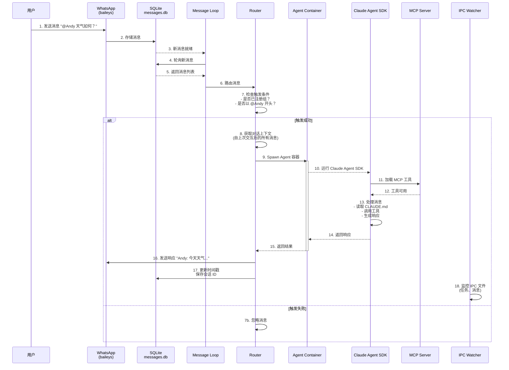

---

### 1.3 三层架构交互

**来源**: [10-整体架构与数据流.md](./10-整体架构与数据流.md)

**说明**: 展示消息层、路由层、执行层之间的数据流向。

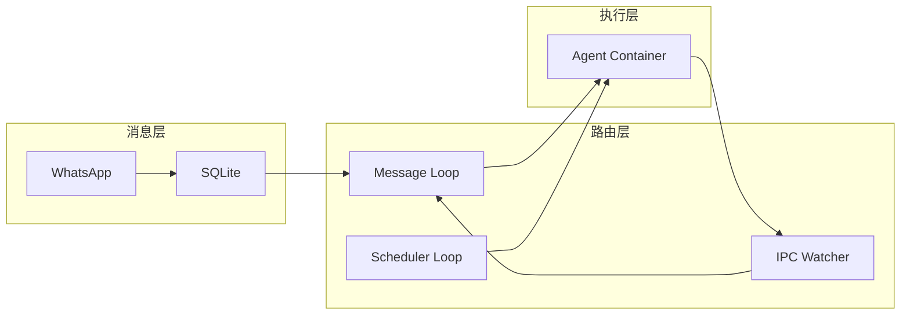

---

### 1.4 依赖关系图

**来源**: [10-整体架构与数据流.md](./10-整体架构与数据流.md)

**说明**: 展示核心技术栈的依赖关系。

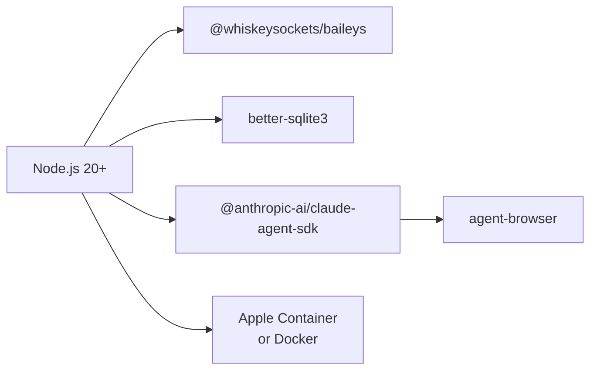

---

### 1.5 整体架构图

**来源**: [00-项目概览与哲学.md](./00-项目概览与哲学.md)

**说明**: 项目整体架构概览图。

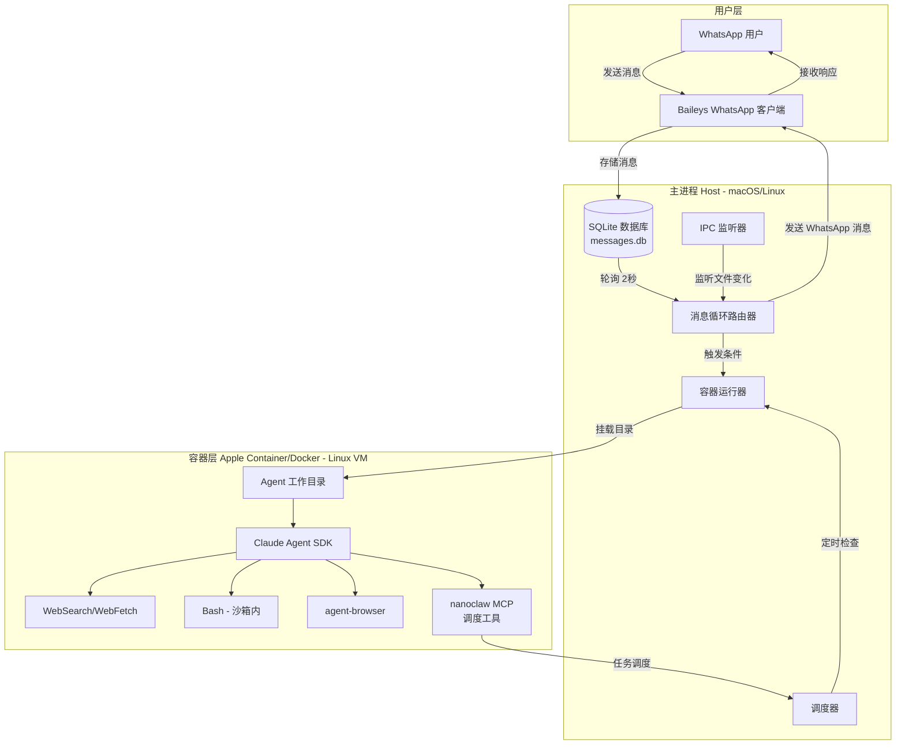

---

## 第二部分：消息路由

### 2.1 消息路由流程图

**来源**: [11-消息路由机制.md](./11-消息路由机制.md)

**说明**: 展示消息从到达 WhatsApp 到处理完成的完整路由流程。

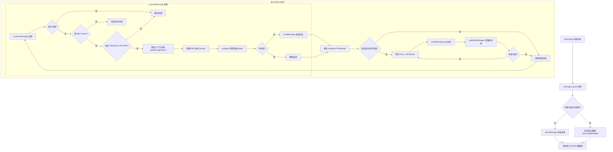

---

## 第三部分：调度系统

### 3.1 任务执行流程

**来源**: [13-调度系统详解.md](./13-调度系统详解.md)

**说明**: 展示调度器检查任务到执行完成的完整流程。

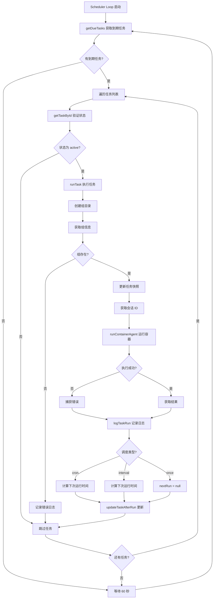

---

### 3.2 调度系统架构图

**来源**: [13-调度系统详解.md](./13-调度系统详解.md)

**说明**: 展示调度系统各组件与数据库的交互关系。

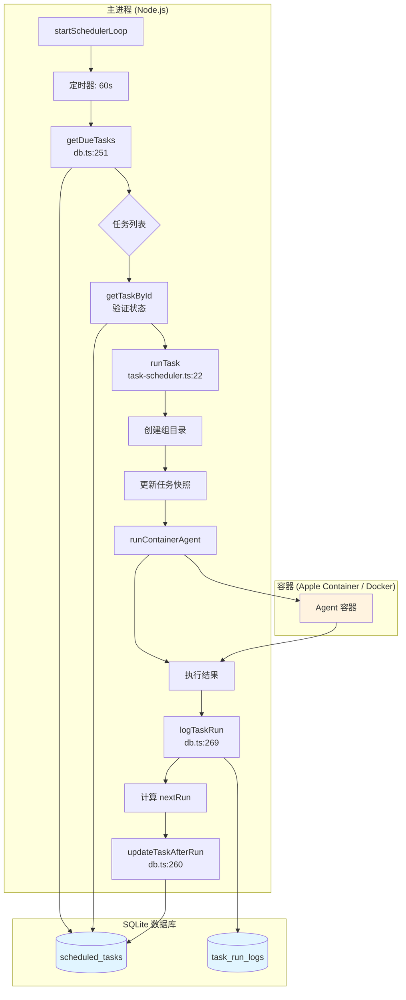

---

## 第四部分：安全设计

### 4.1 安全边界架构图

**来源**: [30-安全设计深度解析.md](./30-安全设计深度解析.md)

**说明**: 展示安全边界和信任模型。

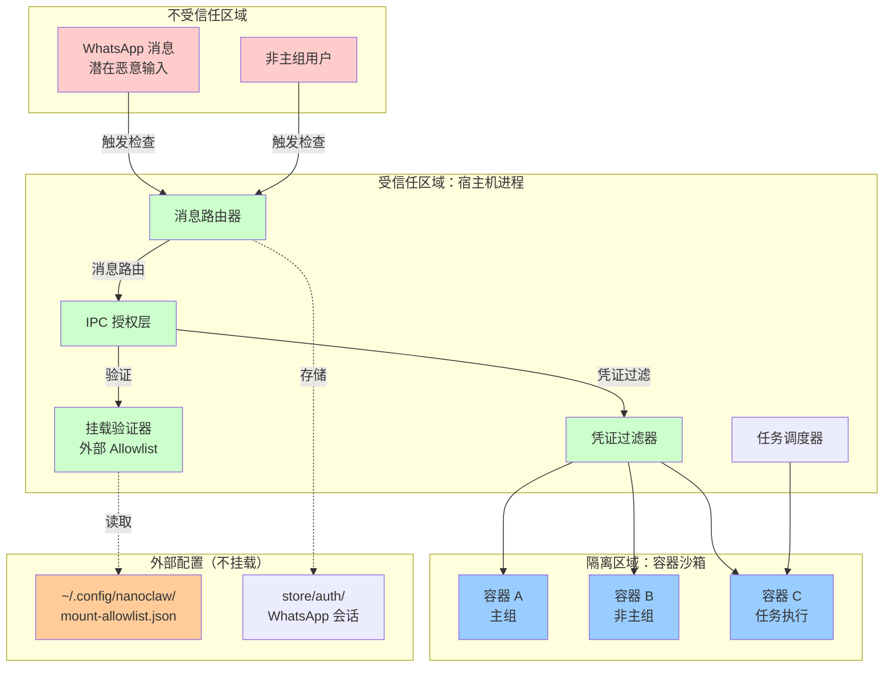

---

### 4.2 威胁矩阵

**来源**: [30-安全设计深度解析.md](./30-安全设计深度解析.md)

**说明**: 展示主要威胁与缓解措施的对应关系。

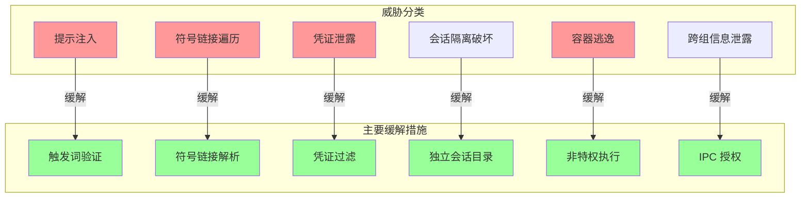

---

### 4.3 完整安全边界图

**来源**: [30-安全设计深度解析.md](./30-安全设计深度解析.md)

**说明**: 展示完整的安全边界和多层防护机制。

```mermaid
graph TB
    subgraph "外部世界"
        WA[WhatsApp 网络]
        USER[用户设备]
    end

    subgraph "不受信任输入层"
        MSG1[主组消息<br/>受信任]
        MSG2[非主组消息<br/>不受信任]
    end

    subgraph "边界 1：宿主机进程（受信任）"
        subgraph "消息处理"
            ROUTER[消息路由器]
            TRIGGER[触发词检查]
        end

        subgraph "授权层"
            AUTH[IPC 授权]
            GROUP_CHECK[群组身份验证]
        end

        subgraph "挂载安全"
            ALLOWLIST[外部 Allowlist<br/>~/.config/nanoclaw/]
            VALIDATOR[挂载验证器]
            SYMLINK[符号链接解析]
            BLOCKED[阻止模式检查]
        end

        subgraph "凭证安全"
            FILTER[环境变量过滤器]
            ENV_VARS[允许的环境变量<br/>CLAUDE_CODE_OAUTH_TOKEN<br/>ANTHROPIC_API_KEY]
        end

        subgraph "会话管理"
            SESSIONS[data/sessions/<br/>群组隔离]
        end

        subgraph "任务调度"
            SCHEDULER[任务调度器]
            TASKS[SQLite 任务存储]
        end
    end

    subgraph "边界 2：容器隔离层"
        subgraph "容器运行时"
            CONTAINER[容器沙箱]
            UID[uid 1000<br/>非特权用户]
            TEMP[临时容器<br/>--rm]
        end

        subgraph "容器文件系统"
            WORKSPACE[/workspace]
            PROJECT[/workspace/project<br/>仅主组 RW]
            GROUP[/workspace/group<br/>当前群组 RW]
            GLOBAL[/workspace/global<br/>只读]
            EXTRA[/workspace/extra/*<br/>验证后挂载]
        end

        subgraph "容器执行"
            AGENT[Claude 代理]
            BASH[Bash 工具<br/>容器内执行]
            TOOLS[MCP 工具]
        end
    end

    subgraph "不挂载资源（外部）"
        AUTH_STORE[store/auth/<br/>WhatsApp 会话]
        SSH[~/.ssh/]
        GNUPG[~/.gnupg/]
        AWS[~/.aws/]
        CONFIG[~/.config/nanoclaw/<br/>mount-allowlist.json]
    end

    WA --> ROUTER
    USER --> ROUTER
    ROUTER --> MSG1
    ROUTER --> MSG2
    MSG1 -->|受信任| AUTH
    MSG2 -->|不受信任| AUTH
    AUTH --> TRIGGER
    TRIGGER --> GROUP_CHECK
    GROUP_CHECK --> VALIDATOR
    VALIDATOR --> SYMLINK
    SYMLINK --> BLOCKED
    BLOCKED --> FILTER
    FILTER --> ENV_VARS
    ENV_VARS --> CONTAINER
    CONTAINER --> WORKSPACE
    WORKSPACE --> PROJECT
    WORKSPACE --> GROUP
    WORKSPACE --> GLOBAL
    WORKSPACE --> EXTRA
    WORKSPACE --> AGENT
    AGENT --> BASH
    AGENT --> TOOLS
    AUTH --> SESSIONS
    AUTH --> SCHEDULER
    SCHEDULER --> TASKS

    ALLOWLIST -.->|验证配置| VALIDATOR
    AUTH_STORE -.->|不挂载| ROUTER
    SSH -.->|阻止| BLOCKED
    GNUPG -.->|阻止| BLOCKED
    AWS -.->|阻止| BLOCKED
    CONFIG -.->|不挂载| VALIDATOR

    style MSG1 fill:#99ff99
    style MSG2 fill:#ff9999
    style ROUTER fill:#ccffcc
    style AUTH fill:#ccffcc
    style VALIDATOR fill:#ccffcc
    style FILTER fill:#ccffcc
    style CONTAINER fill:#99ccff
    style AGENT fill:#99ccff
    style ALLOWLIST fill:#ffcc99
    style AUTH_STORE fill:#ffcc99
    style SSH fill:#ffcccc
    style GNUPG fill:#ffcccc
    style AWS fill:#ffcccc
```

---

### 4.4 攻击面分析图

**来源**: [30-安全设计深度解析.md](./30-安全设计深度解析.md)

**说明**: 展示攻击面、防御层和保护资产的关系。

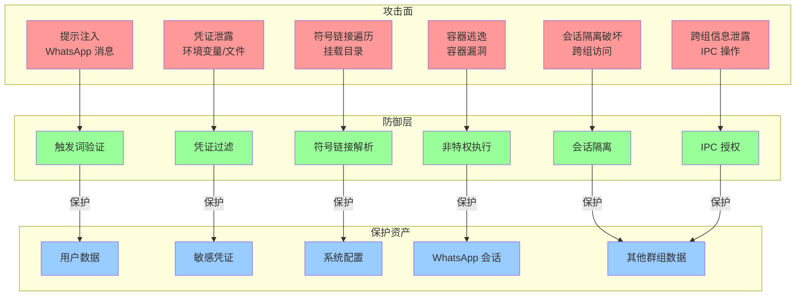

---

### 4.5 安全边界图（实现细节）

**来源**: [15-安全模型实现细节.md](./15-安全模型实现细节.md)

**说明**: 展示安全边界的实现细节。

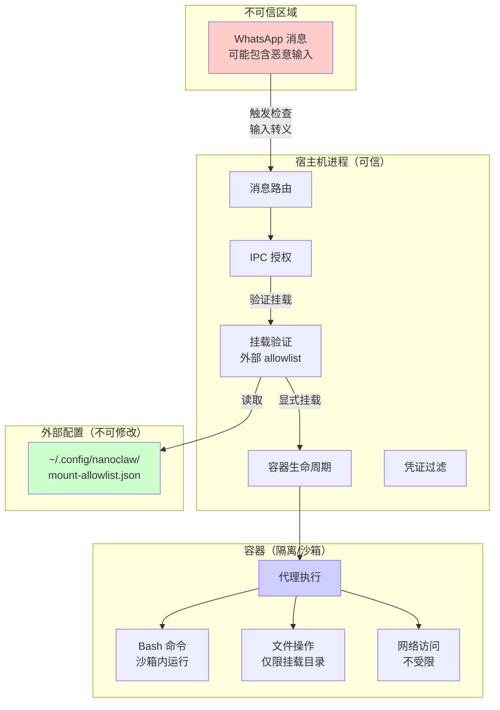

---

### 4.6 挂载验证流程

**来源**: [15-安全模型实现细节.md](./15-安全模型实现细节.md)

**说明**: 展示挂载验证的决策流程。

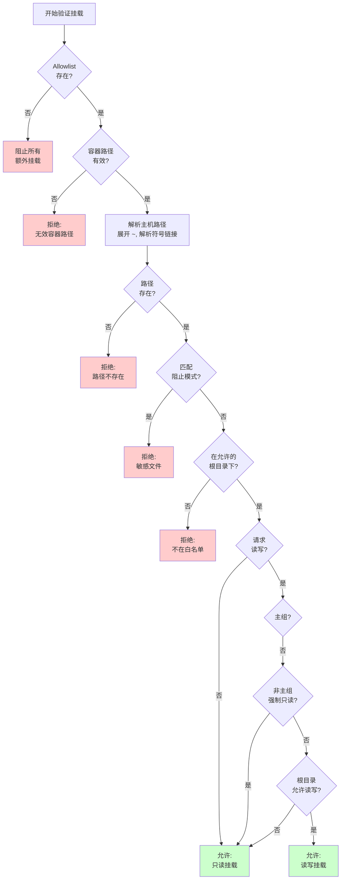

---

### 4.7 路径遍历防护时序图

**来源**: [15-安全模型实现细节.md](./15-安全模型实现细节.md)

**说明**: 展示路径遍历攻击与防护的交互过程。

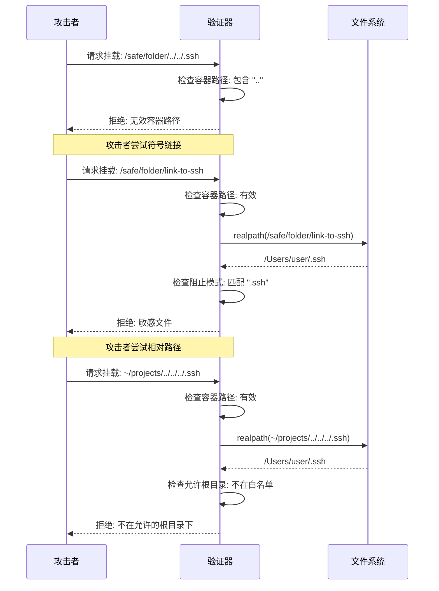

---

## 第五部分：容器隔离

### 5.1 容器生命周期时序图

**来源**: [12-容器隔离系统.md](./12-容器隔离系统.md)

**说明**: 展示容器从创建到销毁的完整生命周期。

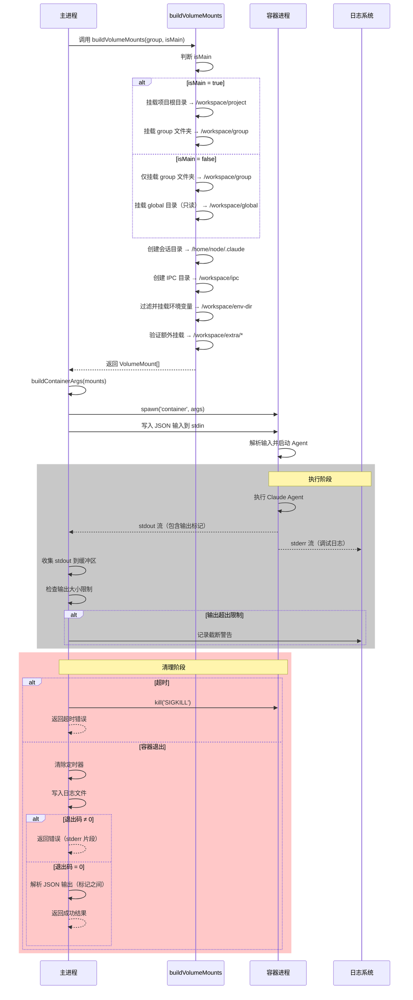

---

## 第六部分：IPC 机制

### 6.1 IPC 通信流程图

**来源**: [14-IPC 机制深度解析.md](./14-IPC机制深度解析.md)

**说明**: 展示 Host 与 Container 之间通过文件系统进行 IPC 的完整流程。

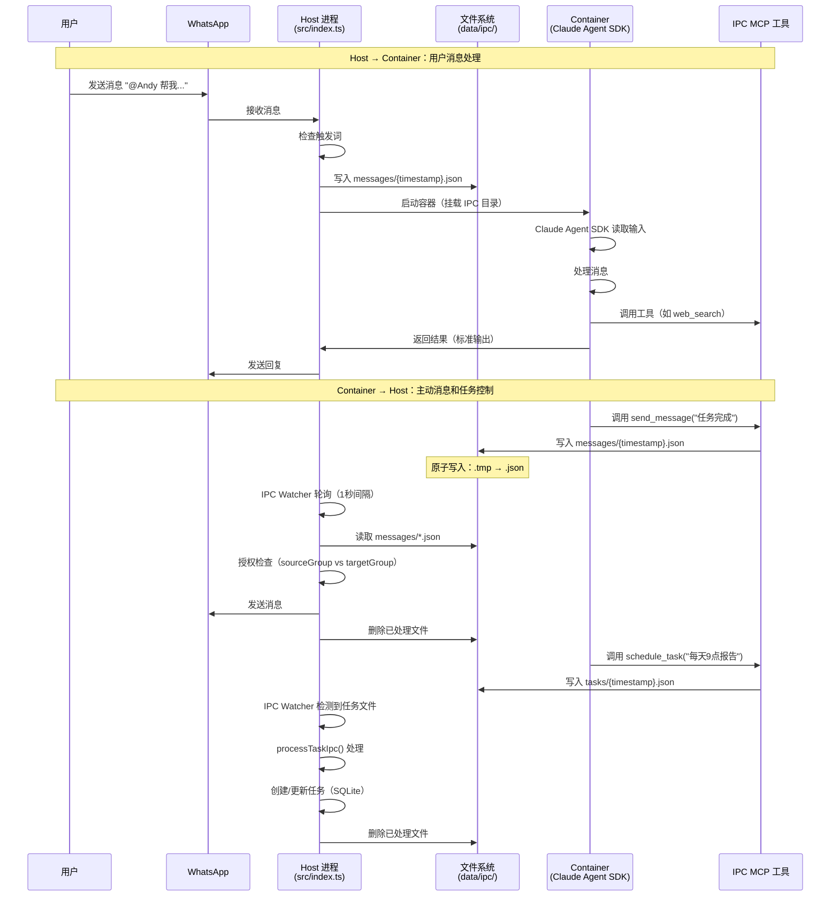

---

## 第七部分：会话管理

### 7.1 对话归档与会话压缩流程

**来源**: [31-对话归档与会话压缩.md](./31-对话归档与会话压缩.md)

**说明**: 展示 PreCompact Hook 机制如何实现对话归档与会话压缩的协同工作。

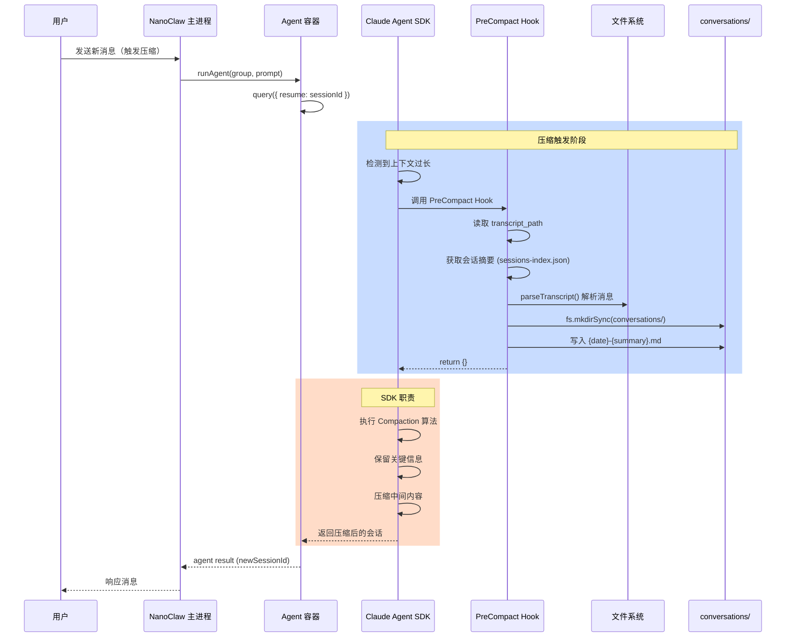

---

## 第八部分：核心概念

### 8.1 IPC 工作流程

**来源**: [03-核心概念入门.md](./03-核心概念入门.md)

**说明**: 展示 IPC 文件系统的工作流程。

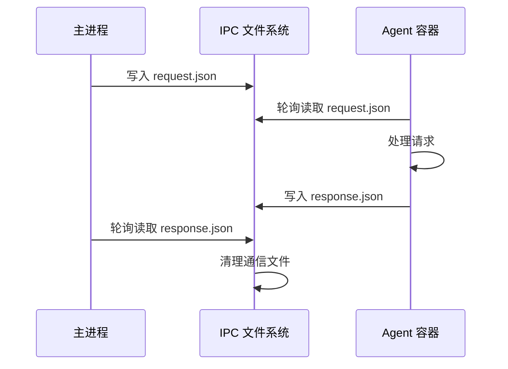

---

### 8.2 记忆层次结构

**来源**: [03-核心概念入门.md](./03-核心概念入门.md)

**说明**: 展示群组记忆和全局记忆的层次关系。

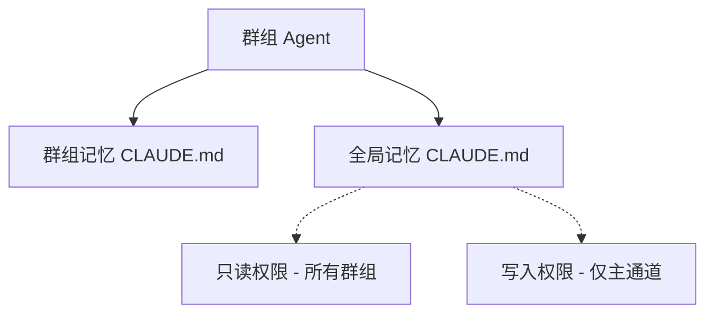

---

### 8.3 核心概念关系图

**来源**: [03-核心概念入门.md](./03-核心概念入门.md)

**说明**: 展示六个核心概念之间的关系。

```mermaid
graph TB
    subgraph "消息输入层"
        WG[WhatsApp Group<br/>群组]
    end

    subgraph "控制层"
        TP[Trigger Pattern<br/>触发词]
        MC[Main Channel<br/>主通道]
    end

    subgraph "执行层"
        C[Container<br/>容器]
        IPC[IPC<br/>进程间通信]
    end

    subgraph "存储层"
        MS[Memory System<br/>内存系统]
    end

    WG -->|检测触发词| TP
    TP -->|路由到| C
    MC -->|跨群组管理| WG
    MC -->|写入全局记忆| MS
    C -->|隔离运行| WG
    C <-->|文件系统轮询| IPC
    IPC <-->|读写记忆文件| MS
    WG -.->|只读| MS
```

---

## 第九部分：主程序流程

### 9.1 主程序流程图

**来源**: [20-index.ts 源码解读.md](./20-index.ts源码解读.md)

**说明**: 展示主程序从启动到处理消息的完整流程。

```mermaid
flowchart TD
    Start([main]) --> CheckContainer[ensureContainerSystemRunning]
    CheckContainer --> InitDB[initDatabase]
    InitDB --> LoadState[loadState]
    LoadState --> Connect[connectWhatsApp]

    Connect --> AuthCheck{需要认证?}
    AuthCheck -->|是| ShowQR[显示 QR 码通知]
    ShowQR --> Exit1[退出进程]

    AuthCheck -->|否| ConnectionOpen{连接成功?}
    ConnectionOpen -->|否| Reconnect{需要重连?}
    Reconnect -->|是| Connect
    Reconnect -->|否| Exit2[退出进程]

    ConnectionOpen -->|是| SyncGroup[syncGroupMetadata]
    SyncGroup --> StartScheduler[startSchedulerLoop]
    StartScheduler --> StartIPC[startIpcWatcher]
    StartIPC --> StartLoop[startMessageLoop]

    StartLoop --> Poll[轮询新消息]
    Poll --> HasMessages{有新消息?}
    HasMessages -->|否| Wait[等待 POLL_INTERVAL]
    Wait --> Poll

    HasMessages -->|是| ProcessMsg[processMessage]
    ProcessMsg --> IsRegistered{组已注册?}
    IsRegistered -->|否| Wait
    IsRegistered -->|是| CheckTrigger{需要触发前缀?}
    CheckTrigger -->|否| Wait
    CheckTrigger -->|是| BuildContext[构建上下文]
    BuildContext --> RunAgent[runAgent]
    RunAgent --> WriteSnapshot[写入快照文件]
    WriteSnapshot --> StartContainer[启动容器代理]
    StartContainer --> GetResponse[获取响应]
    GetResponse --> UpdateSession{有新会话?}
    UpdateSession -->|是| SaveSession[保存会话]
    UpdateSession -->|否| SendMsg[sendMessage]
    SaveSession --> SendMsg
    SendMsg --> UpdateTimestamp[更新 lastTimestamp]
    UpdateTimestamp --> SaveState[saveState]
    SaveState --> HasMessages

    StartIPC --> ScanIPC[扫描 IPC 目录]
    ScanIPC --> ProcessIPC[processTaskIpc]
    ProcessIPC --> AuthCheckIPC{授权检查}
    AuthCheckIPC -->|失败| LogWarn[记录警告]
    AuthCheckIPC -->|成功| ExecuteTask[执行任务操作]
    ExecuteTask --> LogInfo[记录日志]
    LogWarn --> WaitIPC[等待 IPC_POLL_INTERVAL]
    LogInfo --> WaitIPC
    WaitIPC --> ScanIPC

    StartScheduler --> CheckTasks[检查到期任务]
    CheckTasks --> RunTask[运行任务]
    RunTask --> WaitScheduler[等待调度间隔]
    WaitScheduler --> CheckTasks
```

---

## 图表统计

| 分类 | 图表数量 | 来源文档 |
|------|----------|----------|
| 整体架构 | 5 | 10-整体架构与数据流.md, 00-项目概览与哲学.md |
| 消息路由 | 1 | 11-消息路由机制.md |
| 调度系统 | 2 | 13-调度系统详解.md |
| 安全设计 | 7 | 30-安全设计深度解析.md, 15-安全模型实现细节.md |
| 容器隔离 | 1 | 12-容器隔离系统.md |
| IPC 机制 | 1 | 14-IPC 机制深度解析.md |
| 会话管理 | 1 | 31-对话归档与会话压缩.md |
| 核心概念 | 3 | 03-核心概念入门.md |
| 主程序流程 | 1 | 20-index.ts 源码解读.md |
| **总计** | **22** | 11 个文档 |

---

## 相关文档

- [10-整体架构与数据流.md](./10-整体架构与数据流.md) - 详细架构说明
- [11-消息路由机制.md](./11-消息路由机制.md) - 消息路由详解
- [13-调度系统详解.md](./13-调度系统详解.md) - 任务调度详解
- [30-安全设计深度解析.md](./30-安全设计深度解析.md) - 安全架构详解
- [15-安全模型实现细节.md](./15-安全模型实现细节.md) - 安全实现细节
- [12-容器隔离系统.md](./12-容器隔离系统.md) - 容器隔离详解
- [14-IPC 机制深度解析.md](./14-IPC机制深度解析.md) - IPC 详解
- [31-对话归档与会话压缩.md](./31-对话归档与会话压缩.md) - 会话管理详解
- [03-核心概念入门.md](./03-核心概念入门.md) - 核心概念入门
- [20-index.ts 源码解读.md](./20-index.ts源码解读.md) - 主程序源码解读
- [00-项目概览与哲学.md](./00-项目概览与哲学.md) - 项目概览

---

**文档版本**: 1.0  
**最后更新**: 2026-02-03  
**维护者**: NanoClaw 项目
